**日本語** | [English](README.en.md)

# Clearwater VRC

VRChat ワールドに、歩いて入れる透明な浅瀬と海岸を作るパッケージです。水面の反射、水底に揺れる光の模様（コースティクス）、波音に合わせて寄せては返す波打ち際、潜ったときの水中の見え方までを含みます。元になった WebGL デモは [clearwater by Aureliengmz](https://github.com/Aureliengmz/clearwater)（MIT、© Lumaris、`Third Party Notices.md`）です。

VRChat で試せます：[Clearwater Beach](https://vrchat.com/home/world/wrld_9795f8ab-5305-4cfb-a757-745fd264252e)（Build Scene で作る標準のシーンを公開したワールド）

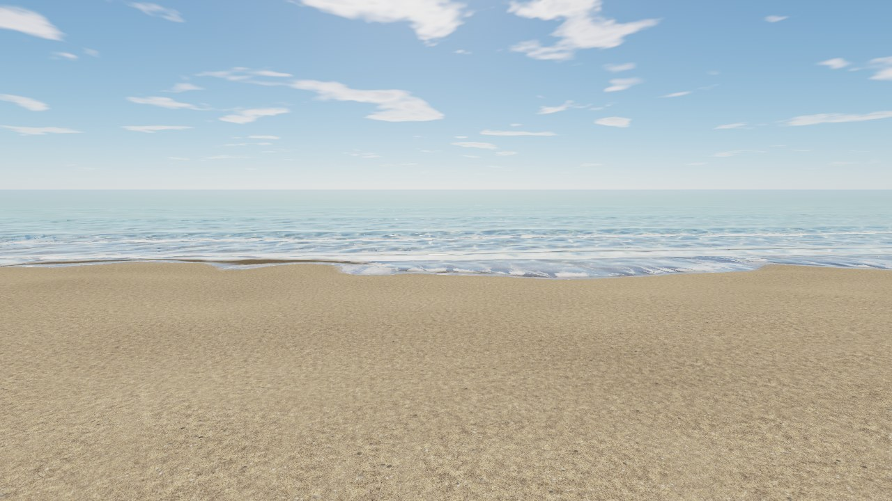

| 遠浅の水と光の模様 | 波打ち際（打ち上げと泡） |
| --- | --- |
| 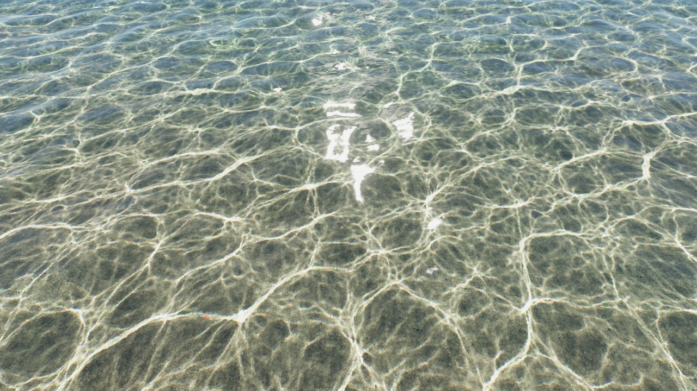 | 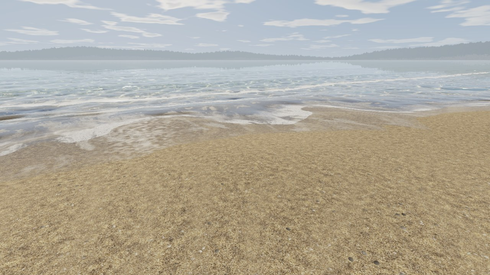 |
| **水中** | **水中から見上げた空（丸く切り取られて見える）** |
| 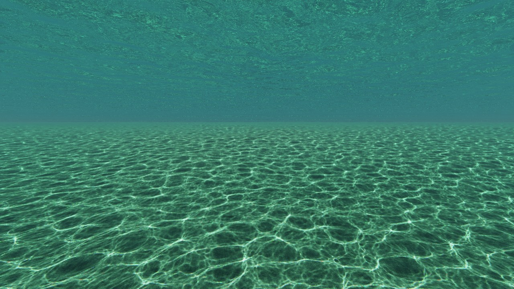 | 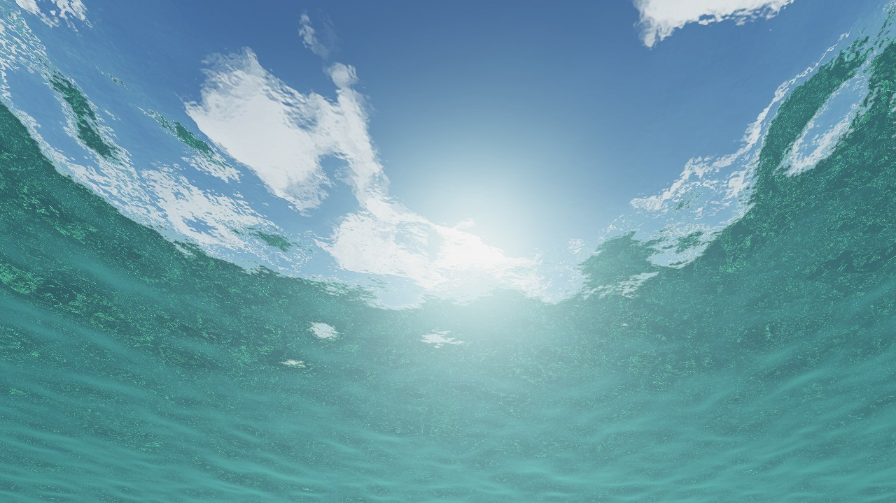 |

時刻に合わせて、空の色を変えられます。日の出から夕焼け、月夜まで、大気が日光を散らす様子を物理に沿って計算した色です。

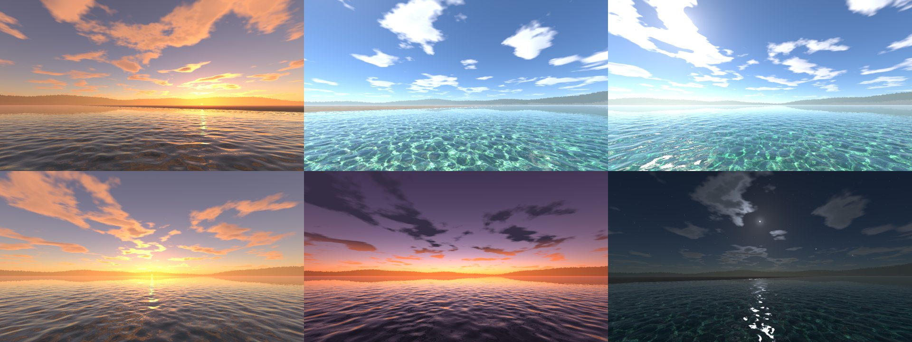

時刻は、ワールドの中のパネルからも変えられます。散乱の重い計算はエディターで一度だけ行って表に焼き込み、実行中は表を引くだけです。そのため、時刻のない空と比べて増える負荷は、VR の片目で 0.1〜0.15 ms に収まります（[時刻と空](#時刻と空clearwater-sky)、[負荷の目安](#負荷の目安)）。

PC 向けです（GPU 計算を多用するため Quest では動きません）。VRChat Worlds SDK 3.10 以降が必要で、Unity でワールドを組んでアップロードしたことがある人を想定しています。

初めて使うときは「入れ方」「始める」「海岸を描く」の 3 章を順に読めば、海岸ができるところまで進めます。それ以降の章は、自分の地形やプールを使いたくなったとき、見た目を調整したいときに引いてください。用語の定義は `CONTEXT.md` に、中で何が起きているか（波の計算、水底の描き方、描画順、空と同期など）は、図と一緒に [docs/technical.md](docs/technical.md) にあります。調整できる数値の初期値とファイルの役割の一覧も、そちらにまとめています。主な仕組みは、[動く図解](https://bmbb93.github.io/clearwater-vrc/how-it-works/)でも見られます。

## 入れ方

ALCOM / VCC にこのパッケージのリポジトリを追加し、ワールドのプロジェクトに「Clearwater VRC」を追加します。

1. ALCOM / VCC の設定（パッケージ）で、リポジトリの追加に次の URL を入れます（[配布ページ](https://bmbb93.github.io/clearwater-vrc/) のボタンからでも追加できます）

   ```
   https://bmbb93.github.io/clearwater-vrc/index.json
   ```

2. プロジェクトの管理画面で「Clearwater VRC」を追加します

リリースの zip を展開してプロジェクトの `Packages/` に置いても使えます（埋め込みパッケージ）。パッケージ自体を編集しながら使うときは、このリポジトリを手元に置き、プロジェクトの `Packages/manifest.json` の `dependencies` にそのフォルダへの参照を書きます（コピーせず、そのフォルダを直接読みます）。パスは `Packages/` からの相対でも書けます。

```json
"com.vbamboo.clearwater": "file:<このリポジトリのフォルダ>"
```

## 始める

### 新しいシーンから始める

`Tools > Clearwater > Build Scene` を実行すると、`Assets/Clearwater/Scenes/Clearwater.unity` に水・浜・太陽・スポーン地点の入ったシーンができ、ビルド設定のシーン一覧がこのシーン 1 つになります。2 回目以降は素材を作り直しますが、シーンに手で置いた物やワールド ID はそのまま残ります。マテリアル（`Assets/Clearwater/Generated` の中の、シーンのフォルダー）で調整した値（波の高さ・明るさ・雲・トーンマッピングの方式など）も残ります。作り直されるのは、テクスチャの参照など Clearwater が決める値だけです。シーンを初めから作り直すときは `Recreate Scene` を使います。トーンマッピングはポストプロセス（PPv2）にします（「トーンマッピング」の章）。

### 既存のワールドに足す

ワールドのシーンを開いて `Tools > Clearwater > Add to Current Scene` を実行します。水一式と、まっすぐな海岸の編集用オブジェクト「Coast (editor only)」が追加されます。最初に「Clearwater の空と太陽も使うか」を聞かれます。

- 使う：Build Scene と同じ空と太陽（Sun (Clearwater)）になり、時刻で変わる空（「時刻と空」の章）が付きます。環境光も、その空に合わせて変わります。ワールドの Directional Light は、その Light コンポーネントだけがオフになります（オブジェクトやほかのコンポーネントはそのまま。削除もしません）
- 使わない：ワールドの太陽をそのまま使います。その太陽の影が無効なら、Clearwater が有効にします。Directional Light がなければ「Sun」を作り、空が未設定か Unity の既定の空なら Clearwater の空にします

どちらでも、トーンマッピングはポストプロセス（PPv2）になり（「トーンマッピング」の章）、追加のあとシーンは保存されます。

あとから切り替えるときは `Tools > Clearwater > Use Clearwater Sky and Sun` を使います。水は画面の奥行き情報を使って水底や水中の物を透かすので、影は有効のままにしてください。影を切ると奥行き情報が作られず、水が正しく描けません。ワールドの Reference Camera の Far Clip も、海の広さに合わせる必要があります（次章の `Sea size`）。

どちらの始め方でも、次は海岸の形を描いて Bake します。

### デモシーンで試す

使い方の例になるシーンを 6 つ用意しています（VRC Light Volumes がプロジェクトに入っていれば 7 つ）。`Tools > Clearwater > Demo Scenes > Build Demo Scenes` を実行すると、`Assets/Clearwater/Demo` にシーンとその地形・マテリアル・テクスチャが作られます（30 秒ほどかかります）。どれも Build Scene と同じ新しいシーンで、Beach はそのまま（Clearwater が作る地面）、ほかはそれに地面を足したものです。開いているシーンは変えません。実行の前に、開いているシーンを保存するかを聞かれます。作り終えると Beach のデモが開きます。どのデモでも、空のパネル（「時刻と空」の章）を、VR では左手のトリガー 2 回、デスクトップでは Tab キーで手元に呼び出せます。パネルを出す小石は、見本として Beach にだけ置いています（スポーン地点のそば）。ほかのデモには、見た目も当たり判定もない呼び出し役（Sky Panel Caller）だけを置いています。スポーン地点は、どのデモでも海から離れた乾いた地面の上です。どのデモも、トーンマッピングはポストプロセス（PPv2）です。

| シーン | 開くメニュー | 内容 | 詳しい章 |
| --- | --- | --- | --- |
| Demo_Beach | `Open Beach (Clearwater's own ground)` | Build Scene と同じ、Clearwater が作る地面の浜（まっすぐな海岸線、既定の断面と起伏）。まず試すならこれです | 海岸を描く |
| Demo_Cove | `Open Cove (a mesh as the ground)` | メッシュで作った砂の入り江。外側の地面を「Match the user terrain」で同じ砂にしています | 自分の地形を使う |
| Demo_Harbor | `Open Harbor (a quay and a pier)` | 垂直な岸壁、階段護岸、スロープ、杭で立つ桟橋。杭には Obstacle を付けています | 自分の地形を使う、物を置く |
| Demo_Pool | `Open Pool (still water only)` | 海のない 25 m プール。深さは 0.5 m で、ジャンプすればプールサイドに上がれます。Pool を使わず、線を `Closed` にして囲み、打ち寄せる波をオフにしています | プールを置く（最初の段落） |
| Demo_Resort | `Open Resort (the sea and two pools)` | 海辺の建物に、1 階の屋内プールと 2 階のテラスのプール。テラスへは、海に向かって右手の外壁沿いのスロープで上がれます。どちらのプールも深さ 0.7 m で、ジャンプすれば縁に上がれます | プールを置く |
| Demo_Terrain | `Open Terrain (a Unity Terrain)` | Unity の Terrain で作った入り江・岬・砂州 | 自分の地形を使う |
| Demo_LightVolumes | `Open Light Volumes (VRC Light Volumes)` | 夜（21 時）の浜を Point Light Volume で照らしたもの。砂の上・浅瀬の上・水の中（浅い所と水深 1.6 m）のランプ、浜を照らすスポット、水際を回りながら色と明るさを変えるランプ（`ClearwaterDemoLamp`）。VRC Light Volumes が入っているときだけ作られ、メニューにも出ます | VRC Light Volumes |

デモは、メニューの `Open ...` からでも Project ウィンドウからでも開けます。焼き込みはシーンごとにあるので（下の「焼き込みはシーンごと」）、デモを開いたり作り直したりしても、自分のシーンは変わりません。

Build Demo Scenes は、どのシーンも使う共有の素材（`Assets/Clearwater/Generated` の直下）を Build Scene と同じように作り直します。デモが要らなくなったら、`Assets/Clearwater/Demo` フォルダと、`Assets/Clearwater/Generated` の `Demo_` で始まるフォルダを消してください。

## 海岸を描く（Coast (editor only)）

シーンの「Coast (editor only)」を選ぶと、Scene ビューに波打ち際の線が出ます。線と断面（沖へ向かう地面の高さ）の設定は、Inspector の **Bake** を押したときに水面・水底・波・歩ける地面・波音の位置へ焼き込まれます。設定を変えたら Bake し直してください。し直すまでは、水も地面も前の形のままです。

Scene ビューには四角が 3 つ出ます。黄色は細かく焼き込む範囲（`Area Size`）、緑は歩ける範囲（`Ground Half Size` はその半分の長さ。端に見えない壁が立ちます）、水色は海の範囲（`Sea size`）です。

線の形：

- 点をドラッグして動かす。線の途中の「+」で点を追加、点を選んで Delete で削除
- `Line` で線の種類を選びます：Straight（点を直線で結ぶ）/ Smooth（点を通るなめらかな曲線、初期値）/ Handles（Illustrator のパスのように、各点の 2 本のハンドルで向きと曲がり具合を決める）
- Handles では、選んだ点と両隣の点にハンドル（四角）が出ます。ドラッグで曲がり具合を変え、Alt を押しながらドラッグすると角になります。Inspector の「Smooth point / Corner point / Auto handles」で点ごとに切り替えられます。「+」で点を足しても曲線の形は変わりません
- 矢印が海の側です（線の進む向きの左側）。逆なら「Reverse direction」
- 開いた線は両端の先へまっすぐ続きます。`Closed` にすると輪（島・湖）になります
- 「Reset line」で線を初期のまっすぐな線（3 点、200 m）に戻します。断面などの設定はそのままです。すべての設定を初期値に戻すときは、コンポーネントの ⋮ メニューの Reset を使います

断面と波：

- 断面：`Gentle Beach`（遠浅の浜、数値で調整）か `Curve`（波打ち際からの距離に対する地面の高さを曲線で描く）
- 断面のプリセット：`Preset` で選んで「Apply」。遠浅の浜（数値）/ 急な浜 / 砂州のある浜 / 礁湖（広い浅瀬）/ 湖岸（`Shore waves` オフ向け）/ 磯の急斜面 / 丘の下の遠浅の浜（遠くからも陸が見える）。遠浅の浜以外は `Curve` として入るので、そのまま曲線を手直しできます
- `Shore waves` をオフにすると、波打ち際の波と波音がなくなり、岸の水は静かになります（湖や池向け）。なくなるのは、寄せ波・砕波・泡・濡れた砂と、打ち上げ（砕けた波が浜を駆け上がって引いていく水）です。沖の小さな波と、遠くの海の環境音は残ります

海の広さは `Sea size`（初期値 5000 m 四方、水のオブジェクトが中心）で変えられます。Bake すると、水面・遠くまで描く地面・水中の表現がこの広さに合わせて変わり、水面の端は遠くのもやに溶け込みます。ワールドの Reference Camera の Far Clip は、`Sea size` の 0.8 倍（初期値なら 4000 m）が必要です。足りないと Inspector に警告と「Set ○○ m」ボタンが出て、押すとワールドの Reference Camera に設定されます。

### 焼き込みはシーンごと

焼き込んだデータと、それを読むマテリアル（水・水底・水中・空など）は、シーンごとのフォルダー `Assets/Clearwater/Generated/（シーン名）_（英数字 8 文字）` にあります。英数字はシーンの GUID の先頭で、シーンの名前を変えても同じフォルダーが使われます。同じプロジェクトの複数のシーンで Clearwater を使っても、それぞれの Bake は互いに影響しません。マテリアルで調整した値も、シーンごとに別です。

- シーンを複製すると、最初の Bake のときにマテリアルが新しいシーンのフォルダーへ複製され、調整した値も引き継がれます
- 前の版で `Assets/Clearwater/Generated` の直下に作ったデータは、最初に Bake したシーンのフォルダーへ移ります。別のシーンが同じデータを使っていたら、そのシーンの Bake のときに複製されて分かれます
- シーンを消しても、そのフォルダーは残ります。要らなければ手で消してください
- 波のスペクトル・光の模様・空の LUT・トーンマッピングなど、シーンによらないものは `Assets/Clearwater/Generated` の直下で共有します

### 波が寄せる向き

波は沖から一方向に寄せ、浜ごとに、その向きへ開けている分だけ届きます。湾の奥には湾口から入る分だけが届き、波が沿って走る壁ぎわではほとんど砕けません。これは波の高さ・打ち上げ・白波・泡・波音の大きさに表れます。

届くタイミングも向きで変わります。湾の奥には遅れて届き、斜めに寄せる波は浜に沿って順に砕けていきます。波は浅い所ほど遅く進むので、届く時刻もそれに合わせて計算しています。波音は、聞こえてくる浜の波に合わせます。

- `Swell direction auto`（初期値オン）：このオブジェクトのまわり約 200 m の海岸が、平均して向いている正面から寄せます
- `Swell from`：auto を外したときの向き（ワールド +Z から時計回りの角度）
- `Swell spread`（初期値 25°）：広げると、湾の奥や横向きの浜にも波が回り込みます

Scene ビューの「swell」の矢印が、いまの向きです。

### 歩ける範囲の外まで線を描く

線は歩ける範囲の外まで描けます。遠くに点を置けば、岬・湾・対岸などの形になり、水面・遠景の地面・沖の波がその形に沿います。黄色の四角の外は、海全体（水色の四角）を粗く焼き込んだデータで描きます。その間隔は `Sea size` ÷ `Outer Resolution` で、初期値では 5000 m ÷ 1024 ≒ 5 m です。海の外では、線はそのまま同じ向きに続きます。

- 遠くの陸は低いと水平線に埋もれて見えません。見せたいときは断面を `Curve` にし、陸側（マイナス側）を高くします
- 線が長くても、歩ける範囲の近くは約 1 m 間隔で細かく焼き込みます。遠くの区間ほど粗くなります（線全体で最大 512 点）
- 波音の音源は、歩ける範囲から 100 m 以内の部分の線だけを使います

## 底の見た目（Bed look）

水の下から浜までひと続きの地面（Bed）の見た目は、Coast の `Bed look` で選びます。水の下と浜は同じ見た目になり、変更は Bake なしですぐ反映されます。

| `Sand` | `Pebbles` |
| --- | --- |
| 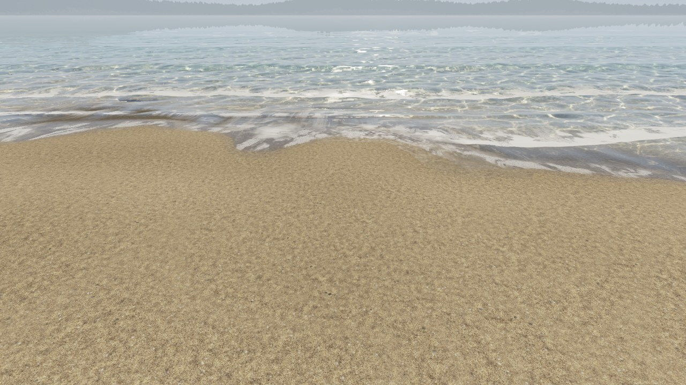 | 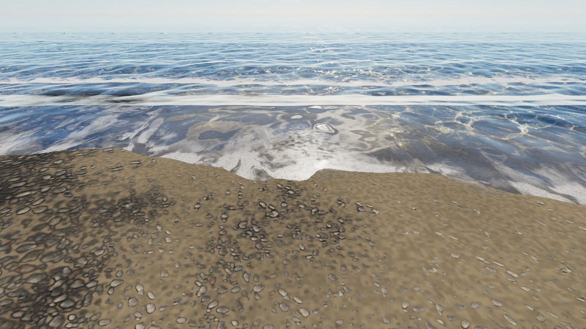 |

- 同梱のプリセット：`Sand`（ベージュ〜茶色の砂浜、初期値）/ `Pebbles`（小石）。Coast の `Sand` / `Pebbles` ボタンで切り替えられます
- 自分の見た目：Project で右クリック > Create > Clearwater > Bed Look。`Color`（色、必須・タイル状）と `Height`（高さ、任意。なければ色の明るさから推定）、1 枚が何 m 四方か（`Tile size`）を指定します
- 重ねる効果：隙間の砂（`Sand fill`）、波紋（`Ripple marks`。`Sand bed` をオンにすると底全体に）、藻の色（`Weed tint`）、色味（`Tint`・`Saturation`・`Brightness`・大きなまだら `Patchiness`・小石の落ち着いた色調 `Muted grade`）
- つや：`Smoothness`（Standard シェーダーの Smoothness と同じ意味。初期値 0 = つやなし）。水より上の乾いた地面に、空の映り込みと太陽のハイライトが付きます。0 のときは負荷も増えません
- 自分の地形に合わせる：次章の「Match the user terrain」を参照

## 自分の地形を使う（Terrain source: User）

歩ける範囲（緑の四角）の地面を、自分で作ったメッシュや Unity の Terrain にできます。岩場の入り江や、岸壁のある港のように、線と断面では作れない形に使います。

| メッシュの入り江 | 岸壁のある港 | Unity の Terrain |
| --- | --- | --- |
| 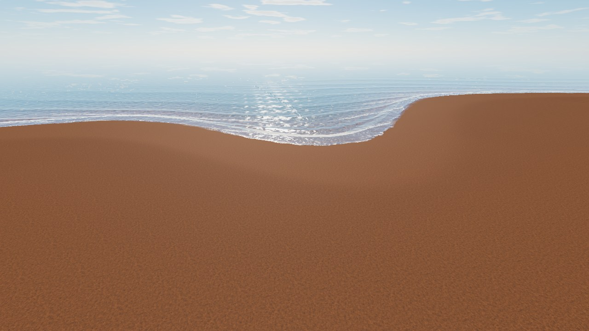 | 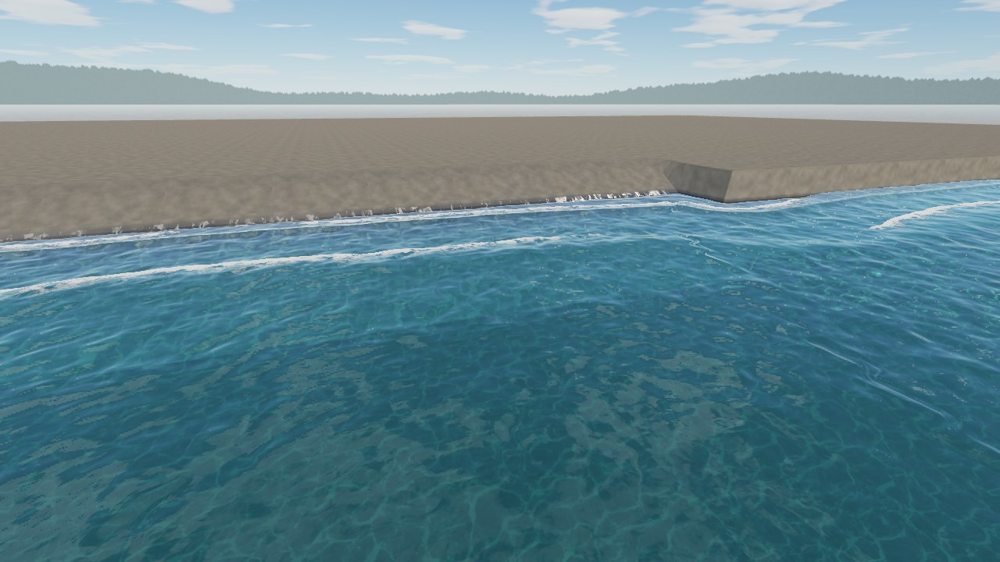 | 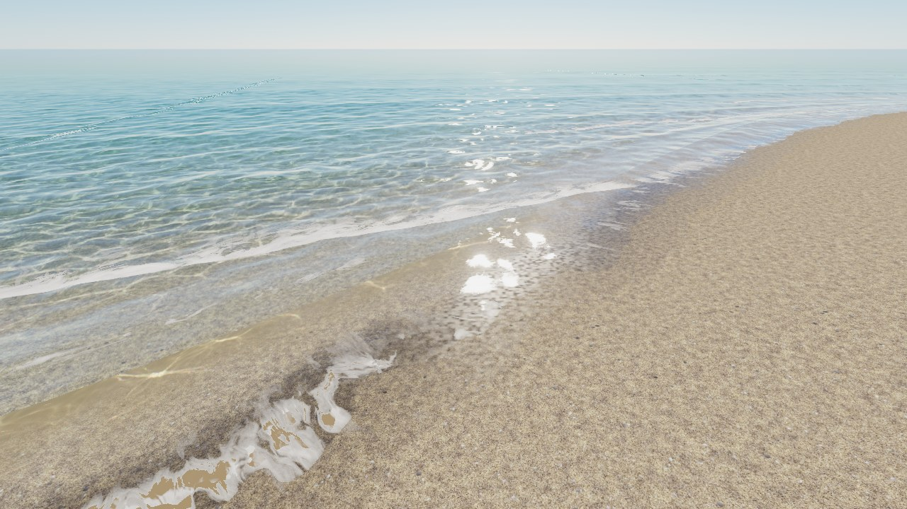 |

1. 地形のメッシュ・Terrain を一つの親オブジェクトの下にまとめます。当たり判定も自分で付けます（Mesh Collider・Terrain Collider など）
2. Coast の `Terrain source` を `User` にし、`User terrain` にその親を指定します
3. Coast の線を、歩ける範囲の端で地形の波打ち際（Waterline：地形が水面の高さ 0 と交わる所）に合うように描きます
4. Bake

Bake すると：

- 地形の見た目と当たり判定は、自分のマテリアル・コライダーのままです。Clearwater は地形を上から見た高さを焼き込み、水面の色・波・水底の光・Seabed（水底を描くオブジェクト）をそれに合わせます
- 歩ける範囲の中では、地形が水面と交わる線を見つけて波打ち際にします（描いた線はその外側の部分だけ使われます）。線を `Closed` にしたときは差し替えないので、線を波打ち際に合わせて描いてください
- 地形の外側は、線と断面から Clearwater が作る地形（生成地形）のままです。その生成地形が、`Seam width`（初期値 20 m）の幅の境目で地形の縁の高さになめらかにつながります
- 地形の上には、水中の光の模様と、波打ち際の濡れ・泡が重なります。これは水の下に作られる 2 つの Projector（Unity のコンポーネント）「User Terrain Caustics」「User Terrain Beach」が描きます。Projector は地形と同じレイヤーにかかるので、そのレイヤーの他の物にもかかります
- 生成地形の当たり判定はオフになります（歩ける範囲の端の見えない壁は残ります）
- 打ち上げの速さと距離は、地形の波打ち際の傾きから決まります
- 地形を動かしたり作り替えたりしたら Bake し直します（Inspector が知らせます）

外側を同じ見た目にするには、`Bed look` の「Match the user terrain」を押します。地形の大部分を覆うマテリアル（Terrain なら一番多く塗られたレイヤー）のテクスチャ・色・1 枚の大きさ・Smoothness から Bed look が作られます（`Specular Highlights` と `Reflections` が両方オフなら、つやなし）。これはシーンと同じフォルダに「（シーン名） Bed Look」として保存され、Coast に設定されます。境目の外側と遠くの水底が地形と同じ見た目になり、明るさなどはその Bed look で調整できます。

Unity の Terrain は、高さを Terrain のデータから直接読みます（メッシュと重なる所は高いほう）。水底の平均の色と「Match the user terrain」は、塗られたレイヤーから取ります。標準の Terrain シェーダー（Standard）はテクスチャのアルファを Smoothness として使うので、アルファ付きのテクスチャだと地面が鏡のように光ります。つや消しにしたいときは、`Nature/Terrain/Diffuse` のマテリアルを Terrain に指定してください。

Bake で見つかった問題は、Coast の Inspector に番号付きの警告として出ます。Scene ビューには同じ番号の赤い印が出て、「Show」でその場所を映せます。

| 警告 | 何が起きるか | 直し方 |
| --- | --- | --- |
| 歩ける範囲に、地形で覆われていない所がある | そこには立てる地面がなく、落ちる | 地形で覆うか、`Ground Half Size` を小さくする |
| 地形が、焼き込む範囲（歩ける範囲と境目）からはみ出している | はみ出した所に生成地形が重なって見える | 地形を小さくするか、`Ground Half Size` か `Seam width` を大きくする |
| 境目が急（高低差が境目の幅の 0.2 倍を超える） | 地形のまわりに土手や溝ができる | `Seam width` を広げるか、縁の高さが生成地形に近くなる所まで地形を延ばす |
| Coast の線が、歩ける範囲の端で地形の波打ち際から 5 m 以上離れている | 波打ち際が端でずれる | 線の端を地形の波打ち際に合わせる |

## プールを置く（Clearwater Pool）

海とは別の高さに水面を置けるプールを、いくつでも追加できます。リゾートの建物なら、1 階の屋内プールと 2 階のテラスにあるプールを、海と一緒に置けます。水面・水中・光の模様・触ったときの波紋は海と同じ仕組みで、打ち寄せる波と波音はありません。

| 1 階の屋内プール（部屋が映る） | 2 階のテラスのプール | プールの水中 |
| --- | --- | --- |
| 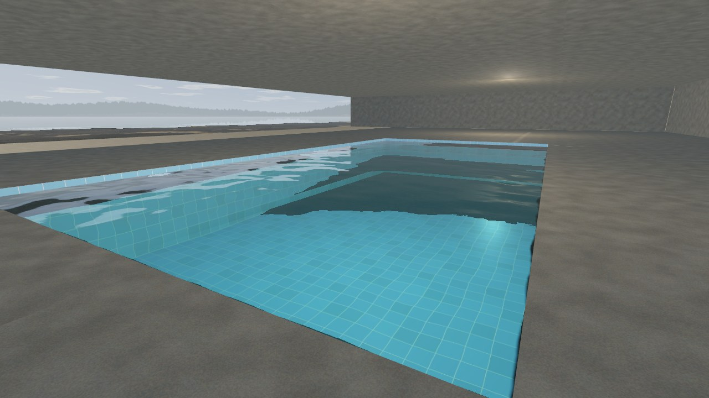 | 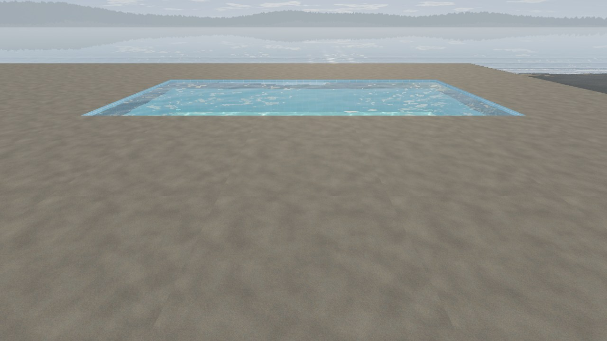 | 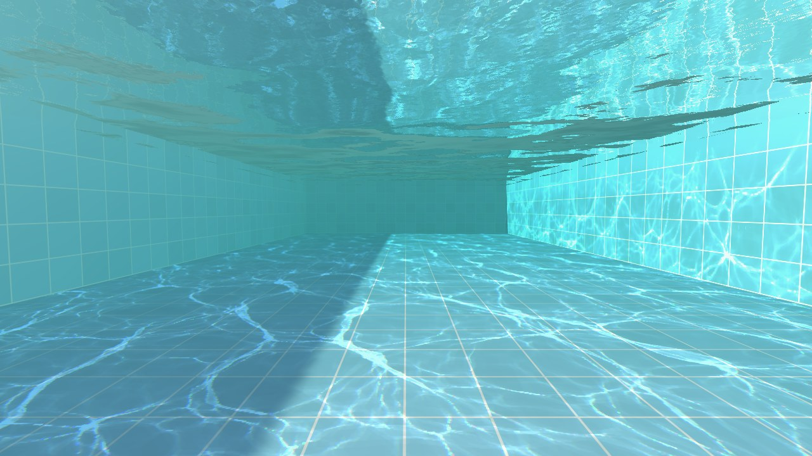 |

同じ水面の高さのプールだけで海がないワールドなら、Pool を使わずに前章の「自分の地形」でも作れます。`Shore waves` をオフにし、線を `Closed` にしてプールを囲みます。水は地形が水面より低い所にだけ見えるので、水面の高さが同じなら、プールがいくつあっても使えます。線は全部を囲む輪で構いません（1 つだけ囲んでも見た目はほぼ同じです）。

Pool の置き方：

1. `Tools > Clearwater > Add Pool` で「Pool」を置き、プールの水面の高さに合わせます。オブジェクトの位置が水面です。回転はさせません
2. 子の「Basin」の下に、プールの水槽（壁と底。まわりのデッキも入れて構いません）のメッシュを入れます。当たり判定も自分で付けます。天井や飛び込み台は入れません。上から見て一番高い面が底として焼き込まれるためです
3. `Size`（水面の範囲、x と z）を水槽の内側より少し大きめにします。水が見えるのは水槽が水面より低い所だけなので、大きめで構いません
4. Pool の Inspector の **Bake** を押します（Coast の Bake でも、すべてのプールが焼き込まれます）

設定：

- `Wave Strength`：水面の揺れ（海の波を 1 として。初期値 0.35）。光の模様の濃さも同じだけ弱まります
- `Indoor`：屋内。太陽の光（光の模様・ギラつき・日の当たる底）がなくなり、空の代わりに部屋が映ります。部屋が映るのはリフレクションプローブからなので、プローブを置かないと何も映りません
  - プローブは Box Projection をオンにします
  - VRChat では Baked のプローブが軽く、Realtime は重くなります。【未確認】Baked のプローブでの見え方は、実ワールドでまだ試していません
- `Fog Distance`：水中の見通し（m）

Bake すると：

- プールの子に「Pool Water」（水面）、「Pool Underwater」（水中）、「Pool Caustics」（壁と底、プールの中のアバターに落ちる光の模様）ができます。素材はシーンのフォルダーの `Pools/` に保存されます
- 海はプールの範囲（上から見た四角の中で、底から水面までの空間）に入り込みません。プールの底が海面や生成地形より低くても、海の水面・地面・光の模様は出ず、生成地形の当たり判定もその部分は抜かれます
- プールを動かしたら Coast も Bake し直してください。し直すまでは、海の当たり判定と穴が前の位置に残ります（Inspector が知らせます）
- どの水の中にいるかは、プールの範囲で判定します。頭がプールの中なら、プールの水中の表現と水中の音になります。画面や写真のカメラも、それぞれがいる水の水中の表現になります
- 波紋は、自分がいる水にだけ付きます。プールの上・中・すぐ横にいれば、そのプールです。【未確認】足や手で触れたとき、タップしたときにプールに波紋が出るかは、実ワールドでまだ試していません
- 下の階から、上の階のプールを水面の下から見た表現は出ません

Bake で見つかった問題は、Pool の Inspector に番号付きの警告として出て、Scene ビューに印が出ます。

| 警告 | 何が起きるか | 直し方 |
| --- | --- | --- |
| 水がない | 水面が描かれない | Pool の位置を水面の高さにする。Basin から天井やカバーを外す |
| 水槽が `Size` の外まで水面下に続いている | その部分で水が途切れる | `Size` を大きくする |
| ほかのプールと同じ高さで重なっている | 水中になるのは一度にどちらか一方だけ | プールの位置か高さをずらす |
| 回転している | 水面は回転せず、ワールドの軸にそろった四角のまま | Pool は回転させず、Basin の中身を回す |

できないこと：

- 水越しに別の水を見ること（ガラス張りのプール越しの海など）。奥の水は映りません
- プールの打ち寄せる波
- 回転したプール（範囲は軸にそろった四角です。斜めのプールはそれを囲む四角で置きます）

## 物を置く（Clearwater Stamp）

海岸の上に置いた物は、`ClearwaterStamp` を付けてから Bake すると、海岸の一部として扱われます。

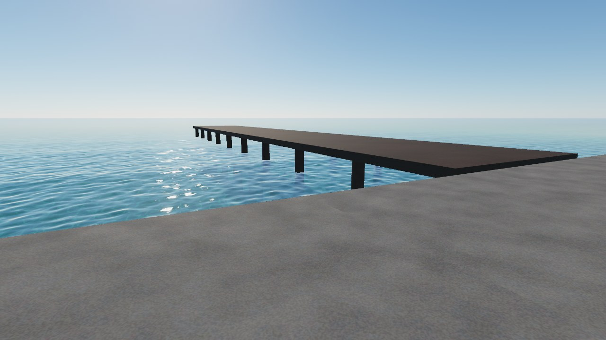

| モード | 使い方 | 効果 |
| --- | --- | --- |
| Obstacle | 水中に立つ岩・杭・流木など、実際に見える物に付ける | 波がその物に当たって砕け、周りに白波ができる。`Receive Caustics` で水中部分に光の模様が落ちる（ClearwaterProps レイヤーに移動） |
| Raise Ground | 形を作るための見えないブラシ（任意のメッシュ） | その上面が地面になる（砂州・岩棚）。水底・歩ける地面・波がすべて追従 |
| Carve Ground | 同上 | その上面まで地面が掘られる（潮だまり・水路） |

ブラシは Bake のあとは見えなくなり、Scene ビューにはワイヤーフレームで出ます（アップロードには含まれません）。スタンプの周りには 30° ほどの斜面が自動で付きます。スタンプを動かしたら Bake し直してください。

## 波・明るさ・雲を変える

波・明るさ・雲・音量を変える設定の置き場所です。マテリアルは `Assets/Clearwater/Generated` の中の、シーンのフォルダーにあります（「焼き込みはシーンごと」）。

- 波の大きさ：Water・Seabed マテリアルの `Breaker height`（砕ける波の高さ）/ `Run-up`（打ち上げが届く高さ。`Breaker height` の倍数）
- 波が沖のどこから現れるか：Water マテリアルの `Swell start depth`（初期値 2.6 m）。水深がこれより浅い所からうねりが現れ、0.8 m 浅い所で本来の高さになります。深くするほど沖から見えます（沖ほど波は低い）。海岸の断面の最深部より深くすると海全体にうねりが出て、そのぶん重くなります（範囲 0.5〜6 m）
- 波打ち際の白波：`Whitewater height`（打ち上げる波の先端の盛り上がり、初期値 3 cm）/ `Foam relief`（泡の凹凸の陰影。近くで見るとき用、初期値 0 = なし）
- 打ち上げの速さと距離は、Bake のときに浜の傾きから自動で決まります。坂に投げたボールと同じ動きで、緩い浜ほどゆっくり遠くまで上がります。浜の傾きは Coast の `Beach Slope`（初期値 0.1）です
- 明るさ：水・Seabed・空・水中のマテリアル（Water・Seabed・Sky・Underwater）の `Sun intensity` / `Exposure`。4 つとも同じ値にします
- 雲：空のマテリアル（Sky）の `Clouds`
  - `Cover`（0 = なし、初期値）、大きさ、流れる速さと向きを決めます
  - 水面の反射、水中から見上げたときに空が見える丸い範囲、濡れた砂の映り込みにも同じ雲が出ます。Inspector で変えると、水面と Seabed のマテリアルにも自動でコピーされます
  - 雲が流れるのはワールドの実行中です（Scene ビューでは Always Refresh をオン）
- 遠景の陸：空のマテリアル（Sky）の `Distant land`。水平線のどれだけを陸（松林の岬）が占めるかを 0〜1 で決めます（0 = 一周すべて海、1 = 一周すべて陸、初期値 0.5）。陸は海と反対側を中心に広がり、端は海面までなだらかに下がります。どちらが海かは、Coast の Bake がうねりの来る向きから決めます（海岸がなければ +Z 側）。雲と同じく、水面と Seabed のマテリアルにもコピーされます
- 波紋・波音の音量：シーンの「Clearwater Controller」
- 水中の見え方：水中のマテリアル（Underwater）の `Fog density`（見通し。1 で水面から見た水と同じ濃さ、小さいほど遠くまで見える。初期値 0.2）/ `Fog saturation`（遠くで行き着く水の色の濃さ。初期値 0.7）/ `Fog brightness`（その色の明るさ。初期値 1）。水面から見た水の色は変わりません

## 時刻と空（Clearwater Sky）

空の色は、大気が日光を散らす様子を物理に沿って計算したものです。空気の分子が青い光をよく散らすので昼の空は青く、夕方は赤い光だけが長い空気を抜けてきます。太陽の周りの白いまぶしさは細かい粒子の散乱、日没後の深い青紫はオゾンの吸収です。この計算はエディターで一度だけ行って表（`Assets/Clearwater/Generated/SkyLUT.asset`）に焼き込み、実行中は表を引くだけです。

時刻を変えると、空の色と一緒に、太陽の光の向きと色、アバターやワールドに当たる環境光、空の映り込みも変わります。夜は満月が太陽の反対側から照らし、星と天の川が天の北極の周りを回ります。

### 使い方

Build Scene で作ったシーンでは、太陽（Sun）に「Clearwater Sky」コンポーネントが付いています。前からあるシーンには、`Tools > Clearwater > Use Clearwater Sky and Sun` を一度実行すると付きます。ワールドの太陽をそのまま使うシーン（Add to Current Scene で「使わない」を選んだとき）には付かず、時刻のない空（太陽 31° の午後の空）のままです。

時刻の扱いは 2 通りです。

- 時刻を止める（`Cycle` オフ、初期値）：`Time of day` の空のまま変わりません
- 時刻を進める（`Cycle` オン）：インスタンスが開いたときに `Time of day` から始まり、`Day minutes` 分（初期値 24 分）で 1 日が過ぎます。開始の時刻はインスタンスのオーナーが配るので、後から入った人にも同じ時刻の空が見えます

Inspector で値を動かすと、Scene ビューと Game ビューにすぐ映ります。初期値（16:30、北緯 35°、夏至）では、太陽の位置と光が時刻のない空と同じになります。

| 項目 | 内容 |
| --- | --- |
| `Time of day` | 時刻。その土地の太陽の時刻で、12 時に太陽が一番高くなる |
| `Cycle` / `Day minutes` | 時刻を進めるか / 1 日にかかる実時間（分） |
| `Latitude` / `Day of year` | 緯度 / 1 月 1 日から数えた日。太陽の高さ、昼と薄明の長さが決まる |
| `North` | ワールドの中で北がどちらか（+Z から時計回りの角度）。ボタン `North as the fixed sky's` で初期値に戻る |
| `Moon` | 満月を出す。夜の明かりになる |
| `Night brightness` | 月夜の明るさ（昼に対して。初期値 0.05） |
| `Stars` | 星と天の川の明るさ |
| `Underwater Glow` | 日も月も光らない夜に、水中から見て水に残すほのかな青緑の明るさ（初期値 1。0 で真っ暗、3 でかなり明るい） |
| `Update interval` / `Probe interval` | 時刻を進めるとき、空を更新する間隔（初期値 0.1 秒）/ 映り込みを描き直す間隔（10 秒） |

夜の明るさには、目が暗さに慣れる分を入れています。光の量は昼から月夜までに 100 万分の 1 ほどになりますが、画面は真っ暗にならず、月夜は昼の 5% ほどの明るさで、色が褪せて青みがかって見えます。日の出前と日没後は、暗くなった景色に対して地平線の残照が明るく見えます。

### ワールドの中で変える

`Tools > Clearwater > Add Sky Control Panel` を実行すると、空と波のパネルと、スポーン地点の前の砂浜に小石（Sky Stone）が置かれます。パネルの左の「Sky」には、時刻・雲の量・雲の流れる速さ（Cloud drift、0〜60 m/s）・1 日の長さ（A day in）のスライダーと、時刻を進めるかのトグル（Day goes by）が並びます。右の「Waves」には、岸の波の高さ（Shore waves）・沖のさざ波の強さ（Ripples）・さざ波の速さ（Ripple speed）のスライダーと、全部を初期状態に戻すボタン（Reset all）が並びます。パネルは普段は隠れていて、小石を Interact する（表示は Sky & Waves）と、小石の上に、目より少し低い高さでこちらを向いて出ます。小石は好きな場所へ動かしてください。すでにあるときは、小石を同じ位置に残して作り直します。

- 誰でも操作でき、変えた空はインスタンスの全員に同じく反映されます。操作した人が Clearwater Sky のオーナーになって値を配るので、後から入った人にも今の空が見えます
- 時刻を進めているときは、時刻のスライダーも時刻に合わせて動きます。途中でスライダーを動かすと、その時刻から進み直します
- 1 日の長さは 1 分から 24 時間（実時間と同じ）までの 17 段階です。変えても時刻は飛ばず、その時刻から新しい速さで進みます
- 小石のところへ行かなくても、どこでもパネルを呼び出せます。VR では左手のトリガーを 2 回すばやく引くと、左手の上に小さめ（ワールドの 0.4 倍）のパネルが出て、手についてきます（右手で操作します）。デスクトップでは Tab キーで、目の前 1.2 m に出ます。同じ操作をもう一度すると隠れます。小石の `Call Anywhere` でオフにでき、キー（`Desktop Key`）、2 回の間隔（`Double Tap Time`）、手の上の大きさ（`Hand Size`）、デスクトップでの距離（`Desktop Distance`）も変えられます
- パネルを出すか隠すかは、見ている人ごとです。小石をもう一度 Interact するか、パネルから 6 m 離れると隠れます（小石の `Close Distance`。0 にすると離れても隠れません）。置いた場所のまま出すときは、小石の `Show Above` をオフにします。いつも出しておくときは、パネルを有効にして小石を消してください
- 雲の速さを変えても雲は飛ばず、今の位置から新しい速さで流れます
- 岸の波の高さ（Shore waves）は、0 から作ったときの 2 倍（30 cm 未満なら 30 cm）までです。砕ける波・打ち上げ・泡・濡れた砂と波音の大きさがまとめて変わります。0 にすると、Coast の `Shore waves` をオフにしたときと同じ静かな水際になります（泡や濡れた砂も消えます）
- 沖のさざ波（Ripples）は、海の水面の揺れと水底の光の模様の強さです。0% で鏡のような凪になります。プールの水面は変わりません
- さざ波の速さ（Ripple speed）は 0〜200% です。変えても模様は飛ばず、今の形から新しい速さで動きます。水面の波はプールと共通なので、プールの波も同じ速さになります
- パネルの初期値（ワールドの開始時と Reset all で戻る値）は、パネルと一緒に作られる「Sky & Waves Settings (Clearwater)」の Inspector でまとめて変えられます。時刻・Day goes by・1 日の長さ（実体は Sun の Clearwater Sky の値）、雲の量・雲の流れ・岸の波・さざ波・さざ波の速さです。雲と波は、変えるとその場で関係するマテリアル（空・水面・水底・水中など）にも書き込まれるので、Scene ビューの見た目もすぐ変わります
- Reset all は、この初期値に全員まとめて戻します（戻す時刻は、シーンを保存したときの Clearwater Sky の値です）
- 時刻の同期は Clearwater Sky が、雲と波の同期は Sky & Waves Settings が受け持ちます（同期するオブジェクトが 2 つなので、ネットワーク ID も 2 つ使います）
- パネルの見た目（子の Face）と小石の見た目（子の Look）は UI レイヤーに置くので、VRChat のカメラ（写真・配信用）には写りません。カメラの設定で UI を表示したときだけ写ります。操作を受ける親（パネルの VRC Ui Shape、小石の当たり判定）は UI レイヤーにしません。UI レイヤーのものは、VRChat のメニューを開いている間しか触れないためです
- パネルの親と小石は Walkthrough レイヤーに置くので、アバターはぶつからずに通り抜けます
- パネルの文字は TextMesh Pro で、スライダーなどの図形は VRChat の超解像 UI シェーダー（`VRChat/Mobile/Worlds/Supersampled UI`）で描くので、VR でも縁がにじみにくくなります。プロジェクトに TextMesh Pro の Essential Resources がないときは、パネルを作るときに取り込みます（`Assets/TextMesh Pro` ができます）

自分の Udon から変えるときは、Clearwater Sky の `SetHour(時刻)`・`SetCycle(true/false)`・`SetDayMinutes(分)`・`ResetTime()` と、Sky & Waves Settings（`ClearwaterSettings`）の `SetClouds(0〜1)`・`SetCloudDrift(m/s)`・`SetShoreWaves(m)`・`SetRipples(0〜1)`・`SetRippleSpeed(倍率)`・`ResetAll()` を呼びます。どれも全員に同期します。

### 一緒に変わるもの

- 太陽の Directional Light：向き・色・強さ。夜は月の光になります
- アバターとワールドの環境光：Lighting の Environment Lighting を Gradient にして、空・地平線・地面の 3 色を時刻に合わせて変えます
- 空の映り込み：太陽の子に置いた、空だけを映すリフレクションプローブ「Sky Reflection (Clearwater)」を描き直します（時刻を進めるときは 10 秒ごと）

ワールドが自分で置いたリフレクションプローブとライトマップは、焼いたときの明るさのままです。夜のシーンで明るく浮くときは、それらを外すか、夜向けに焼き直してください。建物の中に空の光を入れるには、次の節の方法を使います。

### 建物の中の空の光（VRC Light Volumes）

ライトマップに空の光を焼くと、時刻を変えても室内はそのときの明るさのままです。[VRC Light Volumes](https://github.com/REDSIM/VRCLightVolumes) を入れたワールドでは、空の光だけを Additive の Light Volume に焼き、その色と強さを Clearwater Sky が時刻に合わせて変えられます。窓から入る空の光が、昼は白く、夕方は橙に、夜は月明かりになります。

1. 建物を覆う Light Volume を置き、`Additive` にします。部屋の中だけを覆うものをもう 1 つ重ねると、室内だけを明るくできます（下の `Sky Light Gains`）
2. 空だけで焼きます。Bakery なら Skylight を白・強さ 1・`Hemispherical`（上半分だけ）にし、ほかの光源はすべて切ります。地面からの照り返しが欲しいときは、焼く間だけ砂や海の色の板を置きます
3. その Light Volume の `Bake` を切り（焼いた空の光が残ります）、ライトマップと残りの Light Volume を、照明など時刻によらない光だけで焼き直します
4. Sun の Clearwater Sky の `Sky Light Volumes` に、その Light Volume（LightVolumeInstance）を入れます

| 項目 | 内容 |
| --- | --- |
| `Sky Light Volumes` | 空だけで焼いた Additive の Light Volume |
| `Sky Light Gains` | Light Volume ごとの倍率（同じ順。なければ 1）。室内の目は屋外よりずっと暗い光に慣れるので、部屋の中だけを覆う Light Volume を 3〜4 倍にすると、測った明るさではなく見た目の明るさになります |
| `Sky Light Horizon` | 入る光のうち、地平線の近く（窓・軒の下）から来る割合（初期値 0.6）。残りは空の高い所から |
| `Sun Bounce` | 地面や床が返す日差しの割合（水平な地面に当たる日差しに対して。初期値 0.15）。日の差し込む部屋が、その照り返しで明るくなります |
| `Sky Reflection Probes` / `Sky Probe Gain` | 空だけで焼いたリフレクションプローブ（Custom）と、その強さの倍率。強さが空の光に合わせて変わります。照明だけで焼いた同じ範囲のプローブと対にすると、Unity が 2 つを半分ずつ混ぜるので、映り込みも光と同じく足し合わされます（そのときは、どちらも強さを 2 倍に） |
| `Lamp Light Volumes` / `Lamp Night Gain` | 照明だけで焼いた Additive の Light Volume と、夜に足す量（初期値 2）。夜が深まるほど強くなり、昼は 0 です。夜の室内では目が灯りに慣れるので、ライトマップの照明がその分だけ明るく見えます |

- 日差しそのもの（窓から差し込む光と影）は、太陽の Directional Light がリアルタイムで描きます
- 屋内のライトプローブは使わないでください。焼いたプローブがあると、屋外のアバターまでそのプローブで照らされ、時刻の環境光が届きません。屋内のアバターは Light Volume が照らします
- 建物のマテリアルのシェーダーが Additive の Light Volume をライトマップの上に足せる必要があります（Filamented は `VRC Light Volumes` をオン。Mochie Standard は既定で足します）
- `Sky Light Volumes` の箱（最初の 4 つ）は、浜と水にとっての建物です。箱の中の浜と水には Additive の Light Volume を足しません（空の光は浜がもう受けているので、二重になって箱の形に明るくなるため）。箱の中にある Point Light Volume（室内のダウンライトなど）は、どこの浜と水も照らしません（Light Volume は壁を知らないので、光が壁を抜けて外の砂に漏れるため）

### できないこと

- 月はいつも満月で、太陽のちょうど反対側にあります。満ち欠けと月食はありません
- 雲の量は時刻で変わりません（Sky マテリアルの `Clouds` のまま）
- 星座は実際の星空ではありません。数と明るさの分布だけを本物に合わせています

## トーンマッピング（ポストプロセス / シェーダー内）

トーンマッピングは、明るすぎる色を画面に出せる範囲へ丸める処理です。Clearwater には 2 つの方式があります。

- ポストプロセス（PPv2、初期値）：画面全体をまとめて Post Processing Stack v2 でトーンマップします。シーン全体が同じトーンカーブになり、ブルームで太陽や水面のギラつきがにじみます。水が画面から拾う物（自分の地形、水の中のアバター）も、描かれたままの明るさで使えます。一方で、アバターにもトーンマップがかかり、色が少しくすんで暗めになります。Quest ではポストプロセスが使えません
- シェーダー内：水・Seabed・空・水中フォグの各シェーダーが、自分の出力をトーンマップします。ワールドにポストプロセスは要らず、アバターの見た目も変わりません。ただし、水が画面から拾った色は、トーンカーブを逆にたどって元の明るさに戻して使います。そのため、トーンマップされていない物の白に近い色（日の当たる Standard の地面など）は、何倍にも明るくなります。プールのタイルや岸壁のような明るい地形が、水越しに白く飛んで見えます

Build Scene・Add to Current Scene・デモシーンは、ポストプロセスにします（Post Processing パッケージがないプロジェクトではシェーダー内）。`Tools > Clearwater > Tone Mapping > In Shaders` でシェーダー内に、`In Post-processing (PPv2, default)` でポストプロセスに切り替えます。ポストプロセスにすると、Clearwater のマテリアルの `Tone map in shader` がオフになります。グローバルな Post-process Volume は「PostProcessing」レイヤーに追加されます。このレイヤーがなければ、空いているユーザーレイヤーを「PostProcessing」にします。ワールドの Reference Camera には Post-process Layer が付きます。

プロファイルは `Assets/Clearwater/Generated/ClearwaterPost.asset` で、中身はシェーダーと同じトーンカーブを焼いた LUT（`ClearwaterToneLut.asset`、Color Grading の External モード）と、弱いブルーム（強さ 0.15、しきい値 2。太陽やそのきらめきのような本当に明るい所だけがうっすらにじみます）です。色は、シェーダー内でトーンマップしたときと比べて平均 1/255 以下の差に収まります。

- 明るさはプロファイルの `Post-exposure`、ブルームもここで調整できます。切り替え直してもプロファイルは上書きしません
- マテリアルの `Exposure` を変えたときは、もう一度 `In Post-processing` を選ぶと LUT が焼き直されます

PPv2 に内蔵の ACES は使っていません。明るい所の丸め方が違い、水中から太陽を見ると白い範囲が大きく広がるためです。

## 水面すれすれのカメラ

カメラ（頭・画面・写真カメラ）が水面から 60 cm 以内にあるときは、画素ごとに水の上か下かを決めます。レンズが水面をまたぐと、画面の上側は水上、下側は水中（フォグ付き）に分かれて写ります。この間は水面・水中の処理が少し増えます。

## 水に入ったアバターの半透明な部分

水面は、ほかの半透明の物より先に描き、深度を書き込みません。そのため、アバターの半透明の服や髪は、どのレンダーキューでも水に隠れません。服が水中で消えて体が見える、という透けは起きません。

見え方はレンダーキューで変わります。

| アバターのマテリアル | 水中の部分の見え方 |
| --- | --- |
| 2500 以下（lilToon の半透明の既定値 2460 など） | 水の色を帯び、屈折して見える |
| 2501 以上（3000 など） | 水の色を帯びず、水の上にあるように見える |

水中から見ると、3050 以下は水中のフォグで霞み、3051 以上は霞まずに見えます。ワールドに置く半透明の物（泡のパーティクルなど）も同じ扱いです。水面より後に描かれるので、水中にあっても水の上に重なって見えます。

## VRC Light Volumes

[VRC Light Volumes](https://github.com/REDSIM/VRCLightVolumes)（RED_SIM）を入れたワールドでは、Additive にした Light Volume と Point Light Volume の光が、浜・水底・泡にも当たります。水面には、その光の照り返しが映ります。アバターを照らすのと同じ光なので、夜の浜に置いたランプや焚き火は、そばのアバターと砂を同じように照らします。

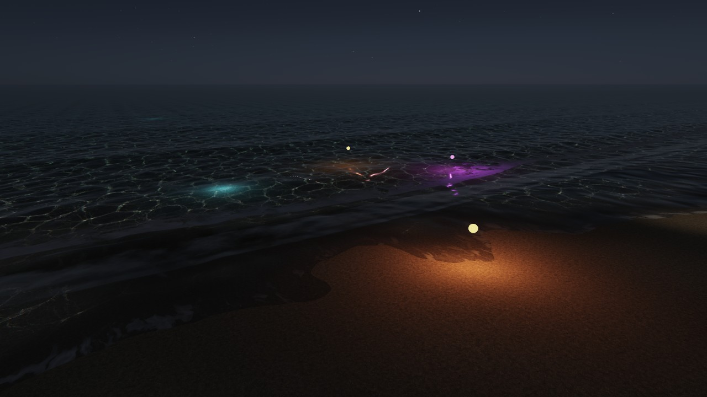

VRChat で試せます：[Clearwater VRCLV demo](https://vrchat.com/home/world/wrld_364c34d1-7e60-4df8-9039-3248d77f2813)（下の「デモで試す」のデモを公開したワールド）

- Light Volumes のパッケージがなくても動きます。シェーダーが読む部分（`LightVolumes.cginc`、MIT）を同梱しているためです。Light Volume のないワールドでは、見た目も負荷も変わりません
- Light Volumes 2.x と 3.0（3.0.0-dev.20 で確認）のどちらでも動きます。3.0 でも、Clearwater は 2.x の読み方（3.0 も出し続けている）で光を読みます。そのため、3.0 で増えた画面の模様の光（クッキー）は、その平均の色で当たります
- 読むのは、Additive の Light Volume と Point Light Volume だけです。Additive でない Light Volume には焼いたときの時刻の明るさが入っていて、時刻の空と合わないため読みません（夜に、砂だけが昼の明るさで浮きます）。時刻によらない光（ランプ・焚き火・建物の灯り）は、Additive か Point Light Volume で置いてください
- 水の中の底に届く光は、空の光と同じだけ水に弱められます。水の中に置いた光も同じ扱いです
- 自分の地形（Terrain source: User）は、そのマテリアルのシェーダーが Light Volumes に対応していれば照らされます。Clearwater が重ねる濡れと泡のうち、泡には光が当たります

### デモで試す

Light Volumes を入れたプロジェクトでは、Build Demo Scenes（「デモシーンで試す」）が、上の画像のデモ「Demo_LightVolumes」も作ります。`Tools > Clearwater > Demo Scenes > Open Light Volumes (VRC Light Volumes)` で開けます。夜 21 時の浜に、Point Light Volume で次の光を置いています。

| 光 | 見どころ |
| --- | --- |
| 砂の上のランプ（暖色） | 砂と、打ち上げた泡が照らされる |
| 浅瀬の上のランプ（暖色） | 水の中の底が照らされ、水面に照り返しの道ができる |
| 水の中のランプ 2 つ（青。浅い所と水深 1.6 m） | 水の中から底を照らす。水の上からも、水の中からも見える |
| 浜を照らすスポット | 上から下に向けたスポットライトの光の輪 |
| 動くランプ | 水際をまたぐ半径 4 m の円を 24 秒で回り、色と明るさを変え続ける。砂・泡・水の中の底の光が付いていき、深い所では水面の下に潜る（`ClearwaterDemoLamp`。速さや範囲は Inspector で変えられます） |

どのランプにも、場所が分かるように小さな光る球を付けています。時刻は空のパネル（Tab キーか左手のトリガー 2 回）で変えられるので、昼と夜で見比べることもできます。

## 負荷の目安

パッケージ 1.0.0 を RTX 4070 Ti SUPER で測った値です。Unity エディターで、VR の片目に近い 2048×2048・視野 90° に同じ視点を繰り返し描き、GPU の完了を待って測りました（Unity のウィンドウは最前面）。シーンは Build Scene のもの（16 時、雲 30%）で、ポストプロセスは含みません。VR の両目では、ほぼこの 2 倍になります。

| 視点 | 負荷（片目） |
| --- | --- |
| 浅瀬で足元を見る | 約 5.7 ms |
| 水上から沖を見下ろす（水が画面いっぱい） | 約 4.8 ms |
| 浜から沖を見る | 約 2.8 ms |
| 水中から水面を見上げる | 約 2.6 ms |

次の条件では、上の値に加えて負荷が増えます。どれも、その条件だけを入れた場合と切った場合を交互に測った差です。

| 条件 | 増える負荷（片目） |
| --- | --- |
| プールの水が画面の大半を占める（水を描かない場合と比べて。画面に映っていないプールは負荷なし） | +1.3〜1.7 ms |
| `Foam relief` を 2 cm にして、波打ち際を近くで見る | +0.45〜0.9 ms（その時の泡の量による） |
| トーンマッピングをポストプロセスで（シェーダー内と比べて。ブルーム込み） | +0.35〜0.5 ms |
| 雲（Cover が 0 より大きいとき） | +0.25 ms |
| 時刻の空（Clearwater Sky。時刻のない空と比べて） | 昼に空を見上げて +0.1 ms、夜空を見上げて +0.15 ms |
| 太陽の影（影を描く分と、浜と水底がそれを読む分。水が奥行き情報を使うので切れません） | +0.1〜0.15 ms |
| 自分の地形（Projector の分） | +0.15 ms 以下 |
| スタンプがある | +0.05 ms 以下 |
| VRC Light Volumes の Point Light Volume 2 つの近くを見る（Light Volume のないワールドでは増えません） | +0.1〜0.4 ms |

## 波音を作り直す

`Tools~/`（Unity には読み込まれないフォルダ）に、波音の加工手順があります。ffmpeg が必要です。

- `Tools~/make_wave_audio.sh <元の録音.flac>`：元録音から 3 種類のループ（`Runtime/Audio/*.ogg`）を作る
- `node Tools~/detect_wave_breaks.js`：波打ち際の音から波が砕ける瞬間を探し、波の時刻表（`Runtime/Audio/WavesShore_breaks.json`）を作る。波音を差し替えたら必ず実行する

## ライセンス

MIT License（`LICENSE`、© 2026 bmbb93 (vbamboo)）。水の表現は clearwater by Aureliengmz（MIT、© Lumaris、`Third Party Notices.md`）を移植したものです。VRC Light Volumes のシェーダーの部品（`Runtime/Shaders/ThirdParty/LightVolumes.cginc`）は RED_SIM によるもので、MIT License です。

## クレジット

- 水の表現：clearwater by Aureliengmz（MIT、© Lumaris）
- 波音：Freesound「Stromboli beach」nicola_ariutti（CC0）
- VRC Light Volumes の光を読む部分：VRC Light Volumes by RED_SIM（MIT）
- 底のテクスチャ：どちらも計算で作ったもので、写真は使っていません（小石は移植元の `tools/make_pebbles.py`、砂は `Tools~/make_sand.py`）
