[日本語](technical.md) | **English**

# How Clearwater VRC works

This document explains how Clearwater VRC draws the sea. It is for people who want to change the code, and for people who want to know the reasons behind its cost and its look. How to use it is in the [README](../README.en.md). Here the same features are described from the side of "what happens inside". Numbers are as of package 1.1.0.

**How to read this.** Chapter 1 (Overview) and chapter 2 (Terms) give you the overall flow; after that you can read the chapters in any order. Chapters 4–8 cover the look of the water, 9–10 baking and pools, 13–14 the sky, and chapter 15 onward is reference material for looking things up. If you are new to Unity, start with the term table in chapter 2. If you change the package, also see the tests in chapter 19. Terms are defined in [CONTEXT.md](../CONTEXT.md) (Japanese), and decisions that are hard to change later are collected in [docs/adr](adr/) (Japanese).

| Chapter | Contents |
| --- | --- |
| [1. Overview](#1-overview-a-few-baked-textures-and-per-frame-gpu-work-draw-the-sea) | The three layers, and the flow of one frame |
| [2. Terms](#2-terms-unity-and-vrchat-basics) | The Unity and VRChat words used in this document |
| [3. Scene contents](#3-scene-contents-what-build-scene-creates) | The objects and layers Build Scene creates |
| [4. Waves](#4-waves-a-46-m-square-of-waves-made-by-fft-repeating-seamlessly-every-60-seconds) | FFT waves, and ripples when you touch the water |
| [5. Seabed](#5-seabed-computed-from-the-baked-shape-not-picked-up-from-the-screen) | Why and how the seabed is computed, shadows |
| [6. Caustics](#6-caustics-a-refracted-grid-drawn-by-a-dedicated-camera) | The light patterns on the seabed |
| [7. Water color](#7-water-color-absorption-scattering-and-reflection-computed-per-pixel) | Absorption, scattering, reflection, looking up from underwater, underwater fog |
| [8. Surf and wave sounds](#8-surf-and-wave-sounds-the-playback-position-of-the-sound-is-the-clock) | Motion at the waterline, the three wave sounds |
| [9. Baked data](#9-baked-data-kept-in-a-folder-per-scene) | What Bake makes, the per-scene folders |
| [10. Pools](#10-pools-copies-of-the-sea-machinery-cut-out-by-area) | Pools as copies of the sea |
| [11. Render order](#11-render-order-the-water-surface-is-drawn-first-among-transparent-objects-and-writes-no-depth) | Queues and depth, avatars' transparent clothes |
| [12. Tone mapping](#12-tone-mapping-one-curve-over-the-whole-screen-post-processing) | How brightness is rolled off |
| [13. Sky](#13-sky-atmospheric-scattering-computed-once-into-a-table-looked-up-by-time-of-day) | The time-of-day sky, eye adaptation, moon and stars, sync |
| [14. Sky panel and pebble](#14-sky-panel-and-pebble-visuals-on-the-ui-layer-input-on-another-layer) | How the sky is changed inside the world |
| [15. Tunable values](#15-tunable-values) | Defaults for the Coast, materials, controller and sky |
| [16. File layout](#16-file-layout) | The role of each file in the package and the project |
| [17. Performance](#17-performance-and-measurement) | Measurements, and the tricks that make it lighter |
| [18. Limits and cautions](#18-limits-and-cautions-what-we-gave-up-for-performance) | What we gave up, what to watch out for |
| [19. Tests](#19-tests-checking-the-bake-math-and-the-bake-warnings) | EditMode tests |

## 1. Overview: a few baked textures and per-frame GPU work draw the sea

Clearwater's rendering splits into three broad layers.

1. **Baking in the editor (Bake).** From the coast line and cross-section, stamps, your own terrain and pools, it bakes the shape of the seabed and how waves reach the shore into textures. The results are saved in a per-scene folder inside `Assets/Clearwater/Generated` (chapter 9).
2. **Per-frame computation on the GPU.** A chain of Custom Render Textures (CRTs) computes the wave height by FFT, and a separate camera draws the caustics (the light patterns) on the seabed.
3. **Udon.** The controller (`Runtime/Udon/ClearwaterController.cs`) decides which water the viewer is in, and switches the ripples, the underwater fog and the wave sounds. The controller has no synced variables. The time-of-day sky is handled by another Udon behaviour, `ClearwaterSky` (chapter 13). The clouds and waves changed on the panel are synced to everyone by a separate object, "Sky & Waves Settings (Clearwater)" (`ClearwaterSettings`), and the controller puts them into the materials (chapter 13).

The water surface shader reads the results of these three layers and decides the color pixel by pixel. In doing so, it **does not pick up the seabed from the screen; it computes it from the baked shape**. This is the single biggest choice that shapes Clearwater's character, and chapter 5 explains it in detail.

### What happens in one frame

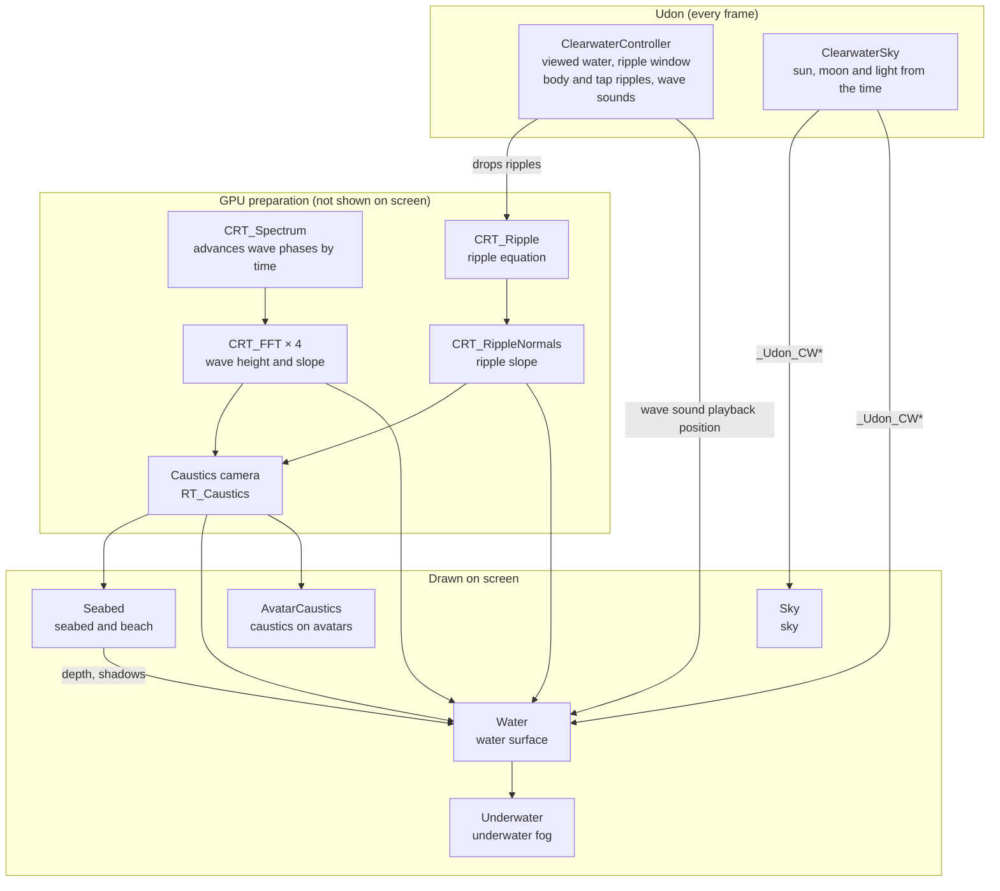

The Udon on the left and the preparation in the middle are "ingredient making" that never appears on screen directly. The five shaders on the right read those ingredients and draw the screen. The preparation makes these three ingredients every frame.

| Ingredient | Contents | Size and format | Coverage |
| --- | --- | --- | --- |
| Wave height (`CRT_FFT_Y1_Surface`) | Height, x and z slopes, squared slopes | 256², half precision, with mipmaps | A 4.6 m square tiled over the whole sea |
| Ripples (`CRT_RippleNormals`) | Ripple slopes | 512², half precision | A 14 m square in front of the viewer |
| Caustics (`RT_Caustics`) | The mesh of light falling on the seabed (red, green and blue separately) | 1024², half precision, with mipmaps | Tiled in 4.6 m squares |

### What the editor bakes

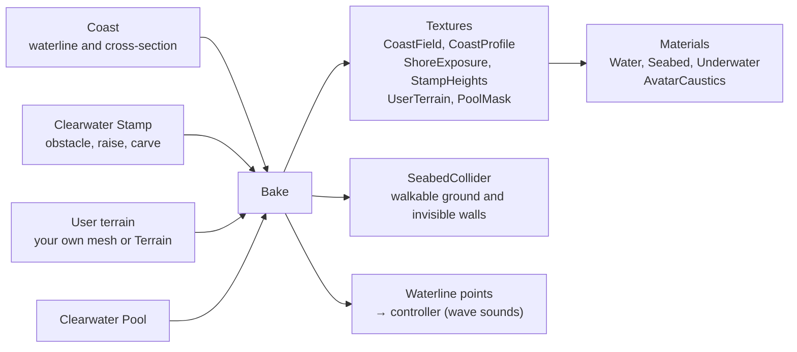

From the line and the cross-section, Bake makes a table of "distance from the waterline" and "depth at that distance". The water surface, the seabed, the underwater fog and the collider all read the same table. That is why the seabed you see and the ground you stand on never drift apart. Only the collider turns the table into a mesh, and even its heights are found by evaluating the shader's own function (`cwFloorDepth`) on the GPU. There is no copy of the terrain math on the C# side.

| What | Where | Main files |
| --- | --- | --- |
| Baking the coast and seabed | Editor | `Editor/ClearwaterCoastBake.cs`, `Editor/ClearwaterUserTerrain.cs`, `Editor/ClearwaterPoolBake.cs` |
| Assembling the scene and assets | Editor | `Editor/ClearwaterSetup.cs` |
| Waves (FFT) and ripples | GPU (CRT) | `Runtime/Shaders/CRT_*.shader` |
| Caustics | GPU (dedicated camera) | `Runtime/Shaders/Caustics.shader` |
| Water surface, seabed, underwater, sky | GPU (rendering) | `Water.shader`, `Seabed.shader`, `Underwater.shader`, `Sky.shader` and `*.cginc` |
| Viewed water, ripples, sound | Udon | `Runtime/Udon/ClearwaterController.cs` |
| Time-of-day sky (sun, moon, stars and their light) | Editor (atmosphere computation), Udon | `Editor/ClearwaterAtmosphere.cs`, `Runtime/Udon/ClearwaterSky.cs` |
| Sky panel | Udon, editor | `Runtime/Udon/ClearwaterSkyPanel.cs`, `ClearwaterSkyPanelOpener.cs`, `Editor/ClearwaterSkyEditor.cs` |

Positions passed to the shaders are in "water coordinates": the position relative to the water object, with the z axis flipped. This matches the axes of the original WebGL demo (`ClearwaterCommon.cginc`).

## 2. Terms: Unity and VRChat basics

This lists only the words used in this document. Clearwater's own terms (Sea, Bed, Waterline, Swash and so on) are in [CONTEXT.md](../CONTEXT.md) (Japanese).

| Term | Meaning | Example in Clearwater |
| --- | --- | --- |
| Scene | The layout data for one world. The unit you upload to VRChat | `Assets/Clearwater/Scenes/Clearwater.unity` |
| GameObject | A "thing" placed in the scene. It has a position, and components give it functions | The water surface, the sun, the controller |
| Mesh | A shape (a set of triangles) | The water plane, the seabed grid, the collider |
| Shader | A program the GPU runs to compute the color of each pixel. It decides most of the look | `Water.shader` |
| Material | Settings for which shader to use, with which numbers and textures. Changing the numbers changes the look | `Water.mat`, `Seabed.mat` |
| Texture | An image. Shaders also use it as a "table of numbers" | Wave height, the baked coast |
| Custom Render Texture (CRT) | A texture that a shader rewrites every frame. The standard way to make the GPU compute things in VRChat | Wave FFT, ripples |
| Render texture | A texture that receives what a camera draws | Caustics (`RT_Caustics`) |
| Depth texture | For each pixel, "the distance from the camera to the nearest object". VRChat creates it only when there is a Directional Light that casts shadows | Distance to objects in the water, and for the underwater fog |
| GrabPass | A way to capture the screen drawn so far | Showing avatars in the water through the water |
| Render queue | A number that sets the draw order. Lower numbers draw first | Water surface 3000, underwater fog 3050 |
| Projector | A component that projects an image from above. It works whatever the target's shader is | Caustics on avatars |
| Layer | A category for objects (0–31). Cameras and colliders can choose which layers they handle | 23 = caustics, 5 = UI |
| Collider | A collision shape. Separate from the look, it is the shape you stand on or bump into | Walkable ground, invisible walls at the edges |
| Reflection probe | Captures the surroundings and uses them for reflections on objects | "Sky Reflection (Clearwater)", which captures only the sky |
| Udon / UdonSharp | Scripts that run in VRChat. UdonSharp is the version you write in C# | `ClearwaterController.cs` |
| Synced variable / owner | A variable shared with everyone in the instance, and the person who can change it | The time-of-day sky (chapter 13) |
| Global shader variable | A variable every shader can read. Udon can write only names that start with `_Udon` | `_Udon_CWSun` |
| Editor extension | A tool that runs only in the Unity editor. It is not included in the world | `Tools > Clearwater > Build Scene` |
| Play mode / ClientSim | Running the world inside Unity as a test. ClientSim imitates a VRChat player | Checking the look |

## 3. Scene contents: what Build Scene creates

`Tools > Clearwater > Build Scene` creates a scene with the following objects. Add to Current Scene adds only the water set, the controller, the caustics machinery and the coast to an existing scene.

| Object | Child | Role | Layer |
| --- | --- | --- | --- |
| Clearwater | | Water surface (`Water.mat`). sortingOrder −1 | 0 |
| | Seabed | Seabed and beach (`Seabed.mat`). A grid that moves with the viewer's feet | 0 |
| | Underwater Volume | The box for the underwater fog (`Underwater.mat`). Shown only when a camera is underwater or near the surface | 0 |
| | Avatar Caustics Projector | Caustics on avatars. Moves with the viewer, above them | 0 |
| | Wave Audio | The three wave sounds (chapter 8) | 0 |
| | Seabed Collider | Walkable ground (made by Bake) and invisible walls at the edges | 0 |
| | User Terrain Caustics / Beach | Caustics and beach on your own terrain (only when you use your own terrain) | 0 |
| Sun | Sky Reflection (Clearwater) | The sun's Directional Light and Clearwater Sky (chapter 13). The child is a reflection probe that captures only the sky | 0 |
| Clearwater Controller | | The Udon controller | 0 |
| Caustics Rig | Caustics Grid, Caustics Camera | The grid that draws the caustics and its dedicated camera. Underground at y = −20000 | 23 |
| VRCWorld | | VRChat world settings and spawn point | 0 |
| Reference Camera | | Source of the VRChat camera settings (Far Clip is 0.8 × Sea size) | 0 |
| Preview Camera (editor only) | | For checking in the editor. Not included in uploads | 0 |
| Coast (editor only) | | The coast line and cross-section. Not included in uploads | 0 |
| Sky Control Panel (Clearwater) | Face | The sky panel (added by Add Sky Control Panel; chapter 14) | 17 / 5 |
| Sky Stone (Clearwater) | Look | The pebble that brings up the panel (same as above) | 17 / 5 |

These are the layers in use. Clearwater names each layer if it is free.

| Number | Name | Use |
| --- | --- | --- |
| 5 | UI | The looks of the sky panel and the pebble. Not captured by VRChat's camera (for photos and streaming) |
| 9, 10, 18 | Player, PlayerLocal, MirrorReflection | Avatars. Lit by the caustics Projector |
| 17 | Walkthrough | The panel's parent and the pebble's collider. Avatars pass through them |
| 22 | ClearwaterProps | Stamps that receive caustics (Receive Caustics) |
| 23 | Caustics | The caustics grid. Only the dedicated camera draws it |

## 4. Waves: a 4.6 m square of waves made by FFT, repeating seamlessly every 60 seconds

The motion of the water surface is a wave pattern on a 4.6 m square, divided into 256 × 256, tiled over the whole sea. The pattern does not depend on position, so the cost of this computation stays the same however large the sea is and however many pools there are.

**The wave spectrum** is built once in the editor (`BuildH0` in `ClearwaterSetup.cs`). It uses the same random seed as the original WebGL demo, so the waves are the same. It adds wind waves that peak around a 0.62 m wavelength to a swell with a 1.6 m wavelength, and weakens the components that travel upwind. Finally, the overall strength is set to match the size of the surface slopes (RMS 0.078).

**The per-frame computation** is done by five CRTs in order.

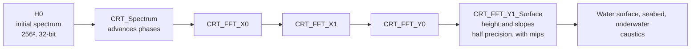

1. `CRT_Spectrum`: advances the phase of each component from the time. The frequencies are rounded to multiples of 2π/60, so the waves return exactly to their start after 60 seconds. The values are packed into complex numbers so that one inverse FFT gives both the height and the slopes.
2. `CRT_FFT` × 4: computes the 256-point FFT split as 16 × 16, in two stages each for the rows and the columns (four stages). The original stacked 16 stages of 2-point FFTs. The last stage packs the height, the x and z slopes and the squared slopes into one texture. Only this one texture is half precision with mipmaps, and the water surface shader reads it.

The waves depend only on time, so people in the same instance see almost the same waves (the time is each person's own Unity time, so they are not strictly in step).

The water surface reads this pattern twice. A second copy, scaled down by 0.41 and rotated, is layered on weakly to make the repetition less visible. Normals are interpolated with a 4-point cubic B-spline, and two layers of fine bumps are added. In the distance, the "spread of slopes" found from the mipmaps changes how widely the glitter spreads, which suppresses flicker.

### Ripples when you touch the water

Ripples are a separate simulation (`CRT_Ripple`, `CRT_RippleNormals`). It divides a 14 m square into 512 × 512 (2.7 cm per pixel) and solves a damped wave equation. `CRT_Ripple` remembers the previous two frames, so it is double-buffered. This window sits a little ahead of the viewer's line of sight and follows in whole-pixel steps. Ripples appear only on the water the viewer is in (never on a pool and the sea at the same time).

| Trigger | How it works | Values (controller) |
| --- | --- | --- |
| The body touches the water and moves | Seven points (feet, shins, hips, hands) near the surface each drop one ripple every time they move a set distance. It covers everyone in the instance (up to 96 people), and each person computes it locally | `Touch Height` 0.18 m, `Step Spacing` 0.22 m, `Step Strength` 0.035 |
| Tap (click; trigger in VR) | A network event sent to everyone. The ripple also appears on other people's screens | `Tap Radius` 0.154 m, `Tap Strength` 0.07, `Max Tap Distance` 40 m |

Up to 32 ripples wait in a queue, and 4 drop per frame. No synced variables are used. Ripples distort not only the shape of the surface but also the caustics (chapter 6).

## 5. Seabed: computed from the baked shape, not picked up from the screen

The seabed you see from the surface is not the seabed mesh drawn on the screen. It is a seabed that the water surface shader computes on its own. The shader hits the refracted ray against the formula for the baked seabed depth once, corrects it just twice, and computes the color, caustics and water absorption at the intersection (`ClearwaterWater.cginc`).

There are two reasons for this. The end of the refracted ray can be found accurately, so the image does not break down even where the seabed is off-screen or hidden behind a nearer object. Also, the caustics can be read at the seabed's true position, so the pattern follows the relief of the seabed.

Three places use the same seabed, each in its own way.

| Where | Role | Detail |
| --- | --- | --- |
| Water surface shader | Draws, by computation, the seabed seen through the water from above | Per pixel |
| Seabed mesh (Seabed) | Draws the seabed you see when diving, and the beach above the surface. Moves with the viewer's feet | 50 cm spacing in the 20 m square under the feet. Outside it, each ring is 8% coarser, out to 0.6 × Sea size (3 km by default) |
| Collider (Seabed Collider) | Walkable ground. Invisible walls 20 m high around the outside | ±100 m around the Coast, 0.5 m spacing |

**The seabed depth** (`cwFloorDepth`, `ClearwaterFloor.cginc`) is the sum of the following.

- The depth by distance from the coast (the cross-section). The `CoastField` texture gives the "signed distance from the waterline", and `CoastProfile` gives the depth at that distance
- Noise for small relief
- Stamps (raise and carve)
- The height of your own terrain (User terrain)

`CoastField` covers 512 m around the walkable area at 1024 × 1024 (0.5 m per pixel). It needs precision, so it is 32-bit float. At half precision, the distance along the coast came in 3 cm steps 40 m away, and the foam pattern broke into blocks. The whole sea is covered by the coarse `CoastFieldOuter` (half precision). Outside the fine area it switches smoothly to the coarse one, so capes and bays drawn outside the walkable area also show up in the water surface, the distant ground and the offshore waves.

**The look of the bed** is set by the Bed look (a `ClearwaterBedLook` asset). On top of color and height textures, their scale and their gloss, it layers four effects: sand in the gaps, ripple marks, algae color and tint. The package includes Pebbles and Sand. The ripple marks line up along the coastline, bending and branching, with a spacing that varies from place to place. They are smoothed away where the swash reaches, and fade on dry beach.

**Objects in the water** (avatars, posts and so on) are the only thing picked up from the screen. The GrabPass color is used only in pixels where the depth texture shows "something nearer than the computed seabed". The seabed mesh (Seabed) casts shadows so that it enters the depth texture, but its underwater part marks itself with an alpha below 0.25, so the water surface does not mistake it for an "object".

**Avatar shadows** are also put on the seabed with the same screen information. The sun's shadows are received by Seabed, which draws the beach and the seabed. In pixels covered by the water surface, Seabed does not draw the seabed; instead it writes "the shadow strength at that spot" into alpha as 0.04–0.2. (From water shallower than 25 cm up to where the swash reaches, it draws color and writes 0.5–1 into alpha.) The color of these pixels is set to the haze color of distant water. The reason is that the water surface decides per pixel whether to draw, while anti-aliasing mixes colors per sample, so at the edge of a distant beach or the outline of an avatar in the water, the color of samples the water did not cover gets mixed in. The water surface reads this at the computed seabed position, and applies it only to the direct sunlight and the caustics. The read position is shifted by how far the wave slope shifts the incoming light, so the shadow edge sways with the waves just like the caustics. It reads exactly one screen pixel. Reading with interpolation mixed the two encodings (0.04–0.2 and 0.5–1) along the 25 cm depth line into values that read as "below 0.5 = dark shadow", and a dark dotted line appeared along that line. The seabed seen from underwater (where Seabed draws directly) also reads the shadow at the same position.

The shift of the shadow position by refraction is not included. A shadow read from the screen carries only flat information, and cannot tell whether the part blocking the light is above or below the surface. Shifting it to match the body above the surface would pull the shadow of the underwater legs away from the feet. So the position that connects to the feet is chosen, and in exchange the shadow of the body above the surface stretches a little longer than the real one.

The exception is your own terrain. To keep the look of your own material, underwater terrain is picked up from the screen ([ADR 0001](adr/0001-user-terrain-seen-through-the-screen.md) (Japanese)). In exchange, we accept that the color switches at the screen edge and at the edge of Snell's window, and that the caustics and the wetness at the waterline are drawn a second time by a Projector. A screen point is used as terrain when it lies beyond the water surface and below it. What shows below the water is the seabed, so it can be used however far away it is along the straight line of sight. Sky and land (above the surface) are not used. The old rule was "within twice the refracted light path + 1 m". At shallow angles, or where the line of sight runs along the slope of a stepped seawall, the bottom shown on screen lies many times farther away than the refracted path. As a result, the pool bottom switched to the average color from a few meters away, and in front of the harbor seawall dark patches of the average color came and went with the waves.

The caustics and waterline wetness on the terrain are drawn by two Projectors. A Projector draws a mesh at its vertices as they are, so Seabed (a flat grid that the shader lowers to the seabed height) does not receive projection (`IgnoreProjector`). It used to receive it, so the swash wetness and sheen were drawn over the whole grid surface at water level. That surface lies in front of the terrain's seabed, so the harbor floor turned whitish and back again in time with the wave clock.

**The depth texture needs the sun's shadows.** VRChat creates the depth texture only when a directional light casts shadows. If you turn shadows off, neither the objects in the water nor the distance for the underwater fog can be known. This is why the README says "keep shadows on".

## 6. Caustics: a refracted grid drawn by a dedicated camera

The caustics falling on the seabed and on avatars are made with Evan Wallace's method (`Caustics.shader`). Each vertex of a grid that covers one wave tile (283 × 283 vertices) is bent along the refracted sunlight down to an average depth of 1.6 m, and the brightness comes from the area of the mesh after bending. Where light gathers, the mesh shrinks and gets brighter.

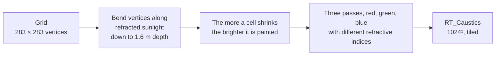

- Red, green and blue are drawn separately in three passes, with refractive indices of 1.3315 / 1.3335 / 1.3365. A faint rainbow fringe appears at the edges of the pattern
- The target is a 1024 × 1024 half-precision texture (with mipmaps). A dedicated orthographic camera draws only the Caustics layer (23), underground at y = −20000. Players cannot see it
- The grid's shader draws nothing in any other camera (it tells them apart by the orthographic size)

On the seabed, the read position is shifted by as much as refraction shifts it. The curvature of the ripples also distorts the pattern, so stirring the water by hand makes the caustics sway too. Even in the shallows, the pattern assumes a 1.6 m depth, so its lines are a little sharper than in real shallows.

**Caustics on avatars** are drawn by a Projector (`AvatarCaustics.shader`). A 32 m square Projector that moves with the viewer's head multiplies the same pattern onto objects on the player layers (9, 10, 18) and ClearwaterProps (22) only. It works whatever shader the avatar uses. The pattern is read where the refracted sunlight through that point reaches the seabed, so it connects with the pattern on the seabed at the feet, and stretches into streaks of light on vertical surfaces. Parts above the water surface are not lit.

## 7. Water color: absorption, scattering and reflection computed per pixel

The water surface color is the light from the seabed and underwater objects, reduced by the water and increased by scattering, with the sky reflection on top (`ClearwaterFloor.cginc`, `ClearwaterWater.cginc`). One pixel of the water surface seen from above is computed in this order.

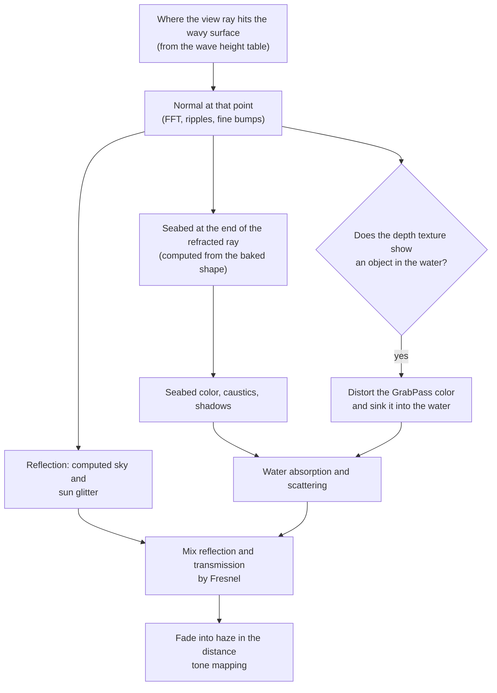

| Coefficient | Red | Green | Blue | Meaning |
| --- | --- | --- | --- | --- |
| Absorption (per m) | 0.40 | 0.074 | 0.088 | Red disappears first, so deeper water turns blue-green |
| Scattering (per m) | 0.028 | 0.052 | 0.068 | Fine particles in the water scatter light |
| Refractive index | 1.3315 | 1.3335 | 1.3365 | Varies by color only for the caustics. The surface refraction uses 1.3335 |

- The brightness from scattering uses a phase function biased toward the sun (Henyey-Greenstein, g = 0.8). Fine particles floating in the water are also drawn, in three layers
- The reflection seen from above is only the computed sky. Screen-space reflections (SSR) are not used. The sun glitter uses a Beckmann distribution and spreads with the variation in wave slopes
- Near the horizon, reflecting with the fine wave orientations as they are would show the far shore without turning it upside down. The farther the water surface, the closer it is brought to a flat mirror, so the far shore and the sky are reflected correctly upside down
- In the distance, the waves become finer than a pixel, and the averaged normal becomes flat. Computing the reflectance from it made the reflectance approach 1 toward the horizon; the water became as bright as the sky, and the horizon disappeared. The slope variation within the pixel (the same value used for the glitter) is put into the reflectance, and between 15 and 300 m the color moves to "the average color of the open sea" (`cwFarSea`: the sky about 2° up reflected at 0.8 ×, plus the blue of deep water). The open sea is darker than the sky just above the horizon, so the sky and the sea meet at a single line. The sun glitter is not moved, so the path of light from the setting sun reaches all the way to the horizon
- Where the seabed is higher than the water surface (the beach), the water surface is not drawn

**Looking up from underwater** is drawn in a separate pass.

- Inside the critical angle (Snell's window), you see the sky and things above the water. Things above the water are found by tracing the screen twice
- Outside the window is total internal reflection. The reflected objects are traced on the screen; if nothing is found, the computed seabed is reflected

The water surface shader has two passes, "seen from above" and "seen from below", and the vertex shader collapses the pass that does not match the camera's side. Which side is used stays a runtime branch (making it a constant actually made the above-water pass about 0.7 ms slower). When the camera is within 60 cm of the surface, above or below is decided per pixel. The test uses the actual wave height at the lens position (swell, ripples and surf) (`ClearwaterSurface.cginc`). This is why the image splits into above water and underwater when the lens straddles the surface.

The water plane only decides which pixels to draw; the actual surface is found per pixel by tracing from the camera. When seen from above, the plane is raised to the height the swash reaches (about 0.5 m). At still-water height, the beach slope above it would hide the plane, the film of water running up the beach would not be drawn, and only wet sand would show. But the plane must stay below the camera, so when the eye is close to the water level it cannot be raised that far. In that case, over the beach slope only, the plane follows the ground 25 cm above it (up to the height the swash reaches; near the camera, kept below the camera). Previously the plane could only be raised to a little below the camera, and when the eye was lower than 0.4 m a brown strip without water appeared at the waterline. Water seen higher than the eyes is not drawn (upward rays are not traced).

**The underwater fog** (`Underwater.shader`) is a box that the controller shows only when needed. It is shown when the head, the screen camera (for third-person view and so on) or the photo camera is underwater or within 0.6 m of the surface. The box is drawn around each camera, and each pixel checks whether that camera is underwater before applying fog, so both images are correct even when the head is above the water and only the photo camera is under it. It covers the whole screen wherever you are in the sea. With the same coefficients, it weakens the background light with distance and adds the sun and sky light from above that the water scatters. The density, saturation and brightness seen from underwater can be tuned separately from the look from the surface, with `Fog density` / `Fog saturation` / `Fog brightness` on the underwater material. (The defaults suit a clear sea: visibility is 5 times that of the water seen from the surface.) Light bounced off the sand on the bottom was also tried, but the effect was small and the cost went up (+0.1–0.2 ms per eye), so it is not included.

**A floor for underwater darkness.** Only when seen from underwater, the light scattered by the water and the sky light reaching the seabed have a deep blue-green floor (`CW_UNDER_GLOW` in `ClearwaterFloor.cginc`; the seabed uses 30% of it, `CW_UNDER_GLOW_FLOOR`). Between sunset and the time the moon starts to give light, the underwater view used to be pitch black, and neither the relief of the seabed nor the shapes of objects could be seen. With the floor, the water glows faintly blue-green, more so in the distance (about 10–16/255 on screen), and the nearby seabed and objects (5–7/255) stand out darkly in front of it. It is just bright enough to avoid total darkness while keeping the feel of night (20/255 was too bright). The floor is less than half of the daytime sky light, and in the day the sunlight is many times that, so the daytime look does not change. The brightness can be changed with `Underwater Glow` on the Sun's Clearwater Sky (default 1, range 0–3). It is passed in `_Udon_CWNight.w`; it is 0 when there is no time-of-day sky, but then the sky is always day, so no floor is needed. Underwater seen from above the water stays dark at night.

The water surface mesh is a grid with 2 m spacing over a 120 m square at the center, surrounded by square rings whose spacing widens by 8% per ring, out to the edge of the sea (5000 m by default). The points around a ring are halved where the cells would become too long and thin, and the seams are joined with triangles without gaps. The beach mesh (Seabed) is built the same way. With one big quad, the water surface flickered on some Radeon GPUs. The outer half of the water surface gradually turns into the open-sea color (`cwFarSea` with haze up to the horizon), and the sky shader draws the same color below the horizon, so the boundary is invisible.

## 8. Surf and wave sounds: the playback position of the sound is the clock

The waves that wash up on the beach are driven by the playback position of the wave sound, so that they match it.

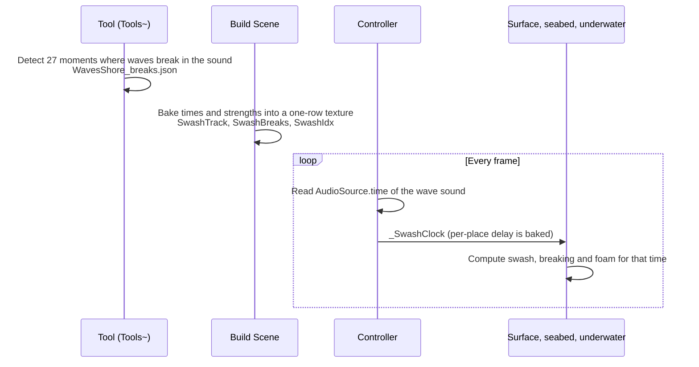

1. In the wave sound (a 90-second loop), 27 moments where a wave breaks (every 2–6 seconds) have been detected (`Tools~/detect_wave_breaks.js`, `Runtime/Audio/WavesShore_breaks.json`)
2. At build time, their times and strengths are baked into a one-row texture (`ClearwaterSetup.cs`)
3. At runtime, the controller passes the wave sound's `AudioSource.time` to the shader's clock (`_SwashClock`). The arrival delay for each place is added as well

The motion at the waterline is computed in four stages (`ClearwaterShore.cginc`).

| Stage | What happens | What decides it |
| --- | --- | --- |
| Swell | Waves crossing from offshore into the shallows. The shallower the water, the slower they travel, the closer together they get, and the higher they rise | The wave speed √(g·h) set by the water depth, Green's law. Tracks up to 6 waves |
| Breaking | When the wave height exceeds 0.8 × the water depth, the wave breaks and the crest foams white | `Breaker height` (default 0.14 m) |
| Swash | Water runs up the beach along a parabola, then draws back with an acceleration 0.6 times the deceleration on the way up. A lace of foam at the tip | `Run-up` (2.6 × `Breaker height`), beach slope (set by Bake) |
| Wet sand | Sand left behind by the receding water shines dark and dries over a few seconds. A little stranded foam remains | The time the swash reached it |

Foam (`cwFoam`) is made of blobs of distorted noise, lace-like threads and irregular holes. The foam density is treated as thickness: the blobs have sharply cut edges and are thicker toward the middle; thick parts are white, and thin parts take on the color of the water below and look grayish (`cwFoamLit`). Even thin foam almost hides what is below it (`cwFoamAlpha`); only the fading edges show through. Previously the edges were soft and thin foam became a translucent film, so all the foam looked a uniform pale white. The band of broken crests also carries the same pattern, stretched along the crest. (Previously patterns under 15 cm were dropped there, so it was a uniform white band.)

The swash foam pattern is shifted up the slope by the distance the water film has run up (run), so it rises and falls with the film. Seaward of the waterline, the shift fades out gradually over a width of 3 × run (`cwFoamRide`). Previously it faded over 1.5 m following the film's weight, so when run exceeded 1.5 m the pattern stopped or reversed along the slope in that band. The foam was stretched into straight streaks and cut off horizontally at both ends of the band, so it looked like a comb.

Differences from place to place are found by baking.

- **Wave exposure** (Shore exposure): from each point on the coast, rays are cast in 25 directions out to sea, and the fraction of directions not blocked by the coast itself is found (`ClearwaterCoastExposure.cs`). Waves get smaller deeper into a cove
- **Arrival delay** (Shore delay): the time for waves to reach each point from offshore is solved with the wave speed √(g·h) set by the depth (the Fast Marching method on a 384 × 384 grid, `ClearwaterCoastTiming.cs`)

### The three wave sounds

The wave sounds are three 90-second loops made from the Freesound CC0 recording "Stromboli beach" (by nicola_ariutti, recorded at the waterline of a pebble beach) (`Runtime/Audio/`).

| Sound | How it plays | Volume (controller) |
| --- | --- | --- |
| Waterline (WavesShore) | Spatial audio. Every frame the controller moves the source to the point on the waterline nearest the viewer, so the whole coastline seems to sound. Loudest within 1.5 m of the shore, fades out at about 60 m | `Shore Level` 0.9 |
| Distant sea (WavesBed) | An ambient sound at the same volume everywhere. The high frequencies are cut so that it sounds distant | `Bed Level` 0.3 |
| Underwater (WavesUnderwater) | A muffled sound that replaces the other two only while you are diving | `Underwater Level` 0.8 |

The waterline is passed to the controller at Bake time, as up to 64 points. Only the parts within 100 m of the walkable area are used. If the line leaves that area and comes back, the pieces are treated as separate lines. The distance is divided by the wave exposure, so the sound is also quieter in sheltered coves. In the middle of a narrow cove, the nearest point can switch between the two shores, and the source can jump to the other shore.

To replace the wave sounds, make the three loops with `Tools~/make_wave_audio.sh` and rebuild the timetable with `Tools~/detect_wave_breaks.js` (see "Remaking the wave audio" in the README).

## 9. Baked data: kept in a folder per scene

What Bake makes is in the per-scene folder `Assets/Clearwater/Generated/(scene name)_(first 8 digits of the scene's GUID)`. The materials that read it (water, seabed, underwater, sky, avatar caustics) and the meshes whose size depends on the sea are in the same folder. Things that do not depend on the scene are shared directly under `Generated` ([ADR 0003](adr/0003-generated-per-scene.md) (Japanese)).

| Location | Contents |
| --- | --- |
| Directly under `Generated/` (shared by all scenes) | The wave spectrum (`H0`), the FFT and ripple CRTs and their materials, the caustics grid (`CausticsGrid`), its material and the camera output (`RT_Caustics`), the swash tables, the sky table (`SkyLUT`), tone mapping (`ClearwaterPost`, `ClearwaterToneLut`), the pebble (`Pebble`) |
| `Generated/(scene name)_(8-digit GUID)/` | The `Water`, `Seabed`, `Underwater`, `AvatarCaustics`, `Sky` and `UserBeach` materials, `WaterPlane`, `SeabedGrid`, `SeabedCollider`, the coast, stamp and own-terrain bakes, `Pools/` |

Which folder belongs to which scene is decided by the GUID at the end of the name. Renaming a scene does not change its GUID, so the same folder is still found. Before baking, the scene is made to use the assets in its own folder (`ClearwaterSetup.OwnSceneAssets`).

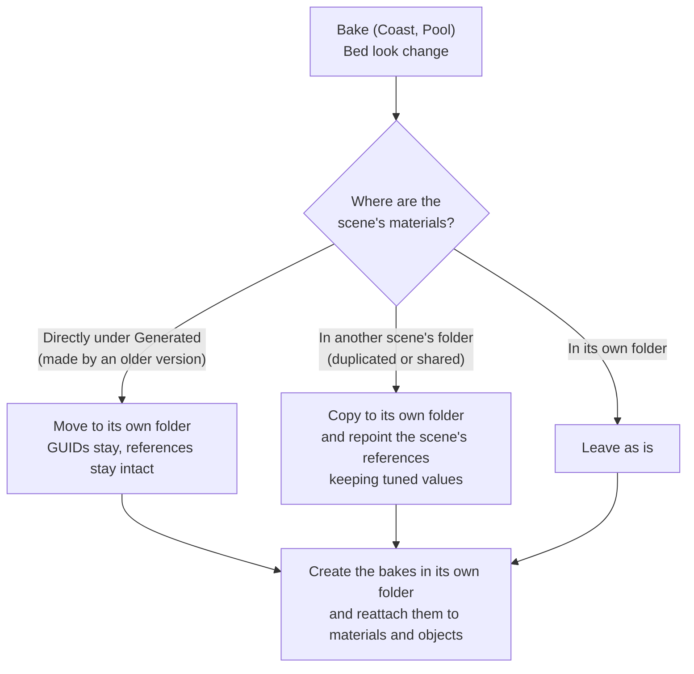

Bake results (textures and meshes) are not copied. Bake recreates them in the scene's own folder and reattaches them. Each added scene takes its own share of disk space (about 40 MB with the default coast, plus about 32 MB if you use your own terrain).

| Asset | Format and size | Contents |
| --- | --- | --- |
| `CoastField` | RGFloat, 1024², 512 m square | R: signed distance from the waterline (positive on the sea side). G: distance along the coast |
| `CoastFieldOuter` | RGHalf, 1024², whole sea | Same as above (coarse) |
| `CoastProfile` | RGFloat, every 0.125 m | R: depth of the cross-section. G: seconds until a wave reaches the waterline |
| `ShoreExposure` | RGFloat, one row, every 2 m | R: wave exposure. G: arrival delay |
| `StampHeights` | RGBAHalf, 1024², 200 m square | R: raise height. G: carve depth. B: obstacle height |
| `UserTerrain` | RGHalf, every 0.2 m (256²–2048²) | The height of your own terrain, and the blend weight at the seam |
| `SeabedCollider` | Mesh, 0.5 m spacing | Walkable ground |
| `WaterPlane` / `SeabedGrid` | Meshes | Grids for the water surface and the seabed (change with Sea size) |
| `Pools/PoolMask` | RGFloat, every 0.25 m | R: the highest pool water surface. G: the lowest pool bottom |
| `Pools/<name>_<id>/` | Materials and plane | Water surface, underwater and caustics for each pool |
| `SwashTrack` and others (shared) | One-row textures | Times and strengths of the breaks in the wave sound |
| `SkyLUT` (shared) | RGBAHalf 3D texture, 64×64×48 | Sky brightness (chapter 13). Made not by Bake but by Build Scene and Use Clearwater Sky and Sun |

**Whether a rebake is needed** is judged by a hash made from the settings and positions of the coast, stamps, your own terrain and pools. The hash is kept on the scene's Coast, so the Coast Inspector tells you when it differs from the last Bake.

**Your own terrain** (`ClearwaterUserTerrain.cs`) is baked by drawing its height from above with the StampBake shader. Unity Terrains are read directly with `GetInterpolatedHeight`, and where they overlap meshes, the higher one wins. Outward from the terrain's edge, the edge heights are spread in order of distance, nearest first, and within the seam width they blend smoothly into the generated terrain. For the waterline, the line where the terrain meets the water level is found with Marching Squares, and the one whose ends best match the drawn line replaces it.

**Stamps** draw the brush meshes from above and combine the heights with a max blend. Around them, a slope that drops 0.6 m per 1 m (about 30°) is added. Obstacles are used only to compute where waves hit and whitewater forms. Brushes (raise and carve) are not drawn after Bake; they are set to EditorOnly so that they are not uploaded.

| Stamp mode | Put it on | Effect |
| --- | --- | --- |
| Obstacle | Rocks, posts or driftwood standing in the water (visible objects) | Waves hit and break, and a lace of whitewater forms around them. With Receive Caustics they also receive caustics |
| Raise Ground | An invisible brush (any mesh) | Its top surface becomes ground (sandbars, rock shelves) |
| Carve Ground | Same as above | The ground is dug down to its top surface (tide pools, channels) |

## 10. Pools: copies of the sea machinery, cut out by area

A pool is not water on an equal footing with the sea. It is a copy of the sea's materials with its own water level and its own bottom ([ADR 0002](adr/0002-one-sea-and-pools.md) (Japanese)).

- The bottom is baked from the pool's body mesh, in the same way as your own terrain. The cross-section is a constant "1 m above the water surface everywhere", so the water surface vanishes outside the pool
- Wave strength is reduced with `_Calm` (1 − Wave strength). Indoors (Indoor), the sun is turned off and a reflection probe is reflected instead of the sky
- The sea cuts its water surface, seabed, collider and caustics out of the pool areas (`PoolMask`)

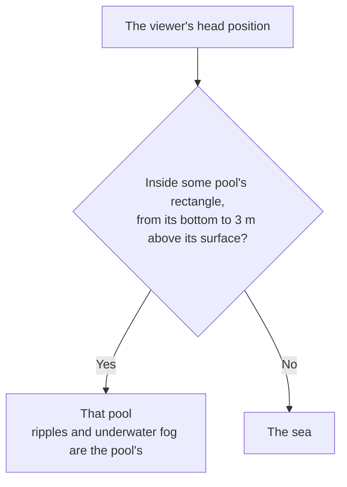

The controller decides every frame which water the viewer is in. The underwater fog and the ripples belong only to that water. Apart from drawing the visible pools and this area check, no cost grows with the number of pools.

## 11. Render order: the water surface is drawn first among transparent objects and writes no depth

This is the draw order of each shader. It decides how avatars' transparent clothes look.

| Shader | Queue | Blend / depth write | Screen grab | Depth texture |
| --- | --- | --- | --- | --- |
| Sky | Background | None / Off | None | Not read |
| Seabed | Geometry (2000) | Opaque / On (casts shadows; dry beach receives the sun's shadows) | None | Writes |
| UserBeach (Projector) | 2498 | One SrcAlpha / Off | None | Not read |
| AvatarCaustics (Projector) | 2499 | 2× multiply / Off | None | Not read |
| Water | 3000, sortingOrder −1 | None / Off (`_CWZWrite`) | `_CWGrabWater` | Reads |
| Underwater | 3050 | None / Off, ZTest Always | `_CWGrabUnder` | Reads |

The water surface's Renderer has sortingOrder −1. Unity sorts transparent objects by sortingOrder before the queue, so the water surface is drawn before every transparent object with a queue of 2501 or higher. On top of that, it does not write depth, so transparent objects drawn later are not hidden by the water surface, even when they are underwater.

The reason for this is avatars' transparent clothes. The water surface used to be at queue 3000 and wrote depth. Against clothes also at 3000, the order was decided by "distance from the camera", and the sea is a 5 km plane whose center is fixed at the origin. So depending on whether the avatar was nearer or farther than the origin, the clothes were drawn in front of or behind the water surface. When they were behind, the underwater part of the clothes was lost to the water surface's depth, and only the body was visible. With the current order, clothes do not disappear, whatever their queue.

| Queue of the avatar's material | How the underwater part looks | Seen from underwater |
| --- | --- | --- |
| 2500 or lower (such as lilToon's transparent default, 2460) | Drawn before the water surface and captured from the screen, so it takes on the water color and looks refracted | Hazed by the fog |
| 2501–3050 | Does not take on the water color; looks as if it were above the water | Hazed by the fog |
| 3051 or higher | Same as above | Drawn after the fog, so it looks sharp |

## 12. Tone mapping: one curve over the whole screen (post-processing)

The tone curve multiplies by an exposure of 0.63, passes the result through an approximation of the ACES curve, lowers the saturation slightly and pushes the shadows toward blue. By default, this is applied to the whole screen with Post Processing Stack v2. As another mode, each shader can apply it itself at the end (`_CW_TONEMAP`, `ClearwaterCommon.cginc`).

Only bright parts (colors above 0.8 after exposure) go through a long shoulder instead of ACES. The value and slope at 0.8 match ACES, and from there the curve approaches 0.9 slowly, so no 100% white appears on screen (you get a soft white that is not too dazzling). Unlike ACES, which is nearly white above 2.5, gradation remains in the glare around the sun and the bright edges of clouds. Because it rolls off each color channel separately, a bright sunset does not stay deep red but shifts from yellow toward white, as on film. Below 0.8 the curve is ACES as before, so the look of water and sand does not change.

With post-processing, the same curve is made into a 33³ LUT and passed in External mode, and the tone mapping inside the shaders is turned off (`Editor/ClearwaterToneMapping.cs`). Bloom is also available. Build Scene, Add to Current Scene and the demo scenes use this mode; you switch with `Tools > Clearwater > Tone Mapping`. Switching affects the materials of the open scene (materials are per scene, so the mode is also per scene).

When the curve is applied in the shaders, colors captured from the screen (underwater objects, your own terrain) are already tone-mapped. Before they are used in the water absorption, the inverse function (`cwInvTonemap`) brings them back to their original brightness. But objects drawn with Standard and similar shaders are not tone-mapped, so colors near the curve's white (0.9) become several or even dozens of times brighter through the inverse. Pool tiles and seawall concrete blew out to white when seen through the water. This is why post-processing is the default. With post-processing, captured colors are at the brightness they were rendered with, so there is nothing to bring back.

| Mode | Pros | Cons |
| --- | --- | --- |
| Post-processing (PPv2, default) | The whole scene shares one tone curve. The water can use colors picked up from the screen as they are. Bloom is available | It also applies to avatars, which look a little duller and darker. Not available on Quest |
| In the shaders | No post-processing needed. Avatars' look does not change | The tone curve does not match the other objects in the world. Bright objects picked up through the water blow out to white |

## 13. Sky: atmospheric scattering computed once into a table, looked up by time of day

The time-of-day sky is made of three parts.

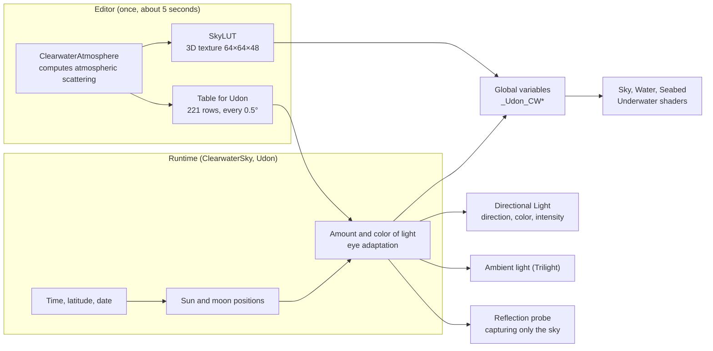

1. **Computation in the editor** (`Editor/ClearwaterAtmosphere.cs`). Computes the brightness of the sky seen from the ground for each sun elevation, and makes it into a table. This takes about 5 seconds.
2. **Udon** (`Runtime/Udon/ClearwaterSky.cs`). Finds the positions of the sun and the moon from the time, looks up the table, and passes the values, with eye adaptation applied, to all shaders at once through global variables (`_Udon_CW*`). While time advances, this runs every 0.1 seconds and takes about 0.07 ms each time. While time is stopped, it computes only when a value changes.
3. **Shaders** (`cwAtmosphere` in `ClearwaterCommon.cginc`). They look up the table once per view direction. When `_Udon_CWSunColor.w` is 0 (a scene without `ClearwaterSky`), they fall back to the formula of the fixed sky, the sky without a time of day.

**The atmosphere model** is a 100 km layer of air on an Earth with a radius of 6360 km. It has air molecules (Rayleigh scattering; they thin out by 1/e every 8 km of height), fine particles (Mie scattering; they thin out over 1.2 km and scatter strongly forward, with g = 0.8) and ozone (centered at a height of 25 km; it absorbs red and green). Light scattered two or more times is added with the approximation of Hillaire (2020). The ground albedo is 0.1 (mostly sea), the eye height is 20 m, and three colors (RGB) are computed. The values come from the Earth atmosphere in Bruneton (2017) and Hillaire (2020).

| How the sky looks | Cause |
| --- | --- |
| The daytime sky is blue | Air molecules scatter blue light well (Rayleigh scattering) |
| White glare around the sun | Fine particles scatter strongly forward (Mie scattering) |
| Red in the evening | Blue scatters away along the long path through the air, and red is left |
| Deep blue-violet after sunset | Ozone absorbs red and green |

**The table layout** is a 3D texture of 64 (azimuth difference from the sun) × 64 (elevation of the view direction) × 48 (sun elevation). Sun elevations from −20° to 90° are mapped with asinh, which gives finer steps around the horizon, where the sky color changes fast. The view elevation and the azimuth difference are also mapped with square roots, which gives finer steps near the horizon and on the sun's side. The twilight sky gets as dark as one hundred-millionth of the day sky, so each sun elevation is divided by the sky's average brightness to fit in half precision, and the divisors are kept in the Udon-side table. The sharp glare within 3° of the sun cannot be drawn at the table's resolution, so it is left out of the table and added in the shader as a formula. Its brightness is kept far below the disk's, so that the outline of the disk shows. The moon only reflects sunlight and its strong core glare is not noticeable, so none is added for it.

The Udon-side table has 221 rows, one every 0.5°, with three values: the direct light reaching a surface facing the sun, the light from the whole sky reaching flat ground (and the sky's average brightness), and the brightness all around, just above the horizon (5°). Udon cannot read 3D textures, so it uses this table to compute the amount of light.

**Matching the brightness.** The table values are in physical units, so they are converted to screen brightness. Per-color factors (white balance and exposure) are set so that at a sun elevation of 31° (the sun elevation of the fixed sky) the direct light matches the old sun color (6.0, 5.4, 4.44). The sky light keeps the same white balance, and only its brightness is matched to the old sky. The brightness of the sky itself is the logarithmic midpoint between two values: the one that matches the whole-sky average to the old sky, and the one that matches the brightness all around the horizon (5°). Because of haze, the real sky has a brighter horizon and a darker zenith than the old sky, so matching the average blows the horizon out to white, and matching the horizon makes the zenith too dark. The light entering shadows also includes the light returned by the ground and the sea (15% of the light reaching flat ground). With sky light alone, shadows were too blue. With the defaults (16:30, latitude 35° N, day 172 = the summer solstice), the sun's position and light are the same as in the fixed sky.

**Eye adaptation.** The amount of light falls to about one millionth from day to a moonlit night. How far the eye has adapted is decided from the sum of half the scene brightness and half the sky brightness, and this is applied to all light. Perceived brightness changes with the 0.55th power of the amount of light near the reference, and changes more gently as it gets darker. The shape of this curve is set so that a moonlit night (one millionth of day) looks as bright as `Night brightness` (default 0.05). As it gets darker, the color of the light is shifted toward blue at the same brightness, and tone mapping also lowers the saturation. This is because the eye in the dark has trouble telling colors apart and is more sensitive to blue. The sky itself (the color looked up from the table) gets the same bluish tint too, but only in the parts that look dark on screen. In those parts, the brightness is also limited to the scotopic brightness, whichever is smaller (the formula of Pattanaik et al. 2000, with a factor chosen so that it equals the current brightness for the night blue). The eye cells that work in the dark barely sense red, so warmer light looks darker. Previously only the sky lacked this correction, and under a low moon the horizon glowed the same orange as a sunset and was too bright. (At 3:30 the brightness now becomes about 0.57 × and turns a bluish gray.) Parts that look bright (such as the afterglow above the set sun) keep their color as before.

**Moon and stars.** The moon is a full moon placed exactly opposite the sun. The moonlight and the moonlit sky are looked up in the sun's table and scaled to 1/2,500,000. Lunar soil returns red light better, so the moonlight is made a little yellower than sunlight (about 4100 K). The moon disk's brightness is that light divided by the disk's solid angle (6.4 × 10⁻⁵ sr), which is about the day sky's average. It is shown with the same eye adaptation as the sky, and gently limited short of 0.6 so that it looks much darker than the sun on screen (up to about 0.45 in display brightness). The moon's path of light on the water is a reflection of the disk, so it never exceeds the disk brightness times the reflectance. The disk itself is bright and its color can be seen, so the night-eye blue tint is not applied to it (tone mapping's night desaturation is also applied only to dark pixels). The stars are placed on a celestial sphere that turns around the north celestial pole with the time. The sphere is divided into cells, 6 cube faces × 96², and one star per 8 cells (about 7,000 over the whole sky) is placed, with a distribution in which the count triples for each magnitude fainter. Stars are drawn about one screen pixel in size, so their size does not change with resolution. The sun, moon and stars hide behind the distant mountains (1.5–4°). These mountains take up the fraction of the horizon set by `Distant land` (`_LandCover`) on the sky material, centered on the side opposite the sea, and drop to sea level over the last 20° at each end. The sea direction (`_SeaDir`) is written by the Coast Bake, from the direction the swell comes from. While the sun or the moon is hidden behind the ridge, the direct light used for the sparkle on the water and for the caustics also goes out (the Unity light that lights the avatars does not).

**Clouds and haze.** Clouds are several km up and have a lower horizon than the ground, so they stay sunlit for a while after sunset. So the clouds are lit with the direct light of a sun 2.5° higher. The haze that fades distant water and land takes the horizon color in that direction for far distances, and the average horizon color all around for near distances. The afterglow at dusk is very distant, high air glowing, not the color of the air in front of you. The haze density matches the visibility on a clear day (about 25 km; 1/e of the light arrives from 6 km away), and it is 54% at the horizon (about 4.7 km from a standing eye height). Previously the density reached 1/e at 250 m; the water melted into the sky color well before the horizon, and the boundary between sky and sea became a white band. The haze in front of the distant mountains (about 2 km away) uses only the average color all around. Using the horizon color in the sun's direction at sunrise and sunset made the mountains glow in the afterglow color, as if light were leaking from inside them. (When a low sun is behind the mountains, the air in front of them is in their shadow.) However, it is never made brighter than the horizon sky in that direction. After sunset, the average all around is almost as bright as the afterglow side, so the mountains beside the afterglow floated, whiter than the dark sky above them. The haze on the nearby beach and land (Seabed) has the same cap. The land a few km back is squeezed into the single row just below the foot of the mountains, so without the cap that row became a bright line along the mountains after sunset. Seabed interpolates its position with centroid. With MSAA, pixels only partly covered by a triangle are still computed at the pixel center. On the long, thin, distant triangles along the horizon, that center fell outside the triangle, and ground that is not there was computed. At dusk it glowed with the red of the low sun, and a red dotted line flickered at the foot of the mountains (noticeable in VR).

**Unity lights.** The Directional Light points at the sun (the moon at night) and has the same color and brightness. The ambient light for avatars and the world is Gradient (Trilight). Its three colors (sky, horizon and ground) are set to match the old sky (the ambient light made from the Skybox) at 31°, and change with the time from there. For sky reflections, a reflection probe that draws only the sky is re-rendered every 10 seconds while time advances.

**VRC Light Volumes.** When the world has VRC Light Volumes, the light of additive Light Volumes and Point Light Volumes is added to the beach (Seabed), the bottom the water surface draws, the foam, and the foam over your own terrain (`cwLightVolumesIrr` in `ClearwaterFloor.cginc`). The Light Volumes functions give the light at a position as L1 spherical harmonics. They are evaluated for the surface's facing, multiplied by π and added as irradiance, the same way as the sky's light (`cwSkyIrr`). This makes the light as bright as it is on avatars with Standard-style shaders. Under the water it is dimmed as the sky's light is, by `exp(-(σa + 0.4σs) × depth × 1.25)`. On the water surface, the reflection from where most of the light comes (the sum of the L1 terms) is added with `LightVolumeSpecularDominant`. Its roughness comes, like the sun glints', from the spread of the wave slopes within the pixel. Light Volumes that are not additive hold the light of the hour they were baked at and are not read. `LightVolumes.cginc` (2.1.3, MIT), which has these functions, is included unchanged in `Runtime/Shaders/ThirdParty/`. So the shaders compile without the package, and when `_UdonLightVolumeEnabled` is 0 (a world without a Light Volume Manager) a branch skips it all. The water surface shader already uses all 16 samplers, so the Light Volumes textures are read with `cw_linear_clamp_sampler`, the one the baked data use (`sampler_UdonLightVolume` is defined to that name before the include). In a world without Light Volumes, both the image and the GPU time match 1.0.0 (within the spread between two draws of the same shader).

### Sync

The instance owner syncs the base time and its server time, whether time advances, the length of a day, and the cloud amount and drift speed (`UdonSynced`, Manual). Each person computes the current time from the server time, so data is sent only when the instance opens and when a value changes, on the panel or elsewhere.

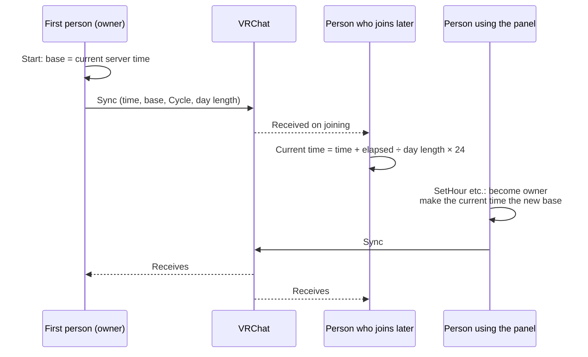

Whoever changes a value becomes the owner, and sends the time at that moment as the new base so that the time does not jump. The clouds are at the position "speed × time since the scene loaded + offset (`_CloudShift`)", and when the speed changes, the offset is recomputed so that the current position stays the same. The cloud position depends on each person's own time, so the shapes differ from person to person, but the amount and speed are the same.

| Call (from Udon) | What changes |
| --- | --- |
| `SetHour(hour)` | The time. If time is advancing, it starts again from that time |
| `SetCycle(true/false)` | Whether time advances. Starts or stops from the current time |
| `SetDayMinutes(minutes)` | The length of a day. Time advances at the new speed from the current time |
| `ResetTime()` | Returns the time, whether it advances and the day length to the Inspector values that the editor recorded when the scene was saved (`startHour` and so on; this is needed because the synced fields change at runtime) |

The clouds and waves changed on the panel are synced by a separate object, "Sky & Waves Settings (Clearwater)" (`ClearwaterSettings`, Manual sync). The roles are: Clearwater Sky is the sky's clock, Settings holds the menu's defaults and syncs them, and the controller handles water rendering and sound. For items that nobody has changed at runtime (a negative synced value), Settings uses the Inspector defaults. It puts the values into the materials through the controller at startup and whenever a sync arrives.

| Settings call | What changes |
| --- | --- |
| `SetClouds(0–1)` | The cloud amount |
| `SetCloudDrift(m/s)` | The cloud drift speed. The clouds drift at the new speed from the current position |
| `SetShoreWaves(m)` | The height of the shore waves (the breaker height, `_SwashHeight`). Put into the water surface, seabed, underwater and own-terrain beach materials. The wave sound gets louder by the square root of the ratio to the height it was made with. At 0, `_ShoreWaves` is also set to 0, giving a waterline without shore waves |
| `SetRippleSpeed(factor)` | The speed of the small waves (1 = as made). The clock of the wave pattern is `(time × factor + offset) × Time scale`; when the factor changes, the offset is adjusted so that the current clock stays the same (global `_Udon_CWRipple`). The waves on the water surface are shared with the pools |
| `ResetAll()` | Returns the clouds and waves to the Settings defaults, and also calls Clearwater Sky's `ResetTime()` |
| `SetRipples(0–1)` | The strength of the small offshore waves. Put into `_Calm` (= 1 − strength) of the sea's water surface, seabed, underwater and avatar caustics materials. Each pool's `_Calm` keeps its own value |

**Cost.** The sky, the water surface and the seabed look up the table once per view direction. When the sky from either the sun or the moon is less than 1/1000 of the other, that part is not looked up. The computation for stars that cannot be seen is also skipped. (The value is set to exactly 0 and a shader branch skips it; leaving the daytime stars at a small value cost +0.2 ms at 1080p.) Compared with the fixed sky, at 2048×2048 per eye, it costs +0.1 ms looking up at the sky by day and +0.15 ms looking up at the night sky.

## 14. Sky panel and pebble: visuals on the UI layer, input on another layer

`Tools > Clearwater > Add Sky Control Panel` places a panel that controls the sky, and a pebble that brings it up (`Editor/ClearwaterSkyEditor.cs`). The panel is normally hidden, and when you Interact with the pebble it appears in front of the viewer.

The pebble's Udon (ClearwaterSkyPanelOpener) also takes input that calls up the panel from anywhere. In VR, pulling the left trigger (`InputUse` for the left hand) twice within 0.4 seconds shows the panel at 0.4 × scale, 16 cm above the left hand; every frame (`PostLateUpdate`) it moves with the hand and turns toward the eyes. On desktop, the Tab key (`Input.GetKeyDown`) shows it level, 1.2 m in front of the eyes and 10 cm below them, and leaves it there. On desktop you aim at things with the center of the screen, so this distance keeps the whole panel in view. There are three ways to show it (above the pebble, above the hand, in front of the eyes). Doing the same one again hides it, and doing a different one moves it there. While it is above the hand, the check that hides it when you walk away (`Close Distance`) is off. Note that in ClientSim, Tab is also bound to "release the mouse".

| Part | Object | Layer | Role |
| --- | --- | --- | --- |
| Panel parent | Sky Control Panel (Clearwater) | 17 Walkthrough | A world-space Canvas and a VRC Ui Shape (the collider that receives input). ClearwaterSkyPanel's Udon |
| Panel look | Face | 5 UI | A nested Canvas. Two panes: the sky on the left (Sky: 4 sliders and a toggle) and the waves on the right (Waves: 3 sliders and a Reset all button at the bottom right). The sky heading is in a warm color and the waves heading in a cool color, with a divider line between them. 106 × 57 cm. The text is TextMesh Pro (the default font; Essential Resources are imported if missing), and the shapes use a material with VRChat's super-sampled UI shader (`Generated/SkyPanelUI.mat`). This answers the SDK builder's warnings (Unity UI shader, text that is not TextMesh Pro) in advance |
| Pebble | Sky Stone (Clearwater) | 17 Walkthrough | A collider (convex mesh) and ClearwaterSkyPanelOpener's Udon. The Interact text is "Sky & Waves" |
| Pebble look | Look | 5 UI | The pebble mesh (about 30 cm) |
| Caller (instead of the pebble) | Sky Panel Caller (Clearwater) | 17 Walkthrough | Only ClearwaterSkyPanelOpener's Udon. It has no look and no collider, and only takes the input that calls the panel to you. The demos other than Beach have it instead of the pebble |

**Why the looks are on the UI layer.** VRChat's camera (for photos and streaming) does not capture the UI layer (it does when UI is turned on in the camera settings). On the other hand, if the part that receives input is also on the UI layer, you can only touch it while the VRChat menu is open. So only the looks are put on the UI layer, as children, and the parent that receives input stays on Walkthrough. Walkthrough does not collide with avatars, so you can walk through the panel and the pebble.

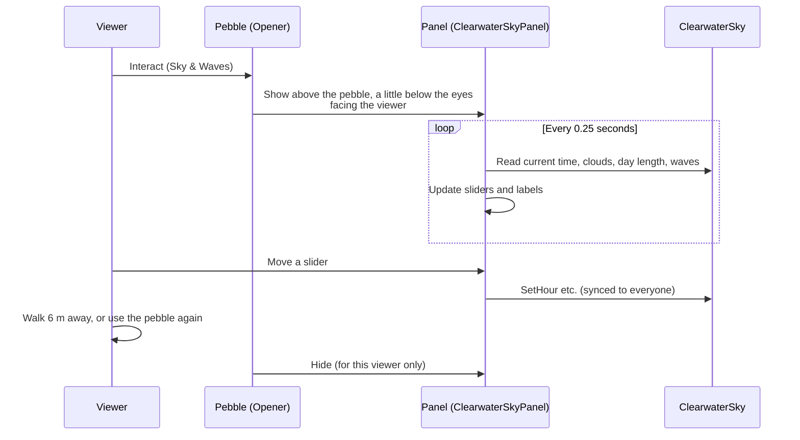

| Slider or toggle | Range | Calls |
| --- | --- | --- |
| Time | 0–24 h | `SetHour` |
| Clouds | 0–100% | Settings' `SetClouds` |
| Cloud drift | 0–60 m/s | Settings' `SetCloudDrift` |
| A day in (length of a day) | 17 steps from 1 minute to 24 hours | `SetDayMinutes` |
| Day goes by (advance the time) | On / Off | `SetCycle` |
| Shore waves (height of the shore waves) | 0 to 2 × the default (at least 30 cm) | Settings' `SetShoreWaves` |
| Ripples (small offshore waves) | 0–100% | Settings' `SetRipples` |
| Ripple speed (speed of the small waves) | 0–200% | Settings' `SetRippleSpeed` |
| Reset all button (back to the initial state) | — | Settings' `ResetAll` |

**Where the defaults live.** They are gathered in the Sky & Waves Settings Inspector. The time, Day goes by and the day length show and edit Clearwater Sky's values directly; the cloud amount, cloud drift, shore waves, ripples and ripple speed are Settings' own values. When you change the clouds or waves, they are also written at once into the related materials (the cloud copies in the sky, water surface, seabed and pool materials; `_SwashHeight` in the water surface, seabed, underwater and own-terrain beach materials; `_Calm` in the sea's water surface, seabed, underwater and avatar caustics materials), so the Scene view matches the runtime look (this can be undone). Add Sky Control Panel creates the Settings object if there is none, and takes its defaults from the materials' current values.

When the panel refreshes what it shows, moving the sliders fires UI events. The panel keeps a flag while it refreshes (`_showing`), and events during that time are not treated as the viewer's input. Whether the panel is shown or hidden is decided per viewer and is not synced.

## 15. Tunable values

### Coast

The component on "Coast (editor only)" in the scene. Bake after you change it.

| Item | Default | Effect |
| --- | --- | --- |
| `Points` / `Closed` | 3 points, a straight 200 m line / Off | The waterline. The sea is on the left of the arrow. Closed makes a loop (an island or a lake) |
| `Line` | Smooth | Straight / Smooth / Handles (a handle on each point) |
| `Shore waves` | On | Surf and wave sounds. Off gives calm water (a lake or a pond) |
| `Wave direction auto` / `Wave from` / `Wave spread` | On / 0° / 25° | The direction the swell comes from, and its spread |
| `Section` | Gentle Beach | The cross-section. Gentle Beach (numbers) or Curve (a curve) |
| `Shallow depth` | 0.35 m | Water depth at the foot of the beach |
| `Shallow slope` | 0.041 | How much the knee-deep shallows deepen per 1 m |
| `Shelf slope` | 0.155 | The steep slope beyond the shallows |
| `Deep depth` / `Deep start` | 3.45 m / 48.3 m | The depth of the flat offshore bottom, and its distance from the waterline |
| `Beach slope` | 0.1 | The slope of the beach. The speed and distance of the swash also come from it |
| `Land height` | 0.6 m | The height of the land behind the beach |
| `Terrain source` / `User terrain` / `Seam width` | Generated / None / 20 m | Where the terrain comes from (chapters 5 and 9) |
| `Bed look` | None (Sand) | The look of the bed |
| `Sea size` | 5000 m | The side length of the sea. The Reference Camera's Far Clip is 0.8 × this |
| `Area size` / `Resolution` | 512 m / 1024 | The area and resolution of the fine bake (0.5 m spacing) |
| `Outer resolution` | 1024 | The coarse bake of the whole sea (about 5 m spacing at 5000 m) |
| `Ground half size` / `Ground step` | 100 m / 0.5 m | Half the side of the walkable area, and the collider spacing |
| `Stamp resolution` | 1024 | The stamp bake (0.2 m spacing over 200 m) |

### Materials

They are in the scene's folder (chapter 9). Changes in the Inspector show in the scene at once (the waves and caustics move only in Play mode).

| Material | Item | Default | Effect |
| --- | --- | --- | --- |
| Water, Seabed, Sky, Underwater | `Sun intensity` | 6 | The strength of the sun. Use the same value on all four |
| Same | `Exposure` | 0.63 | Overall brightness. Use the same value on all four |
| Same | `Tone map in shader` | On | Chapter 12 |
| Water, Seabed | `Breaker height` | 0.14 m | The height of breaking waves |
| Same | `Run-up` | 2.6 | The height the swash reaches (a multiple of `Breaker height`) |
| Same | `Whitewater height` | 0.03 m | The rise at the tip of the swash and on breaking waves |
| Water | `Swell start depth` | 2.6 m | The water depth where the incoming waves (swell) start to appear. They reach full height 0.8 m shallower. If this is deeper than the deepest part of the coast's cross-section, they appear over the whole sea (heavier). The controller copies it at startup to the seabed, underwater and own-terrain beach materials |
| Same | `Foam relief` | 0 | Shading for the relief of the foam. For viewing up close (+0.45–0.9 ms per eye at 2 cm) |
| Water | `Depth write` | Off | Chapter 11. When On, avatars' transparent clothes are hidden by the water |
| Underwater | `Fog density` | 0.2 | Underwater visibility (1 = the same density as the water seen from the surface) |
| Same | `Fog saturation` / `Fog brightness` | 0.7 / 1 | The saturation and brightness of the water color reached in the distance |
| Same | `Max fog distance` | 200 m | The upper limit for the fog computation |
| Sky | `Cover` | 0 | The cloud amount. Also shows in the reflection on the water and in the sky seen from underwater |
| Same | `Size` / `Drift speed` / `Drift direction` | 900 m / 8 m/s / 60° | Cloud size, drift speed and drift direction |
| Same | `Distant land` | 0.5 | The fraction of the horizon taken up by distant land |

When you change the Sky's clouds and distant land in the Inspector, they are copied to Water and Seabed automatically (`Editor/ClearwaterSkyGUI.cs`).

### Clearwater Controller

| Item | Default | Effect |
| --- | --- | --- |
| `Tap Radius` / `Tap Strength` | 0.154 m / 0.07 | The size and strength of tap ripples |
| `Step Strength` / `Step Spacing` | 0.035 / 0.22 m | The strength of ripples from body movement, and how many meters apart they appear |
| `Touch Height` | 0.18 m | Body parts within this distance of the surface count as "touching the water" |
| `Max Tap Distance` | 40 m | Water surface farther away than this cannot be tapped |
| `Shore Level` / `Bed Level` / `Underwater Level` | 0.9 / 0.3 / 0.8 | The volumes of the three wave sounds |
| `Ripple Resolution` / `Ripple Size` | 512 / 14 m | The ripple window. Must match the CRT (set by Build Scene) |

### Clearwater Sky and the pebble

| Item | Default | Effect |
| --- | --- | --- |
| `Time of day` | 16.5 | The time (local solar time; the sun is highest at 12:00) |
| `Cycle` / `Day minutes` | Off / 24 min | Whether time advances / the real time one day takes |
| `Latitude` / `Day of year` | 35° / 172 | Latitude and date. They set the sun's elevation and the length of day and twilight |
| `North` | Computed by Build Scene | The direction of north. With the defaults, the sun comes to the same position as in the fixed sky |
| `Moon` / `Night brightness` / `Stars` | On / 0.05 / 1 | The full moon, the brightness of a moonlit night, the brightness of the stars |
| `Underwater Glow` | 1 | The blue-green brightness kept underwater at night (a multiplier on the floor for underwater darkness; 0 = no floor; range 0–3) |
| `Update interval` / `Probe interval` | 0.1 s / 10 s | Update intervals for the sky and for the reflections while time advances |
| The pebble's `Close Distance` | 6 m | How far from the panel you can go before it hides (0 = it never hides) |
| The pebble's `Show Above` | On | Shows the panel above the pebble. When Off, it appears where it was placed |

## 16. File layout

`Runtime` holds what goes into the world, `Editor` holds what runs only in the editor, and folders whose names end in `~` are not imported by Unity.

| File | Role |
| --- | --- |
| `Runtime/Shaders/ClearwaterCommon.cginc` | Shared code: coordinates, noise, the sky (fixed sky and time-of-day sky), reflectance, tone mapping |
| `Runtime/Shaders/ClearwaterFloor.cginc` | Seabed: `cwFloorDepth` (reading the bakes), the Bed look patterns, underwater light, the light of VRC Light Volumes |
| `Runtime/Shaders/ThirdParty/LightVolumes.cginc` | The VRC Light Volumes shader include (RED_SIM, MIT, unchanged) |
| `Runtime/Shaders/ClearwaterShore.cginc` | Waterline: swell, breaking, swash, foam, wet sand |
| `Runtime/Shaders/ClearwaterSurface.cginc` | Water surface height, and the above/below test for a camera right at the surface |
| `Runtime/Shaders/ClearwaterWater.cginc`, `Water.shader` | Water surface (two passes: from above the water and from underwater) |
| `Runtime/Shaders/Seabed.shader` | Seabed and beach |
| `Runtime/Shaders/Underwater.shader` | Underwater fog |
| `Runtime/Shaders/Sky.shader` | Sky (skybox), clouds, distant land |
| `Runtime/Shaders/CRT_Spectrum.shader`, `CRT_FFT.shader` | Wave FFT |
| `Runtime/Shaders/CRT_Ripple.shader`, `CRT_RippleNormals.shader` | Ripples |
| `Runtime/Shaders/Caustics.shader` | The caustics grid |
| `Runtime/Shaders/AvatarCaustics.shader` | Caustics on avatars and on Receive Caustics objects (Projector) |
| `Runtime/Shaders/UserBeach.shader` | The beach on your own terrain (wetness, swash, foam; Projector) |
| `Runtime/Shaders/CoastBake.shader`, `FloorBake.shader`, `StampBake.shader`, `RockBake.shader` | For baking (coast coordinates, collider heights, stamps, rocky areas) |
| `Runtime/Udon/ClearwaterController.cs` | Viewed water, ripples, body and tap ripples, underwater test, sun direction, wave sounds, caustics Projector |
| `Runtime/Udon/ClearwaterSky.cs` | The time-of-day sky and its sync |
| `Runtime/Udon/ClearwaterSkyPanel.cs`, `ClearwaterSkyPanelOpener.cs` | The sky panel, and the pebble that brings it up |
| `Runtime/Authoring/ClearwaterCoast.cs` | Coast (for editing; not included in uploads) |
| `Runtime/Authoring/ClearwaterStamp.cs`, `ClearwaterPool.cs`, `ClearwaterBedLook.cs` | Stamps, pools, Bed look |
| `Runtime/BedLooks/`, `Runtime/Textures/` | The pebble and sand Bed looks, and their images (generated by computation) |
| `Runtime/Audio/` | The three wave sounds, the timetable of wave breaks, credits (`CREDITS.txt`) |
| `Editor/ClearwaterSetup.cs` | Build Scene, Recreate Scene, Add to Current Scene, Use Clearwater Sky and Sun, the shared assets and the scene folders |
| `Editor/ClearwaterCoastBake.cs` | The coast Bake: coordinates, cross-section, stamps, walkable ground, wave sound points |
| `Editor/ClearwaterCoastEditor.cs` | The Coast and Stamp Inspectors, line editing in the Scene view |
| `Editor/ClearwaterCoastExposure.cs`, `ClearwaterCoastTiming.cs` | Wave exposure and arrival delay |
| `Editor/ClearwaterUserTerrain.cs` | Baking your own terrain, and its Projectors |
| `Editor/ClearwaterPoolBake.cs`, `ClearwaterPoolEditor.cs` | The pool Bake and Inspector, Add Pool |
| `Editor/ClearwaterBedLooks.cs` | Applying a Bed look to materials, making one from your own terrain |
| `Editor/ClearwaterAtmosphere.cs` | Computing atmospheric scattering (the sky table) |
| `Editor/ClearwaterSkyEditor.cs` | Setting up the time-of-day sky and its Inspector, Add Sky Control Panel |
| `Editor/ClearwaterSkyGUI.cs` | The Sky material Inspector (copies the clouds and distant land to the water surface and seabed) |
| `Editor/ClearwaterToneMapping.cs` | Switching the tone mapping mode (the PPv2 LUT) |
| `Editor/ClearwaterDemoScenes.cs` | Six demo scenes (a beach on ground generated by Clearwater, and examples with your own terrain and pools) |
| `Tests/Editor/` | EditMode tests (chapter 19) |
| `Tools~/make_wave_audio.sh`, `detect_wave_breaks.js`, `make_sand.py` | Processing the wave sounds, detecting the moments waves break, the sand image |
| `Documentation~/images/` | Images for the README |
| `docs/technical.md`, `docs/adr/`, `CONTEXT.md` | This document, decisions that are hard to change later, terms |
| `.github/` | Automation for releases and the VPM listing (GitHub Actions) |

On the world project's side, Clearwater creates the following.

| Location | Contents |
| --- | --- |
| `Assets/Clearwater/Scenes/Clearwater.unity` | The scene Build Scene creates. Running Build Scene again keeps the objects and values you placed in the scene by hand, and recreates only the assets |
| `Assets/Clearwater/Generated/` | The shared assets and the per-scene folders (chapter 9). Do not edit directly |
| `Assets/Clearwater/Demo/` | The demos that Build Demo Scenes creates |

## 17. Performance and measurement

The cost is roughly proportional to the number of pixels, and is largest when the water covers the screen. The "Performance" section of the README sums up how the cost grows under each condition. Here we keep the breakdown of where the time goes.

**How it is measured.** In the Unity editor, the same view is drawn repeatedly at 2048×2048 (about 4.2 million pixels, close to one VR eye) with a 90° field of view, and the time is measured after waiting for the GPU to finish. The value for each part is the difference from a run with only that part removed. Each measurement varies by about 10%, so comparisons alternate within a single measurement. The GPU is about 10% slower when the Unity window is not in the foreground, so it is brought to the front for measuring.

| View (package 1.0.0, RTX 4070 Ti SUPER) | ms/eye | Of which water surface |
| --- | --- | --- |
| Looking at your feet in the shallows | 5.7 | 5.2 |
| Looking down at the sea 26 m from the shore | 5.4 | 4.9 |
| Looking down offshore (water fills the screen) | 4.8 | 4.2 |
| Looking out to sea from the beach | 2.8 | 1.5 |
| Looking up at the surface from underwater | 2.6 | 1.8 |
| Diving and looking horizontally | 1.9 | 0.9 |

Most of the time goes to the water surface. It gets heavier nearer the shore because the surf and foam are computed inside the water surface computation.

Whatever the view, the caustics camera takes 0.33 ms every frame. For the wave and ripple computation (the Custom Render Texture updates), the GPU time cannot be isolated in the editor (the CPU side that issues the updates takes 0.09 ms). Halving the resolution in both directions (a quarter of the pixels) made the time about 1/3.

| GPU (both VR eyes, water fills the screen; rough estimate) | Cost of the water alone | Against the 11.1 ms budget at 90 fps |
| --- | --- | --- |
| RTX 4090 | About 6 ms | About half |
| RTX 4070 Ti SUPER (from measurement) | About 10 ms | Almost all of it |
| RTX 3070 | About 15 ms | Over budget |
| RTX 3060 | About 21 ms | Over budget |

The 4070 Ti SUPER value is twice the per-eye value of the offshore view looking down, plus the caustics camera. The others are scaled by rough performance ratios from public benchmarks, and are not measured. The water fills the screen when you look down; looking out to sea from the beach, the 4070 Ti SUPER takes about 6 ms. In actual VRChat, avatar and UI rendering come on top of this, and the cost scales with the SteamVR resolution setting. On desktop (1920×1080, 60° vertical field of view), looking down offshore takes about 2.6 ms and looking out to sea from the beach about 2.4 ms.

These are the main optimizations so far. For each one, images of the same view before and after were compared to confirm that the look did not change (average color difference under 1/255).

1. When looking from above the water surface, Seabed does not paint the seabed hidden by the surface (it still paints down to 25 cm of water depth)
2. The "sky above the horizon" that the water surface computed is limited to pixels near the horizon
3. The water surface and beach computation and vertices are cut down
4. Computation that cannot be seen is skipped with a branch, by setting its value to exactly 0 (the stars, the moon's sky, the sun's sky)
5. Seabed takes no Projectors. Your own terrain's projectors were drawing the whole Seabed grid again at the water's level (0.3–0.6 ms per eye in the harbour demo)

## 18. Limits and cautions: what we gave up for performance

To keep the cost down, we accept the following.

- **It does not run on Quest.** The CRT FFT and the per-pixel seabed computation are too heavy
- **The wave pattern repeats every 4.6 m.** A second, rotated copy is layered on top to make this less visible
- **Reflections seen from above show only the sky.** Shores and buildings are not reflected in the water
- **Water cannot be seen through water.** GrabPass is shared by name, so water drawn later does not show water drawn earlier
- **Bakes and materials are per scene.** Each added scene adds about 40 MB with the default coast (plus about 32 MB if you use your own terrain)

Some effects of the original WebGL demo were also left out.

- Light streaks and bleeding around the glitter (glare), chromatic aberration and film grain. They imitate a smartphone lens and look unnatural in VR, so they were removed. As a result, colors look a little deeper than in the original demo. Bloom is available only when you choose the post-processing mode
- Lowering the resolution when the load is heavy

Things to watch out for:

- **Keep the sun's shadows on.** Seeing avatars through the water and the underwater fog both use the depth texture, which VRChat creates only when there are shadows (chapter 5)
- **Set the Reference Camera's Far Clip to 0.8 × Sea size (4000 m by default).** If it is shorter, distant water and ground are cut off. The Coast Inspector warns you when it is too short, and a button sets it
- **After Play mode, runtime values may remain in materials.** Values that Udon wrote at runtime (the sun direction, the wave sound clock, the ripple window and so on) stay in the editor as unsaved changes, and are written out the next time you save. If you use git, revert those diffs
- **Rocky areas are built but turned off.** Set `Rocks` in `ClearwaterSetup.cs` to `true` and run Build Scene to bring them back (+0.85 ms per eye when looking down through the water)

How the code maps to the original WebGL demo, and the smaller decisions in the code, are written at the top of each file and in the function comments. If something in this document is unclear, ask in a GitHub Issue.

## 19. Tests: checking the bake math and the Bake warnings

`Tests/Editor` has Unity Test Framework (EditMode) tests. They cover the bake computations whose correct answers can be written down as numbers, and the Bake warnings.

| Test | What it checks |
| --- | --- |
| `PoolSpanTests` | The span of a pool (up to what height a point is inside that pool) |
| `CoastFieldTests` | The signed distance from the waterline and the distance along the coast (`CoastField`) |
| `CoastLineTests`, `RebakeCheckTests` | The limit on the number of line points, the rebake check |
| `UserTerrainTests` | Replacing the waterline with your own terrain's, and its warnings |
| `BakeNoteTests` | Warnings for areas not covered and for going outside the bake area |
| `SkyTests` | The sky computation (the daytime zenith is bluer than the horizon, the sunset horizon is redder on the sun's side, the sky is nearly dark once the sun is 18° below the horizon) |
| `SkyClockTests` | How the time-of-day sky is matched (with the defaults, the sun's position and light equal the fixed sky), and that the stars turn with the sky |

Shader looks and behavior inside VRChat (sync, actual jumps) are not tested. The look is checked by capturing images in Play mode and comparing them.

To run the tests, add the following to `Packages/manifest.json` in the world project, and run EditMode in `Window > General > Test Runner`. The tests run in an empty scene that Test Runner prepares, and do not write to the baked data (`Assets/Clearwater/Generated`).

```json
"testables": ["com.vbamboo.clearwater"]
```
