**日本語** | [English](technical.en.md)

# Clearwater VRC の仕組み

この文書は、Clearwater VRC が海をどう描いているかを説明します。対象は、コードに手を入れたい人と、負荷や見た目の理由を知りたい人です。使い方は [README](../README.md) にあります。ここでは同じ機能を「中で何が起きているか」の側から書きます。数値はパッケージ 1.0.0 時点のものです。

**読み方**。1 章（全体像）と 2 章（用語）で全体の流れをつかめば、あとはどの章からでも読めます。4〜8 章は水の見た目、9〜10 章は焼き込みとプール、13〜14 章は空、15 章以降は調べるときに引く参照用です。Unity に詳しくない人は、2 章の用語表から読んでください。パッケージに手を入れるときは、19 章のテストも見てください。用語の定義は [CONTEXT.md](../CONTEXT.md)、後から変えにくい決定は [docs/adr](adr/) にまとめてあります。

| 章 | 内容 |
| --- | --- |
| [1. 全体像](#1-全体像焼き込んだ少しのテクスチャと毎フレームの-gpu-計算で海を描く) | 3 つの層と、1 フレームの流れ |
| [2. 用語](#2-用語unity-と-vrchat-の基本) | この文書で使う Unity と VRChat の言葉 |
| [3. シーンの中身](#3-シーンの中身build-scene-が作るもの) | Build Scene が作るオブジェクトとレイヤー |
| [4. 波](#4-波46-m-四方の波を-fft-で作り60-秒で継ぎ目なく繰り返す) | FFT の波と、触ったときの波紋 |
| [5. 水底](#5-水底画面から拾わず焼き込んだ形から計算する) | 水底を計算で求める理由と方法、影 |
| [6. 光の模様](#6-光の模様屈折した格子を専用のカメラで描く) | コースティクス |
| [7. 水面の色](#7-水面の色吸収散乱反射を-1-画素ずつ計算する) | 吸収・散乱・反射、水中から見上げたとき、水中の霧 |
| [8. 打ち寄せる波と波音](#8-打ち寄せる波と波音波音の再生位置を時計にする) | 波打ち際の動き、3 つの波音 |
| [9. 焼き込みデータ](#9-焼き込みデータシーンごとのフォルダーに置く) | Bake が作るもの、シーンごとのフォルダー |
| [10. プール](#10-プール海の仕組みを複製し範囲で切り分ける) | 海の複製としてのプール |
| [11. 描画順](#11-描画順水面は半透明の物の中で最初に描き深度を書かない) | キューと深度、アバターの半透明の服 |
| [12. トーンマッピング](#12-トーンマッピング画面全体を-1-本の曲線でポストプロセス) | 明るさの丸め方 |
| [13. 空](#13-空大気の散乱を一度だけ計算して表にし時刻で引く) | 時刻の空、目の順応、月と星、同期 |
| [14. 空のパネルと小石](#14-空のパネルと小石見た目は-ui-レイヤー操作は別のレイヤー) | ワールドの中で空を変える仕組み |
| [15. 調整できる数値](#15-調整できる数値) | Coast・マテリアル・コントローラー・空の初期値 |
| [16. ファイル構成](#16-ファイル構成) | パッケージとプロジェクトの各ファイルの役割 |
| [17. 負荷](#17-負荷と計測) | 計測値と、軽くするための工夫 |
| [18. 制限と注意](#18-制限と注意負荷のために諦めたこと) | 諦めたこと、気をつけること |
| [19. テスト](#19-テスト焼き込みの計算と-bake-の警告を確かめる) | EditMode のテスト |

## 1. 全体像：焼き込んだ少しのテクスチャと、毎フレームの GPU 計算で海を描く

Clearwater の描画は、大きく 3 つの層に分かれます。

1. **エディターでの焼き込み（Bake）**。海岸の線と断面、スタンプ、自分の地形、プールから、水底の形と波の届き方をテクスチャに焼きます。結果は `Assets/Clearwater/Generated` の中の、シーンごとのフォルダーに保存されます（9 章）。
2. **GPU での毎フレームの計算**。Custom Render Texture（CRT）の連鎖で波の高さを FFT で求め、別のカメラで水底の光の模様を描きます。
3. **Udon**。コントローラー（`Runtime/Udon/ClearwaterController.cs`）が、見ている人がどの水にいるかを決め、波紋・水中の霧・波音を切り替えます。コントローラーに同期する変数はありません。時刻の空は別の Udon（`ClearwaterSky`）が受け持ちます（13 章）。パネルで変えた雲と波は、別のオブジェクト「Sky & Waves Settings (Clearwater)」（`ClearwaterSettings`）が全員に同期し、コントローラーがマテリアルに入れます（13 章）。

水面のシェーダーは、この 3 つの結果を読んで 1 画素ずつ色を決めます。そのとき、**水底を画面から拾わず、焼き込んだ形から計算で求めます**。これが Clearwater の性格を決めている一番大きな選択で、5 章で詳しく説明します。

### 1 フレームの流れ

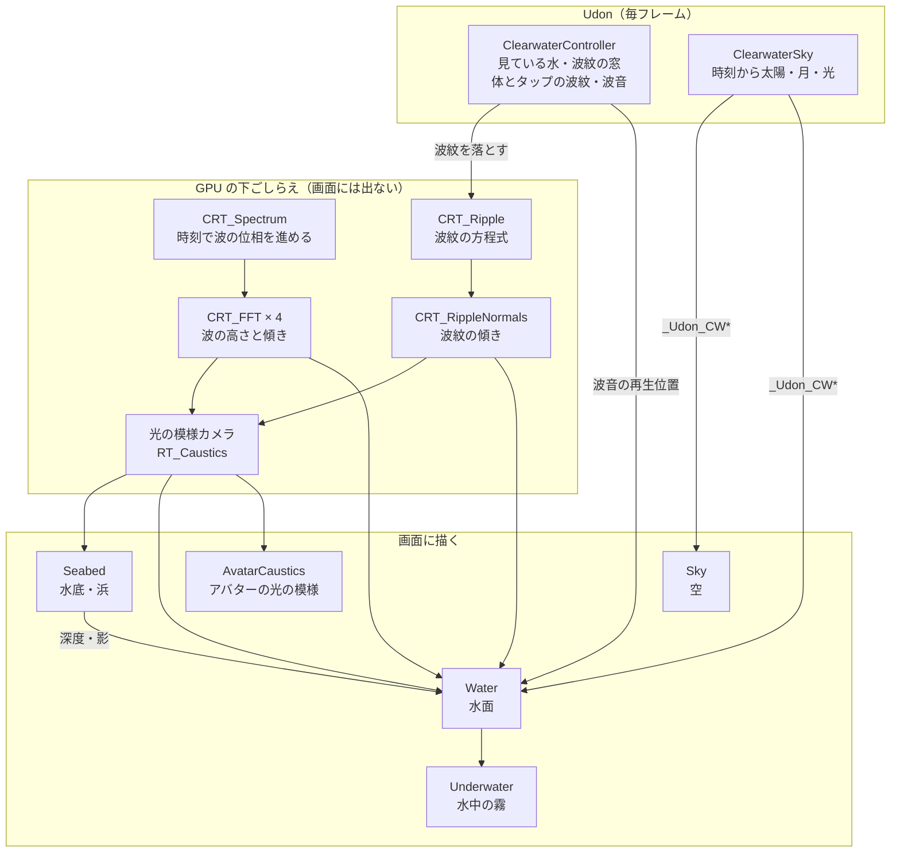

左の Udon と真ん中の下ごしらえは、画面に直接は出ない「材料作り」です。右の 5 つのシェーダーが、その材料を読んで画面を描きます。下ごしらえで毎フレーム作る材料は次の 3 つです。

| 材料 | 中身 | 大きさ・形式 | 範囲 |
| --- | --- | --- | --- |
| 波の高さ（`CRT_FFT_Y1_Surface`） | 高さ、x と z の傾き、傾きの 2 乗 | 256²、半精度、ミップマップ付き | 4.6 m 四方を海全体に敷き詰める |
| 波紋（`CRT_RippleNormals`） | 波紋の傾き | 512²、半精度 | 見ている人の前の 14 m 四方 |
| 光の模様（`RT_Caustics`） | 水底に落ちる光の網目（赤・緑・青で別々） | 1024²、半精度、ミップマップ付き | 4.6 m 四方を敷き詰める |

### エディターで焼くもの

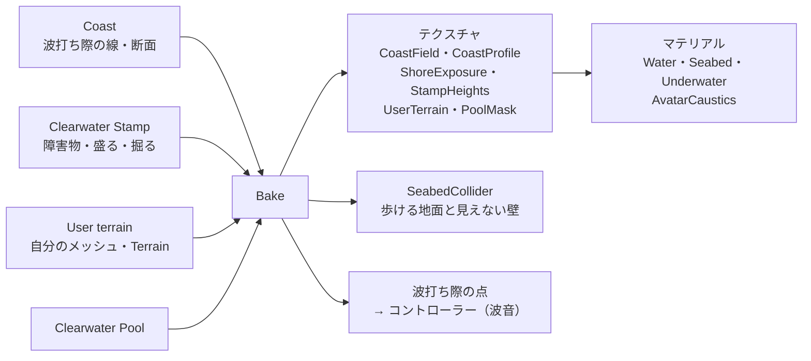

Bake は、線と断面から「波打ち際からの距離」と「その距離での深さ」を表にします。水面・水底・水中の霧・当たり判定は、すべて同じ表を読みます。そのため、見た目の水底と足で立つ地面がずれません。当たり判定だけは表からメッシュを作りますが、その高さも GPU でシェーダーと同じ関数（`cwFloorDepth`）を評価して求めています。C# 側に地形の計算の複製はありません。

| 何を | どこで | 主なファイル |
| --- | --- | --- |
| 海岸・水底の焼き込み | エディター | `Editor/ClearwaterCoastBake.cs`、`Editor/ClearwaterUserTerrain.cs`、`Editor/ClearwaterPoolBake.cs` |
| シーンと素材の組み立て | エディター | `Editor/ClearwaterSetup.cs` |
| 波（FFT）と波紋 | GPU（CRT） | `Runtime/Shaders/CRT_*.shader` |
| 光の模様 | GPU（専用カメラ） | `Runtime/Shaders/Caustics.shader` |
| 水面・水底・水中・空 | GPU（描画） | `Water.shader`、`Seabed.shader`、`Underwater.shader`、`Sky.shader` と `*.cginc` |
| 見ている水・波紋・音 | Udon | `Runtime/Udon/ClearwaterController.cs` |
| 時刻の空（太陽・月・星と、その光） | エディター（大気の計算）、Udon | `Editor/ClearwaterAtmosphere.cs`、`Runtime/Udon/ClearwaterSky.cs` |
| 空のパネル | Udon、エディター | `Runtime/Udon/ClearwaterSkyPanel.cs`、`ClearwaterSkyPanelOpener.cs`、`Editor/ClearwaterSkyEditor.cs` |

シェーダーに渡す位置は「水の座標」で表します。水のオブジェクトからの相対位置で、z の向きを反転させたものです。移植元の WebGL デモの座標軸に合わせるためです（`ClearwaterCommon.cginc`）。

## 2. 用語：Unity と VRChat の基本

この文書で使う言葉だけをまとめました。Clearwater 独自の用語（Sea、Bed、Waterline、Swash など）は [CONTEXT.md](../CONTEXT.md) にあります。

| 用語 | 意味 | Clearwater での例 |
| --- | --- | --- |
| シーン | ワールド 1 つ分の配置データ。VRChat にアップロードする単位 | `Assets/Clearwater/Scenes/Clearwater.unity` |
| GameObject | シーンに置く「物」。位置を持ち、コンポーネントを付けて機能を持たせる | 水面、太陽、コントローラー |
| メッシュ | 形（三角形の集まり） | 水面の板、水底の格子、当たり判定 |
| シェーダー | GPU が画素ごとに色を計算するプログラム。見た目はほぼここで決まる | `Water.shader` |
| マテリアル | どのシェーダーを、どの数値とテクスチャで使うかの設定。数値を変えると見た目が変わる | `Water.mat`、`Seabed.mat` |
| テクスチャ | 画像。シェーダーからは「数値の表」としても使う | 波の高さ、焼き込んだ海岸 |
| Custom Render Texture（CRT） | 毎フレーム、シェーダーで書き換えるテクスチャ。VRChat で GPU に計算させる定番の方法 | 波の FFT、波紋 |
| レンダーテクスチャ | カメラの描いた絵を受けるテクスチャ | 光の模様（`RT_Caustics`） |
| 深度テクスチャ | 画素ごとの「カメラから一番手前の物までの距離」。VRChat では、影を落とす Directional Light があるときだけ作られる | 水中の物と水中の霧の距離 |
| GrabPass | それまでに描いた画面を取り込む仕組み | 水の中のアバターを水越しに見せる |
| レンダーキュー | 描く順番の番号。小さいほど先に描く | 水面は 3000、水中の霧は 3050 |
| Projector | 上から絵を投影するコンポーネント。相手のシェーダーによらず効く | アバターの光の模様 |
| レイヤー | 物の分類（0〜31）。カメラや当たり判定で、どのレイヤーを扱うかを選べる | 23 = 光の模様、5 = UI |
| コライダー | 当たり判定。見た目とは別の、乗れる・ぶつかる形 | 歩ける地面、端の見えない壁 |
| リフレクションプローブ | 周りを撮って、物への映り込みに使う | 空だけを映す「Sky Reflection (Clearwater)」 |
| Udon / UdonSharp | VRChat で動くスクリプト。UdonSharp は C# で書ける版 | `ClearwaterController.cs` |
| 同期変数・オーナー | インスタンスの全員に配る変数と、それを書き換えられる人 | 時刻の空（13 章） |
| グローバルなシェーダー変数 | すべてのシェーダーから読める変数。Udon は `_Udon` で始まる名前だけ書ける | `_Udon_CWSun` |
| エディター拡張 | Unity の編集画面だけで動くツール。ワールドには含まれない | `Tools > Clearwater > Build Scene` |
| Play モード / ClientSim | Unity の中でワールドを試しに動かす機能。ClientSim が VRChat のプレイヤーを真似る | 見た目の確認 |

## 3. シーンの中身：Build Scene が作るもの

`Tools > Clearwater > Build Scene` は、次の物を置いたシーンを作ります。Add to Current Scene は、このうち水一式とコントローラー、光の模様の仕組み、海岸だけを既存のシーンに足します。

| オブジェクト | 子 | 役割 | レイヤー |
| --- | --- | --- | --- |
| Clearwater | | 水面（`Water.mat`）。sortingOrder −1 | 0 |
| | Seabed | 水底と浜（`Seabed.mat`）。見ている人の足元に付いて動く格子 | 0 |
| | Underwater Volume | 水中の霧の箱（`Underwater.mat`）。カメラが水中か水面の近くにあるときだけ表示 | 0 |
| | Avatar Caustics Projector | アバターへの光の模様。見ている人の上に付いて動く | 0 |
| | Wave Audio | 3 つの波音（8 章） | 0 |
| | Seabed Collider | 歩ける地面（Bake が作る）と、端の見えない壁 | 0 |
| | User Terrain Caustics / Beach | 自分の地形への光の模様と浜（自分の地形を使うときだけ） | 0 |
| Sun | Sky Reflection (Clearwater) | 太陽の Directional Light と Clearwater Sky（13 章）。子は空だけを映すリフレクションプローブ | 0 |
| Clearwater Controller | | Udon のコントローラー | 0 |
| Caustics Rig | Caustics Grid、Caustics Camera | 光の模様を描く格子と専用カメラ。y = −20000 の地下 | 23 |
| VRCWorld | | VRChat のワールド設定とスポーン地点 | 0 |
| Reference Camera | | VRChat のカメラの設定元（Far Clip は Sea size の 0.8 倍） | 0 |
| Preview Camera (editor only) | | エディターでの確認用。アップロードには含まれない | 0 |
| Coast (editor only) | | 海岸の線と断面。アップロードには含まれない | 0 |
| Sky Control Panel (Clearwater) | Face | 空のパネル（Add Sky Control Panel で追加。14 章） | 17 / 5 |
| Sky Stone (Clearwater) | Look | パネルを出す小石（同上） | 17 / 5 |

使っているレイヤーは次のとおりです。レイヤーの名前は、空いていれば Clearwater が付けます。

| 番号 | 名前 | 使い道 |
| --- | --- | --- |
| 5 | UI | 空のパネルと小石の見た目。VRChat のカメラ（写真・配信用）に写らない |
| 9・10・18 | Player・PlayerLocal・MirrorReflection | アバター。光の模様の Projector が照らす |
| 17 | Walkthrough | パネルの親と小石の当たり判定。アバターが通り抜ける |
| 22 | ClearwaterProps | 光の模様を受ける Stamp（Receive Caustics） |
| 23 | Caustics | 光の模様の格子。専用カメラだけが描く |

## 4. 波：4.6 m 四方の波を FFT で作り、60 秒で継ぎ目なく繰り返す

水面の揺れは、4.6 m 四方を 256 × 256 に分けた波の模様を、海全体に敷き詰めたものです。模様は位置によらないので、海の広さやプールの数が増えても、この計算の負荷は変わりません。

**波のスペクトル**は、エディターで一度だけ作ります（`ClearwaterSetup.cs` の `BuildH0`）。移植元の WebGL デモと同じ乱数の種を使うので、同じ波になります。波長 0.62 m あたりに山を持つ風の波と、波長 1.6 m のうねりを足し、風上へ向かう成分を弱めています。最後に、水面の傾きの大きさ（RMS 0.078）に合わせて全体の強さを決めます。

**毎フレームの計算**は 5 枚の CRT が順に行います。

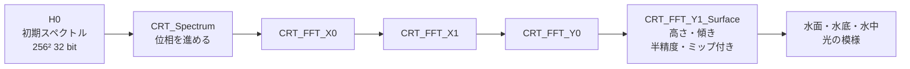

1. `CRT_Spectrum`：時刻から各成分の位相を進めます。周波数を 2π/60 の倍数に丸めてあるので、波は 60 秒でちょうど元に戻ります。高さと傾きを 1 回の逆 FFT で同時に求められるよう、複素数に詰めて渡します。
2. `CRT_FFT` × 4：256 点の FFT を 16 × 16 に分けて、縦横それぞれ 2 段で計算します（4 段）。移植元は 2 点ずつの FFT を 16 段重ねていました。最後の段が、高さ・x と z の傾き・傾きの 2 乗を 1 枚にまとめます。この 1 枚だけがミップマップ付きの半精度で、水面のシェーダーが読みます。

波は時刻だけで決まるので、同じインスタンスの人にはほぼ同じ波が見えます（時刻は各自の Unity の時間なので、厳密にはそろっていません）。

水面では、この模様を 2 回読みます。0.41 倍に縮めて回した 2 枚目を小さく重ね、同じ模様の繰り返しを目立たなくしています。法線は 4 点の 3 次 B スプラインで補間し、細かい凹凸を 2 段足します。遠くでは、ミップマップから求めた「傾きのばらつき」でギラつきの広がりを変え、ちらつきを抑えます。

### 触ったときの波紋

波紋は別のシミュレーションです（`CRT_Ripple`、`CRT_RippleNormals`）。14 m 四方を 512 × 512（1 画素 2.7 cm）に分け、減衰する波の方程式を解きます。`CRT_Ripple` は前の 2 フレームを覚えるため、ダブルバッファにしています。この窓は見ている人の視線の少し先に置かれ、画素単位でずれて付いていきます。波紋が付くのは、見ている人がいる水だけです（プールと海の両方にはつきません）。

| きっかけ | 仕組み | 数値（コントローラー） |
| --- | --- | --- |
| 体が水に触れて動く | 足・すね・腰・手の 7 か所が水面の近くにあり、一定の距離を動くたびに 1 つ落とす。対象はインスタンスの全員（最大 96 人）で、各自が手元で計算する | `Touch Height` 0.18 m、`Step Spacing` 0.22 m、`Step Strength` 0.035 |
| タップ（クリック、VR ではトリガー） | 全員に送るネットワークイベント。ほかの人の画面にも波紋が出る | `Tap Radius` 0.154 m、`Tap Strength` 0.07、`Max Tap Distance` 40 m |

波紋は 32 個まで待ち行列に入り、1 フレームに 4 個ずつ落ちます。同期する変数は使っていません。波紋は水面の形だけでなく、光の模様もゆがめます（6 章）。

## 5. 水底：画面から拾わず、焼き込んだ形から計算する

水面から見える水底は、画面に描かれた水底メッシュではなく、水面のシェーダーが自分で計算した水底です。屈折した視線を、焼き込んだ水底の深さの式に 1 回当ててから 2 回だけ補正し、交わった所の色・光の模様・水の吸収を計算します（`ClearwaterWater.cginc`）。

こうしている理由は 2 つあります。屈折した視線の先を正確に求められるので、画面の外や、手前の物に隠れた水底でも絵が崩れません。また、光の模様を水底の本当の位置で読めるので、模様が水底の起伏に沿います。

同じ水底を、3 つの場所がそれぞれのやり方で使います。

| 使う場所 | 役割 | 細かさ |
| --- | --- | --- |
| 水面のシェーダー | 上から水越しに見る水底を、計算で描く | 画素ごと |
| 水底メッシュ（Seabed） | 潜ったときに見える水底と、水面より上の浜を描く。見ている人の足元に付いて動く | 足元の 20 m 四方は 50 cm 間隔。その外は 1 周ごとに 8% ずつ粗くして、Sea size の 0.6 倍（既定 3 km）まで |
| 当たり判定（Seabed Collider） | 歩ける地面。外周に高さ 20 m の見えない壁 | Coast の周り ±100 m、0.5 m 間隔 |

**水底の深さ**（`cwFloorDepth`、`ClearwaterFloor.cginc`）は、次を重ねたものです。

- 海岸からの距離ごとの深さ（断面）。`CoastField` テクスチャで「波打ち際からの符号付き距離」を引き、`CoastProfile` でその距離の深さを引きます
- 小さな起伏のノイズ
- スタンプ（盛る・掘る）
- 自分の地形（User terrain）の高さ

`CoastField` は歩ける範囲の周り 512 m を 1024 × 1024（1 画素 0.5 m）で持ちます。精度が要るので 32 bit の浮動小数点です。半精度では、海岸沿いの距離が 40 m 先で 3 cm 刻みになり、泡の模様がブロック状に割れました。海全体は、粗い `CoastFieldOuter`（半精度）が受け持ちます。細かい範囲の外では粗い方に滑らかに切り替わるので、歩ける範囲の外に描いた岬や湾も、水面・遠くの地面・沖の波に表れます。

**底の見た目**は Bed look（`ClearwaterBedLook` アセット）で決まります。色と高さのテクスチャ、その大きさ、つやに、隙間の砂・波の跡（リップルマーク）・藻の色・色味の 4 つの効果を重ねます。パッケージには小石（Pebbles）と砂（Sand）が入っています。波の跡は海岸線に沿って並び、曲がったり枝分かれしたりしながら間隔も場所ごとに変わります。打ち上げの届く所ではならされて消え、乾いた浜では薄くなります。

**水の中にある物**（アバター、杭など）だけは、画面から拾います。深度テクスチャで「計算した水底より手前に何かある」と分かった画素だけ、GrabPass の色を使います。水底メッシュ（Seabed）は深度テクスチャに入るよう影を落としますが、水中の部分はアルファを 0.25 未満にして目印にするので、水面はそれを「物」と取り違えません。

**アバターの影**も同じ画面の情報で水底に落とします。太陽の影は、浜と水底を描く Seabed が受け取ります。水面が上を覆う画素では、Seabed は水底を描かず、「その場所の影の濃さ」をアルファに 0.04〜0.2 で書きます（水深 25 cm より浅い所から打ち上げの届く所までは色を描き、アルファに 0.5〜1 で書きます）。この画素の色は遠くの水の霞の色にしておきます。水面は画素ごとに描くかどうかを決め、アンチエイリアスはサンプルごとに色を混ぜるので、遠くの浜の縁や水の中のアバターの輪郭では、覆われなかったサンプルの色が混ざるためです。水面は計算した水底の位置でそれを読み、日なたの光と光の模様にだけ掛けます。読む位置は、波の傾きで光の入り方がずれる分だけ揺らすので、影の輪郭は光の模様と同じように波で揺れます。読むときは、画面の 1 画素をそのまま読みます。補間して読むと、水深 25 cm の線で 2 通りの書き方（0.04〜0.2 と 0.5〜1）が混ざって「0.5 未満 = 濃い影」と読める値になり、その線に沿って暗い点線が出ていました。水中から見た水底（Seabed が直接描く所）も、同じ位置で影を読みます。

屈折による影の位置のずれは入れていません。画面から読める影は平面の情報しか持たず、光を遮っている部分が水面の上か下かを区別できません。水面より上の体に合わせてずらすと、水中の脚の影が足元から離れてしまいます。そのため足元からつながる位置を選び、代わりに水面より上の体の影は、実物より少し長く伸びます。

例外は自分の地形です。自分のマテリアルの見た目を保つため、水中の地形は画面から拾います（[ADR 0001](adr/0001-user-terrain-seen-through-the-screen.md)）。代わりに、画面の端やスネルの窓の縁で色が切り替わること、光の模様と波打ち際の濡れを Projector でもう一度描くことを受け入れています。画面の点を地形として使うのは、その点が水面の先にあり、水面より下にあるときです。水の下に写っているのは水底なので、まっすぐな視線に沿ってどれだけ先でも使えます。空や陸（水面より上）は使いません。以前は「屈折した光の道のりの 2 倍 + 1 m 以内」で決めていました。浅い角度や、視線が階段護岸の斜面に沿って進む所では、画面に写る底は屈折した道のりの何倍も先にあります。そのため、数 m 先からプールの底が平均の色に替わり、港の護岸の前では波につれて平均の色の暗い斑が出たり消えたりしていました。

地形の上の光の模様と波打ち際の濡れは、2 つの Projector が描きます。Projector はメッシュを頂点のまま描くので、Seabed（平らな格子をシェーダーで水底の高さに下げている）には投影を受けさせません（`IgnoreProjector`）。以前は受けていたので、水面の高さにある格子の面全体に打ち上げの濡れと照りが描かれていました。その面は地形の水底より手前にあるので、港の底が波の時計に合わせて白っぽくなったり戻ったりしていました。

**深度テクスチャには太陽の影が必要です。** VRChat は、ディレクショナルライトが影を落とすときだけ深度テクスチャを作ります。影を切ると、水の中の物も水中の霧の距離も分からなくなります。README で「影は有効のままに」と書いているのはこのためです。

## 6. 光の模様：屈折した格子を専用のカメラで描く

水底とアバターに落ちる光の模様は、Evan Wallace の方法で作っています（`Caustics.shader`）。波 1 枚分を覆う格子（283 × 283 頂点）の各頂点を、屈折した太陽光に沿って平均の深さ 1.6 m まで曲げ、曲がった後の網目の面積から明るさを求めます。光が集まる所ほど網目が縮んで明るくなります。

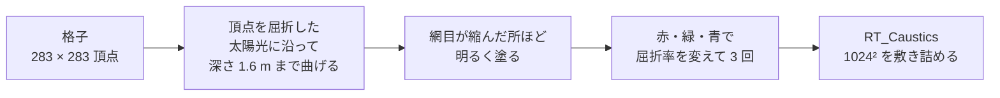

- 赤・緑・青を別々に 3 回描き、屈折率をそれぞれ 1.3315 / 1.3335 / 1.3365 にしています。模様の縁に、うっすら虹色がにじみます
- 描く先は 1024 × 1024 の半精度テクスチャ（ミップマップ付き）です。専用の正射影カメラが、y = −20000 の地下で Caustics レイヤー（23）だけを描きます。プレイヤーからは見えません
- 格子のシェーダーは、このカメラ以外では何も描きません（正射影の大きさで見分けます）

水底では、屈折でずれる分だけ読む位置をずらします。波紋の曲率も模様をゆがめるので、手でかき回すと光の模様も揺れます。浅瀬でも深さ 1.6 m を想定した模様を使うので、本物の浅瀬より線が少しくっきりしています。

**アバターへの光の模様**は Projector で描きます（`AvatarCaustics.shader`）。見ている人の頭に付いて動く 32 m 四方の Projector が、プレイヤーのレイヤー（9・10・18）と ClearwaterProps（22）の物だけに、同じ模様を掛け合わせます。アバターのシェーダーが何であっても効きます。模様は、その点を通る屈折した太陽光が水底に届く位置で読むので、足元の水底の模様とつながり、立っている面には光の筋として伸びます。水面より上の部分は照らしません。

## 7. 水面の色：吸収・散乱・反射を 1 画素ずつ計算する

水面の色は、水底や水中の物から届く光が水の中でどれだけ減り、どれだけ散乱で足されるか、に空の反射を重ねたものです（`ClearwaterFloor.cginc`、`ClearwaterWater.cginc`）。水上から見た水面の 1 画素は、次の順に計算します。

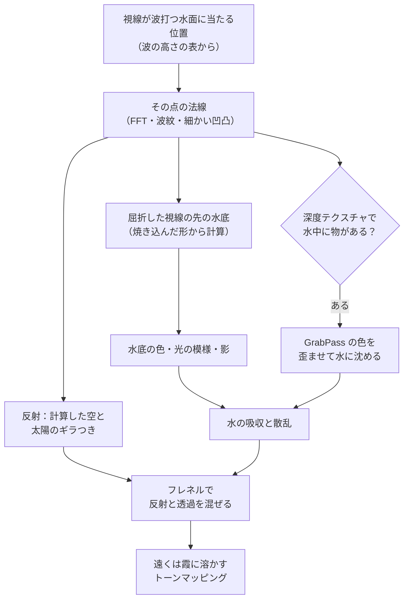

| 係数 | 赤 | 緑 | 青 | 意味 |
| --- | --- | --- | --- | --- |
| 吸収（1 m あたり） | 0.40 | 0.074 | 0.088 | 赤が最初に消えるので、深い所ほど青緑になる |
| 散乱（1 m あたり） | 0.028 | 0.052 | 0.068 | 水中の細かい粒子が光を散らす |
| 屈折率 | 1.3315 | 1.3335 | 1.3365 | 光の模様だけ色ごとに変える。水面の屈折は 1.3335 |

- 散乱による明るさは、太陽の向きに偏った位相関数（Henyey-Greenstein、g = 0.8）で求めます。水中の細かい浮遊物も 3 層で描いています
- 上から見た反射は、計算で描いた空だけです。画面の反射（SSR）は使っていません。太陽のギラつきは Beckmann 分布で、波の傾きのばらつきに応じて広がります
- 水平線の近くでは、波の細かな向きのまま映すと対岸が上下反転せずに映ってしまいます。遠くの水面ほど平らな鏡に近づけて映し、対岸や空が正しく逆さまに映るようにしています
- 遠くでは波が画素より細かくなり、ならした法線は平らになります。そのまま反射率を求めると水平線に向かって 1 に近づき、水面が空と同じ明るさになって水平線が消えました。画素の中の傾きのばらつき（光のギラつきにも使う値）を反射率に入れ、15〜300 m で「沖の海の平均の色」（`cwFarSea`：2° ほど上の空を 0.8 倍で映し、深い水の青を足したもの）に移します。沖の海は水平線のすぐ上の空より暗いので、空と海は 1 本の線で分かれます。太陽のギラつきは移さないので、夕日の光の道は水平線まで届きます
- 水底が水面より高い所（浜）では、水面を描きません

**水の中から見上げたとき**は、別のパスで描きます。

- 臨界角より内側（スネルの窓）では、空と水上の物が見えます。水上の物は画面を 2 回たどって探します
- 窓の外は全反射です。映る物を画面からたどり、見つからなければ計算した水底を映します

水面のシェーダーは「上から見たとき」と「下から見たとき」の 2 つのパスを持ち、カメラの側に合わないパスは頂点シェーダーで潰します。どちらの側かは実行時の分岐のままにしています（定数にすると、上から見るパスがかえって 0.7 ms ほど遅くなりました）。カメラが水面から 60 cm 以内にあるときは、画素ごとに上か下かを決めます。判定には、レンズの位置での実際の波の高さ（うねり・波紋・打ち寄せる波）を使います（`ClearwaterSurface.cginc`）。レンズが水面をまたいだときに、画面が水上と水中に分かれて写るのはこのためです。

水面の板は描く画素を決めるだけで、実際の水面は画素ごとにカメラからたどって求めます。上から見るときは、板を打ち上げが届く高さ（約 0.5 m）まで持ち上げます。静水面の高さのままだと、それより高い浜の斜面に板が隠されて、駆け上がる水の膜が描かれず、濡れた砂だけが見えるからです。ただし板はカメラより下に置く必要があるので、目の高さが水面に近いと、そこまで上げられません。そのときは浜の斜面の上だけ、板を地面から 25 cm 上に沿わせます（打ち上げが届く高さまで。カメラの近くでは、カメラより下に抑えます）。以前は板をカメラの少し下までしか上げられず、目の高さが 0.4 m より低いと、水際に水のない茶色の帯が出ていました。目より高い所に見える水は描きません（上向きの視線はたどらないため）。

**水中の霧**（`Underwater.shader`）は、コントローラーが必要なときだけ表示する箱です。頭・画面のカメラ（三人称視点など）・写真カメラのどれかが水中か、水面から 0.6 m 以内にあるときに表示します。箱はカメラごとにそのまわりへ描き、画素ごとにそのカメラが水中かを見て霧をかけるので、頭は水の上で写真カメラだけが潜っていても、どちらの絵も正しくなります。海のどこにいても画面全体にかかります。同じ係数で背景の光を距離に応じて弱め、上から届く太陽と空の光を水が散らした分を足します。水中から見たときの濃さ・色の濃さ・明るさは、水中のマテリアルの `Fog density` / `Fog saturation` / `Fog brightness` で、水面からの見た目とは別に調整できます（初期値は透明な海に合わせて、見通しを水面から見た水の 5 倍にしています）。底の砂が跳ね返す光も試しましたが、効果が小さく負荷が増える（片目 +0.1〜0.2 ms）ので入れていません。

**水中の暗さの下限**。水中から見るときだけ、水が散らす光と水底に届く空の光に、深い青緑の下限を設けています（`ClearwaterFloor.cginc` の `CW_UNDER_GLOW`、水底はその 3 割の `CW_UNDER_GLOW_FLOOR`）。日が沈んで月もまだ光らない間は、水中が真っ黒になり、水底の起伏も物の形も分かりませんでした。下限があると、遠くほど水がほのかな青緑に光り（画面で 10〜16/255 ほど）、近くの水底や物（5〜7/255）がその前に暗く浮かびます。夜らしさは残し、完全な闇だけを避ける明るさです（20/255 では明るすぎました）。下限は昼の空の光の半分に満たず、昼は太陽の光がその何倍もあるので、昼の見た目は変わりません。明るさは Sun の Clearwater Sky の `Underwater Glow`（初期値 1、0〜3）で変えられます（`_Udon_CWNight.w` で渡します。時刻の空がないときは 0 ですが、時刻のない空は常に昼なので要りません）。水の上から見た水中は、夜は暗いままです。

水面のメッシュは、中心から 120 m 四方を 2 m 間隔の格子にし、その外側に四角い輪を 1 周ごとに 8% ずつ間隔を広げながら重ねて、海の端（既定 5000 m）まで伸ばします。輪の周りの点は、マスが細長くなりすぎたところで半分に減らし、つなぎ目は隙間なく三角形でつなぎます。浜のメッシュ（Seabed）も同じ作りです。1 枚の大きな四角形にすると、一部の Radeon で水面がちらつきました。水面の外側の半分は少しずつ沖の海の色（`cwFarSea` に水平線までの霞をかけたもの）になり、空のシェーダーも水平線の下に同じ色を描くので、境目は見えません。

## 8. 打ち寄せる波と波音：波音の再生位置を時計にする

浜に打ち上げる波は、波音と合うように、波音の再生位置で動かしています。

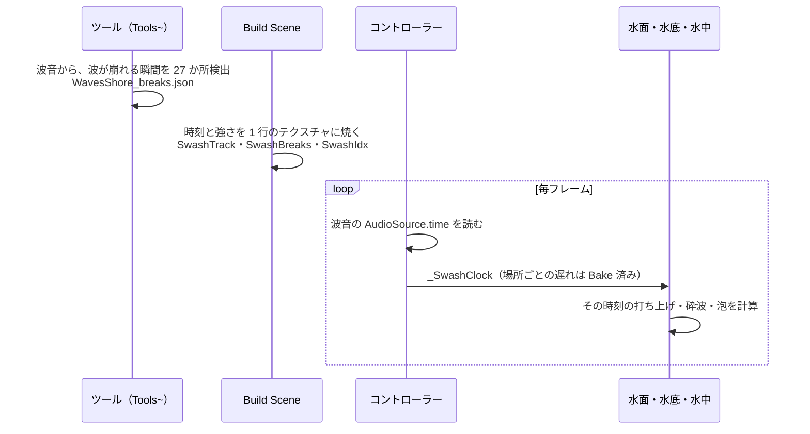

1. 波音（90 秒のループ）から、波が崩れる瞬間を 27 か所（2〜6 秒おき）検出してあります（`Tools~/detect_wave_breaks.js`、`Runtime/Audio/WavesShore_breaks.json`）
2. ビルド時に、その時刻と強さを 1 行のテクスチャに焼きます（`ClearwaterSetup.cs`）
3. 実行中は、コントローラーが波音の `AudioSource.time` をシェーダーの時計（`_SwashClock`）に渡します。場所ごとの到着の遅れも足します

波打ち際の動きは 4 つの段階に分けて計算しています（`ClearwaterShore.cginc`）。

| 段階 | 起きること | 決め手 |
| --- | --- | --- |
| うねり | 沖から浅瀬を渡ってくる波。浅くなるほど遅く、波間が詰まり、高くなる | 水深で決まる波の速さ √(g·h)、Green の法則。6 本まで追う |
| 砕波 | 波の高さが水深の 0.8 倍を超えると崩れ、波頭が白く泡立つ | `Breaker height`（初期値 0.14 m） |
| 打ち上げ（Swash） | 水が浜を放物線を描いて駆け上がり、駆け上がるときの減速の 0.6 倍の加速で引いていく。先端に泡のレース | `Run-up`（`Breaker height` の 2.6 倍）、浜の傾き（Bake で決まる） |
| 濡れた砂 | 水が引いた後の砂が暗く光り、数秒かけて乾く。取り残された泡も少し残る | 打ち上げの届いた時刻 |

泡（`cwFoam`）は、ゆがめたノイズの塊とレース状の糸、不規則な穴でできています。泡の密度は厚みとして扱い、塊の縁はくっきり切れて中ほどほど厚く、厚い所は白く、薄い所は下の水の色を帯びて灰色がかります（`cwFoamLit`）。泡は薄くても下をほぼ隠し（`cwFoamAlpha`）、下が透けるのは消えかけの端だけです。以前は縁がやわらかく、薄い泡が半透明の膜になっていたので、泡全体が一様な淡い白に見えました。砕けた波頭の帯にも同じ模様を波頭に沿って引き伸ばして載せます（以前は 15 cm 未満の模様を落としていたので、一様な白い帯でした）。

打ち上げの泡の模様は、水の膜が駆け上がった距離（run）だけ斜面の方向にずらし、膜と一緒に上り下りさせます。水際より沖では、ずらす量を run の 3 倍の幅で少しずつ減らします（`cwFoamRide`）。以前は膜の重みのまま 1.5 m で減らしていたので、run が 1.5 m を超えると、その帯で模様が斜面の方向に止まったり裏返ったりしました。泡がまっすぐな筋に引き伸ばされ、帯の両端で水平に切れて、櫛のように見えていました。

場所ごとの違いは、焼き込みで求めます。

- **波の届きやすさ**（Shore exposure）：海岸の各点から沖の 25 方向へ線を飛ばし、海岸自身に遮られない方向の割合を求めます（`ClearwaterCoastExposure.cs`）。入り江の奥ほど波が小さくなります
- **到着の遅れ**（Shore delay）：水深で決まる波の速さ √(g·h) で、沖から各地点に届くまでの時間を解きます（384 × 384 の格子での Fast Marching 法、`ClearwaterCoastTiming.cs`）

### 3 つの波音

波音は、Freesound の CC0 素材「Stromboli beach」（nicola_ariutti、小石の浜の波打ち際で録音）から作った 90 秒のループ 3 種類です（`Runtime/Audio/`）。

| 音 | 鳴り方 | 音量（コントローラー） |
| --- | --- | --- |
| 波打ち際（WavesShore） | 立体音響。コントローラーが音源を、波打ち際の線のうち見ている人に一番近い点へ毎フレーム動かすので、海岸線全体が鳴っているように聞こえる。岸から 1.5 m 以内で最大、約 60 m で消える | `Shore Level` 0.9 |
| 遠くの海（WavesBed） | どこでも同じ大きさで鳴る環境音。高音を削って遠くの音にしている | `Bed Level` 0.3 |
| 水中（WavesUnderwater） | 潜っている間だけ、ほかの 2 つと入れ替わるこもった音 | `Underwater Level` 0.8 |

波打ち際の線は、Bake のときにコントローラーへ最大 64 点で渡します。使うのは、歩ける範囲から 100 m 以内にある部分だけです。線がその範囲から出て戻ってくる場合は、別々の線として扱います。距離は波の届きやすさで割るので、奥まった入り江では音も小さくなります。細い入り江の中ほどでは、一番近い点が両岸の間で入れ替わり、音源が向こう岸へ跳ぶことがあります。

波音を差し替えるときは、`Tools~/make_wave_audio.sh` で 3 つのループを作り、`Tools~/detect_wave_breaks.js` で時刻表を作り直します（README の「波音を作り直す」）。

## 9. 焼き込みデータ：シーンごとのフォルダーに置く

Bake が作るものは、シーンごとのフォルダー `Assets/Clearwater/Generated/（シーン名）_（シーンの GUID の先頭 8 桁）` にあります。それを読むマテリアル（水・水底・水中・空・アバターの光の模様）と、海の広さで決まるメッシュも同じフォルダーです。シーンによらないものは `Generated` の直下で共有します（[ADR 0003](adr/0003-generated-per-scene.md)）。

| 置き場所 | 中身 |
| --- | --- |
| `Generated/` の直下（全シーンで共有） | 波のスペクトル（`H0`）と FFT・波紋の CRT とそのマテリアル、光の模様の格子（`CausticsGrid`）・マテリアル・カメラの出力（`RT_Caustics`）、Swash の表、空の表（`SkyLUT`）、トーンマッピング（`ClearwaterPost`、`ClearwaterToneLut`）、小石（`Pebble`） |
| `Generated/（シーン名）_（GUID 8 桁）/` | `Water`・`Seabed`・`Underwater`・`AvatarCaustics`・`Sky`・`UserBeach` のマテリアル、`WaterPlane`・`SeabedGrid`・`SeabedCollider`、海岸・スタンプ・自分の地形の焼き込み、`Pools/` |

どのフォルダーがどのシーンのものかは、名前の末尾の GUID で決めます。シーンの名前を変えても GUID は変わらないので、同じフォルダーが見つかります。Bake の前に、シーンが自分のフォルダーのものを使うようにそろえます（`ClearwaterSetup.OwnSceneAssets`）。

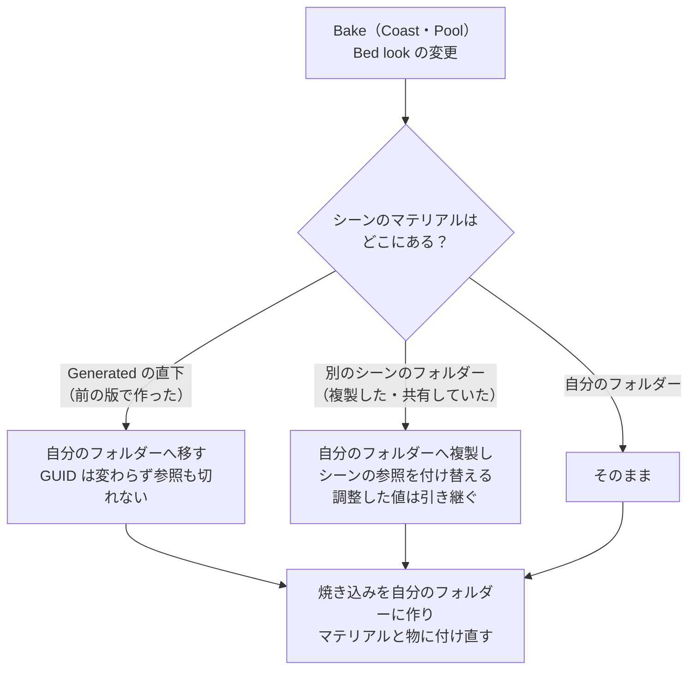

焼き込みの結果（テクスチャやメッシュ）は複製しません。Bake が自分のフォルダーに作り直して付け直します。シーンを増やすと、そのシーンの分だけ容量が増えます（既定の海岸で約 40 MB、自分の地形を使うとさらに約 32 MB）。

| アセット | 形式・大きさ | 中身 |
| --- | --- | --- |
| `CoastField` | RGFloat、1024²、512 m 四方 | R：波打ち際からの符号付き距離（海側が正）。G：海岸に沿った距離 |
| `CoastFieldOuter` | RGHalf、1024²、海全体 | 同上（粗い） |
| `CoastProfile` | RGFloat、0.125 m ごと | R：断面の深さ。G：波が波打ち際に届くまでの秒数 |
| `ShoreExposure` | RGFloat、1 行、2 m ごと | R：波の届きやすさ。G：到着の遅れ |
| `StampHeights` | RGBAHalf、1024²、200 m 四方 | R：盛る高さ。G：掘る深さ。B：障害物の高さ |
| `UserTerrain` | RGHalf、0.2 m ごと（256²〜2048²） | 自分の地形の高さと、境目での重み |
| `SeabedCollider` | メッシュ、0.5 m 間隔 | 歩ける地面 |
| `WaterPlane` / `SeabedGrid` | メッシュ | 水面と水底の格子（Sea size で変わる） |
| `Pools/PoolMask` | RGFloat、0.25 m ごと | R：プールの水面の一番高い所。G：プールの底の一番低い所 |
| `Pools/<名前>_<id>/` | マテリアルと板 | プールごとの水面・水中・光の模様 |
| `SwashTrack` ほか（共有） | 1 行のテクスチャ | 波音の崩れる時刻と強さ |
| `SkyLUT`（共有） | RGBAHalf の 3D テクスチャ、64×64×48 | 空の明るさ（13 章）。Bake ではなく、Build Scene と Use Clearwater Sky and Sun が作る |

**Bake し直しが必要か**は、海岸・スタンプ・自分の地形・プールの設定と位置から作ったハッシュで判定しています。ハッシュはシーンの Coast に残るので、前回の Bake と違えば Coast の Inspector が知らせます。

**自分の地形**（`ClearwaterUserTerrain.cs`）は、上から見た高さを StampBake シェーダーで描いて焼きます。Unity の Terrain は `GetInterpolatedHeight` で直接読み、メッシュと重なる所は高いほうを取ります。地形の縁から外側へは、縁の高さを距離の近い順に広げ、境目の幅の中で生成地形へなめらかにつなぎます。波打ち際は、地形が水面の高さと交わる線を Marching Squares で探し、描いた線と端がよく合うものを選んで差し替えます。

**スタンプ**は、ブラシのメッシュを上から描き、最大値の合成で高さを重ねます。周りには 1 m につき 0.6 m 下がる斜面（約 30°）を付けます。障害物（Obstacle）は、波が当たって白波が立つ位置の計算にだけ使います。ブラシ（盛る・掘る）は Bake の後は描かず、EditorOnly にしてアップロードに含めません。

| スタンプのモード | 付ける物 | 効果 |
| --- | --- | --- |
| Obstacle | 水中に立つ岩・杭・流木（見える物） | 波が当たって砕け、周りに白波のレースができる。Receive Caustics で光の模様も受ける |
| Raise Ground | 見えないブラシ（任意のメッシュ） | 上面が地面になる（砂州・岩棚） |
| Carve Ground | 同上 | 上面まで地面が掘られる（潮だまり・水路） |

## 10. プール：海の仕組みを複製し、範囲で切り分ける

プールは海と同格の水ではなく、海のマテリアルを複製して、自分の水面の高さと底を持たせたものです（[ADR 0002](adr/0002-one-sea-and-pools.md)）。

- 底は、プール本体のメッシュを自分の地形と同じ方法で焼きます。断面は「どこでも水面より 1 m 高い」一定の値で、プールの外では水面が消えます
- 波の強さは `_Calm`（1 − Wave strength）で弱めます。屋内（Indoor）では太陽を消し、空の代わりにリフレクションプローブを映します
- 海は、プールの範囲（`PoolMask`）で水面・水底・当たり判定・光の模様を抜きます

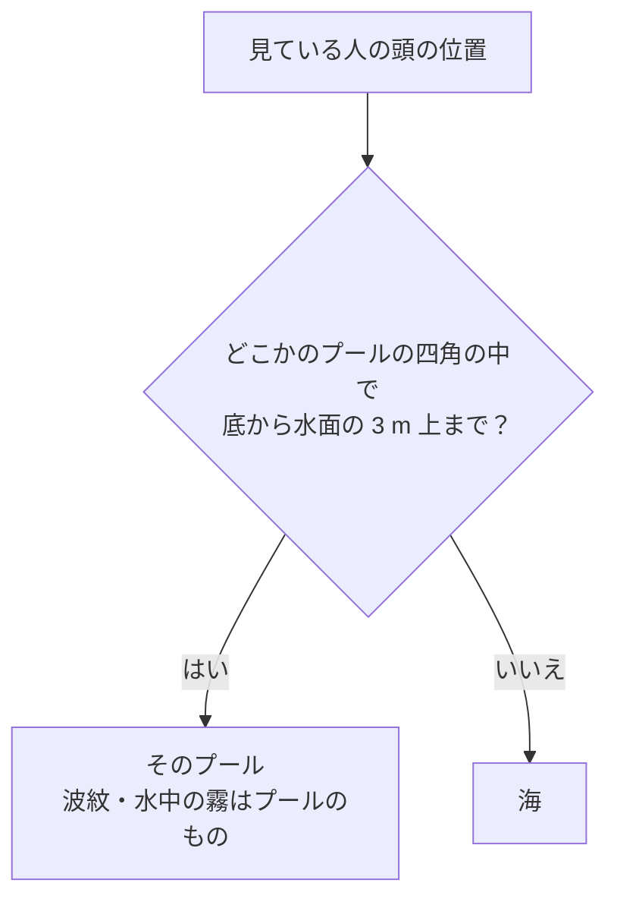

どの水にいるかは、コントローラーが毎フレーム決めます。水中の霧と波紋は、その水にだけ付きます。見えているプールの描画と、この範囲の判定のほかに、プールの数で増える負荷はありません。

## 11. 描画順：水面は半透明の物の中で最初に描き、深度を書かない

各シェーダーの描画順です。アバターの半透明な服の見え方は、ここで決まります。

| シェーダー | キュー | 合成 / 深度書き込み | 画面の取り込み | 深度テクスチャ |
| --- | --- | --- | --- | --- |
| Sky | Background | なし / Off | なし | 読まない |
| Seabed | Geometry（2000） | 不透明 / On（影を落とし、乾いた浜は太陽の影を受ける） | なし | 書く |
| UserBeach（Projector） | 2498 | One SrcAlpha / Off | なし | 読まない |
| AvatarCaustics（Projector） | 2499 | 2 倍の乗算 / Off | なし | 読まない |
| Water | 3000、sortingOrder −1 | なし / Off（`_CWZWrite`） | `_CWGrabWater` | 読む |
| Underwater | 3050 | なし / Off、ZTest Always | `_CWGrabUnder` | 読む |

水面の Renderer は sortingOrder を −1 にしています。Unity は半透明の物を、キューより先に sortingOrder で並べるので、水面はキューが 2501 以上のどの半透明の物よりも先に描かれます。そのうえで深度を書き込まないので、後から描かれる半透明の物は、水中にあっても水面に隠れません。

こうした理由は、アバターの半透明な服です。以前は水面がキュー 3000 で深度を書いていました。同じ 3000 の服とは「カメラからの距離」で順番が決まり、海は 5 km の板でその中心は原点に固定されています。そのため、アバターが原点より手前か奥かで、服が水面の前に描かれたり後ろに描かれたりしていました。後ろに回ると、服の水中の部分が水面の深度で消え、体だけが見えました。今の順番なら、どのキューの服も消えません。

| アバターのマテリアルのキュー | 水中の部分の見え方 | 水中から見たとき |
| --- | --- | --- |
| 2500 以下（lilToon の半透明の既定値 2460 など） | 水面より前に描かれて画面に取り込まれるので、水の色を帯びて屈折して見える | 霧で霞む |
| 2501〜3050 | 水の色を帯びず、水の上にあるように見える | 霧で霞む |
| 3051 以上 | 同上 | 霧の後に描かれるので、くっきり見える |

## 12. トーンマッピング：画面全体を 1 本の曲線で（ポストプロセス）

トーンカーブは、露出 0.63 を掛けて ACES の近似曲線を通し、わずかに彩度を落として影を青に寄せるものです。既定では、これを Post Processing Stack v2 で画面全体に掛けます。もう一つの方式として、各シェーダーが最後に自分で掛けることもできます（`_CW_TONEMAP`、`ClearwaterCommon.cginc`）。

明るい所（露出後に 0.8 を超える色）だけは、ACES の代わりに長い肩を通ります。0.8 での値と傾きを ACES と揃え、そこからゆっくり 0.9 に近づくので、画面に 100% の白は出ません（まぶしすぎず、やわらかい白になります）。2.5 を超えるとほぼ白になる ACES と違い、太陽の周りのまぶしさや雲の縁の明るさにも階調が残ります。色ごとに丸めるので、フィルムと同じく、明るい夕日は深い赤のままにならず黄色から白へ寄ります。0.8 以下は ACES のままなので、水や砂の見た目は変わりません。

ポストプロセスでは、同じ曲線を 33³ の LUT にして External モードで渡し、シェーダーの中のトーンマッピングを切ります（`Editor/ClearwaterToneMapping.cs`）。ブルームも使えます。Build Scene・Add to Current Scene・デモシーンはこの方式で作り、`Tools > Clearwater > Tone Mapping` で切り替えます。切り替えは、開いているシーンのマテリアルに効きます（マテリアルはシーンごとなので、方式もシーンごとです）。

シェーダーの中で掛けるときは、画面から取り込んだ色（水中の物、自分の地形）がすでにトーンマッピング済みです。これを水の吸収の計算に使う前に、逆関数（`cwInvTonemap`）で元の明るさに戻します。ただし、Standard などで描かれた物はトーンマップされていないので、曲線の白（0.9）に近い色は、逆関数で何倍、何十倍にもなります。プールのタイルや岸壁のコンクリートが、水越しに白く飛んでいました。既定をポストプロセスにしたのはこのためです。ポストプロセスでは、取り込んだ色は描かれたままの明るさなので、戻す必要がありません。

| 方式 | 長所 | 短所 |
| --- | --- | --- |
| ポストプロセス（PPv2、初期値） | シーン全体が同じトーンカーブ。水が画面から拾う色をそのまま使える。ブルームが使える | アバターにもかかり、少しくすんで暗めになる。Quest では使えない |
| シェーダーの中 | ポストプロセスが要らない。アバターの見た目が変わらない | ワールドの他の物とトーンカーブがそろわない。水越しに拾う明るい物が白く飛ぶ |

## 13. 空：大気の散乱を一度だけ計算して表にし、時刻で引く

時刻の空は 3 つの部分でできています。

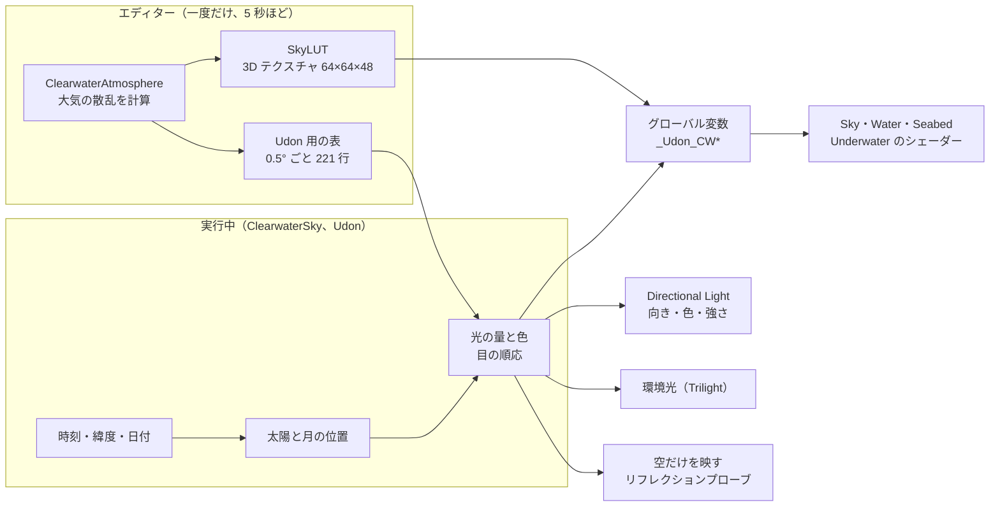

1. **エディターでの計算**（`Editor/ClearwaterAtmosphere.cs`）。地上から見た空の明るさを、太陽の高さごとに計算して表にします。5 秒ほどかかります。
2. **Udon**（`Runtime/Udon/ClearwaterSky.cs`）。時刻から太陽と月の位置を求めて表を引き、目の順応を掛けた値をグローバル変数（`_Udon_CW*`）で全シェーダーに一度に渡します。時刻を進めるときは 0.1 秒ごとで、1 回 0.07 ms ほどです。時刻を止めているときは、値が変わったときだけ計算します。
3. **シェーダー**（`ClearwaterCommon.cginc` の `cwAtmosphere`）。見る方向ごとに表を 1 回引きます。`_Udon_CWSunColor.w` が 0 のとき（`ClearwaterSky` のないシーン）は、時刻のない空の式に戻ります。

**大気のモデル**は、半径 6360 km の地球に厚さ 100 km の空気を載せたものです。空気の分子（Rayleigh 散乱。高さ 8 km ごとに 1/e に薄まる）、細かい粒子（Mie 散乱。1.2 km で薄まり、前へ強く散らす g = 0.8）、オゾン（高さ 25 km を中心に赤と緑を吸収）を置き、光が 2 回以上散る分は Hillaire（2020）の近似で足します。地面の反射率は 0.1（ほとんど海）、目の高さは 20 m、計算するのは RGB の 3 色です。値の出どころは Bruneton（2017）と Hillaire（2020）の地球の大気です。

| 空の見え方 | 原因 |
| --- | --- |
| 昼の空が青い | 空気の分子が青い光をよく散らす（Rayleigh 散乱） |
| 太陽の周りが白くまぶしい | 細かい粒子が前へ強く散らす（Mie 散乱） |
| 夕方に赤くなる | 長い空気の道を抜けるあいだに青が散って、赤が残る |
| 日没後の深い青紫 | オゾンが赤と緑を吸収する |

**表の形**は、3D テクスチャ 64（太陽との方位差）× 64（見る方向の高さ）× 48（太陽の高さ）です。太陽の高さ −20°〜90° は asinh で割り付け、空の色が速く変わる地平線の前後を細かくしています。見る方向の高さと方位差も平方根で割り付け、地平線と太陽の側を細かくしています。夕暮れの空は昼の 1 億分の 1 まで暗くなるので、太陽の高さごとに空の平均の明るさで割って半精度に収め、割った値は Udon 側の表に残します。太陽から 3° 以内の鋭いまぶしさは表の細かさでは描けないので、表からは外し、シェーダーで式として足します。その明るさは円盤よりずっと低く抑え、円盤の輪郭が見えるようにします。月は太陽光を返すだけで、芯の強いまぶしさは目立たないので足しません。

Udon 側の表は 0.5° ごとの 221 行で、太陽に向いた面に届く直射光、水平な地面に届く空全体の光（と空の平均の明るさ）、地平線の少し上（5°）の全周の明るさ、の 3 つです。Udon は 3D テクスチャを読めないので、光の量の計算にはこちらを使います。

**明るさの合わせ方**。表の値は物理の単位なので、画面の明るさに換算します。太陽の高さ 31°（時刻のない空の太陽の高さ）で直射光がこれまでの太陽の色 (6.0, 5.4, 4.44) に一致するように、色ごとの係数（ホワイトバランスと露出）を決めます。空の光は、同じホワイトバランスのまま、明るさだけをこれまでの空に合わせます。空そのものの明るさは、全天の平均をこれまでの空に合わせる値と、地平線（5°）の全周を合わせる値の、対数での中間にします。実際の空は、霞のせいで地平線がこれまでの空より明るく、真上は暗いので、平均で合わせると地平線が白く飛び、地平線で合わせると真上が暗くなりすぎるためです。影に入る光には、地面と海が返す光（水平な地面に届く光の 15%）も足します。空の光だけでは、影が青くなりすぎるためです。初期値（16:30、北緯 35°、172 日目 = 夏至）では、太陽の位置と光が時刻のない空と同じになります。

**目の順応**。光の量は、昼から月夜までに 100 万分の 1 ほどになります。景色と空の明るさを半分ずつ足した値から目の慣れ具合を決め、すべての光に掛けます。見える明るさは、基準の近くでは光の量の 0.55 乗で変わり、暗くなるほど変わり方が緩くなります。月夜（昼の 100 万分の 1）が `Night brightness`（初期値 0.05）の明るさに見えるように、この曲がり方を決めています。暗くなると、光の色を明るさはそのまま青へ寄せ、トーンマッピングでも彩度を落とします。暗い所の目は色を見分けにくく、青に敏感になるためです。空そのもの（表から引く色）にも、画面で暗く見える部分にだけ同じ青みを掛けます。さらにその部分では、明るさを暗所視の明るさ（Pattanaik ほか 2000 の式。夜の青では今の明るさと同じになるように係数を揃える）との小さいほうにします。暗い所で働く目の細胞は赤をほとんど感じないので、暖色の光ほど暗く見えるからです。以前は空にだけこの補正がなく、低い月の下の地平線が夕焼けと同じ橙に光り、明るすぎました（3:30 で明るさが約 0.57 倍になり、青みの灰色になります）。明るく見える部分（沈んだ太陽の上の残照など）は、これまでどおり色を残します。

**月と星**。月は満月として、太陽のちょうど反対側に置きます。月の光と月に照らされた空は、太陽の表を 250 万分の 1 にして引きます。月面の土は赤い光ほどよく返すので、月の光は太陽光より少し黄色く（4100 K ほど）します。月の円盤は、その光を円盤の広さ（6.4 × 10⁻⁵ sr）で割った明るさ（昼の空の平均ほど）を、空と同じ目の順応で見せ、画面で太陽よりずっと暗く見えるよう（表示の明るさで最大 0.45 ほど）、0.6 の手前でゆるく抑えます。水面に映る月の光の道も、円盤を映したものなので、円盤の明るさに反射率を掛けた値を超えないようにします。円盤そのものは明るく色が分かるので、夜の目の青みは掛けません（トーンマッピングの夜の色褪せも、暗い画素にだけ掛けます）。星は、天の北極の周りを時刻とともに回る天球に置きます。天球を立方体の 6 面 × 96² のます目に分け、8 ますに 1 つ（全天で約 7,000 個）の星を、1 等級暗くなるごとに数が 3 倍になる分布で置きます。星は画面の 1 画素ほどの大きさで描くので、解像度が変わっても大きさは変わりません。太陽・月・星は、遠景の山（1.5〜4°）の後ろに隠れます。この山は、空のマテリアルの `Distant land`（`_LandCover`）の割合だけ、海と反対側を中心に水平線を占め、端の 20° で海面まで下がります。海の向き（`_SeaDir`）は Coast の Bake が、うねりの来る向きから書き込みます。太陽や月が稜線に隠れている間は、水面のきらめきや光の模様に使う直射光も消えます（アバターを照らす Unity のライトは消えません）。

**雲と霞**。雲は数 km 上にあり、地上より地平線が低く見えるので、日没の後もしばらく日が当たります。そこで雲には、太陽を 2.5° 高くしたときの直射光を当てます。遠くの水と陸をかすませる霞は、遠いほどその方向の地平線の色に、近いほど地平線の全周の平均の色にします。夕暮れの残照は、はるか遠くの高い空気が光っているもので、目の前の空気の色ではないためです。霞の濃さは晴れた日の見通し（約 25 km、6 km 先で光の 1/e が届く）に合わせ、水平線（立った目の高さから約 4.7 km）で 54% です。以前は 250 m で 1/e の濃さで、水面が水平線のかなり手前から空の色に溶け、空と海の境が白い帯になっていました。遠景の山（約 2 km 先）の手前の霞は、全周の平均の色だけにします。日の出・日の入りに太陽の方向の地平線の色を使うと、山が残照の色に光って、内側から光が漏れているように見えました（低い太陽が山の後ろにあるとき、手前の空気は山の陰です）。ただし、その方向の地平線の空より明るくはしません。日没後は全周の平均がほとんど残照側の明るさなので、残照の脇の山が、上の暗い空より白っぽく浮いていました。手前の浜と陸（Seabed）の霞にも同じ上限を付けます。陸の奥の数 km は山の麓のすぐ下の 1 行に詰まって描かれるので、上限がないと、日没後にそこが山との境の明るい線になっていました。Seabed の位置の補間は centroid にしています。MSAA では、三角形に一部しかかからない画素も画素の中心で計算します。水平線沿いの細長い遠くの三角形では、その中心が三角形の外に出て、ない地面を計算していました。夕暮れにはそこが低い太陽の赤で光り、山の麓に赤い点線がちらついていました（VR で目立ちます）。

**Unity の光**。Directional Light は太陽（夜は月）へ向け、同じ色と明るさにします。アバターやワールドの環境光は Gradient（Trilight）にし、空・地平線・地面の 3 色を、31° のときにこれまでの空（Skybox から作られた環境光）と同じになるように決めて、そこから時刻に合わせて変えます。空の映り込みは、空だけを描くリフレクションプローブを、時刻を進めるときに 10 秒ごとに描き直します。

### 同期

インスタンスのオーナーが、起点の時刻とそのサーバー時刻、時刻を進めるか、1 日の長さ、雲の量と流れる速さを同期します（`UdonSynced`、Manual）。今の時刻は各自がサーバー時刻から計算するので、送るのはインスタンスが開いたときと、パネルなどで値が変わったときだけです。

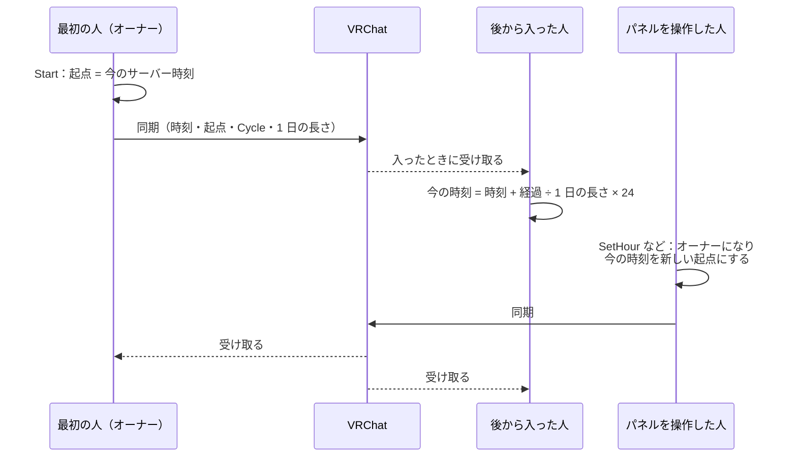

値を変えた人がオーナーになり、時刻が飛ばないように、その時点の時刻を新しい起点にして送ります。雲は「速さ × シーンを読み込んでからの時間 ＋ ずれ（`_CloudShift`）」の位置にあり、速さを変えるときは、今の位置が変わらないようにずれを足し直します。雲の位置は人ごとの時間で決まるので、形は人によって違いますが、量と速さは同じです。

| 呼び出し（Udon から） | 何が変わるか |
| --- | --- |
| `SetHour(時刻)` | 時刻。進めているときは、その時刻から進み直す |
| `SetCycle(true/false)` | 時刻を進めるか。今の時刻から進める・止める |
| `SetDayMinutes(分)` | 1 日の長さ。今の時刻から新しい速さで進む |
| `ResetTime()` | 時刻・時刻を進めるか・1 日の長さを、シーンを保存したときにエディターが控えた Inspector の値（`startHour` など。同期する欄は実行中に変わるため）に戻す |

パネルで変える雲と波は、別のオブジェクト「Sky & Waves Settings (Clearwater)」（`ClearwaterSettings`、Manual 同期）が同期します。役割は、Clearwater Sky が空の時計、Settings がメニューの初期値と同期、コントローラーが水の描画と音です。Settings は、実行中に誰も変えていない項目（同期値が負）には Inspector の初期値を使い、起動時と同期を受けたときにコントローラー経由でマテリアルに入れます。

| Settings の呼び出し | 何が変わるか |
| --- | --- |
| `SetClouds(0〜1)` | 雲の量 |
| `SetCloudDrift(m/s)` | 雲の流れる速さ。今の位置から新しい速さで流れる |
| `SetShoreWaves(m)` | 岸の波の高さ（砕ける波の高さ、`_SwashHeight`）。水面・水底・水中・自分の地形の浜のマテリアルに入れる。波音は作ったときの高さとの比の平方根で大きくなる。0 では `_ShoreWaves` も 0 にして、岸の波のない水際にする |
| `SetRippleSpeed(倍率)` | さざ波の速さ（1 = 作ったとき）。波の模様の時計は `(時間 × 倍率 + ずれ) × Time scale` で、倍率を変えるときは今の時計が変わらないようにずれを足す（グローバル `_Udon_CWRipple`）。水面の波はプールと共通 |
| `ResetAll()` | 雲と波を Settings の初期値に戻し、Clearwater Sky の `ResetTime()` も呼ぶ |
| `SetRipples(0〜1)` | 沖のさざ波の強さ。海の水面・水底・水中・アバターの光の模様のマテリアルの `_Calm`（= 1 − 強さ）に入れる。プールの `_Calm` はプールごとの値のまま |

**負荷**。空・水面・水底は、見る方向ごとに表を 1 回引きます。太陽と月のどちらかの空が他方の 1000 分の 1 に満たないときは、その分は引きません。見えない星の計算も飛ばします（値をちょうど 0 にして、シェーダーの分岐で飛ばします。昼の星を小さな値のまま残すと、1080p で +0.2 ms かかりました）。時刻のない空と比べて、片目 2048×2048 で、昼に空を見上げて +0.1 ms、夜空を見上げて +0.15 ms です。

## 14. 空のパネルと小石：見た目は UI レイヤー、操作は別のレイヤー

`Tools > Clearwater > Add Sky Control Panel` は、空を操作するパネルと、それを出す小石を置きます（`Editor/ClearwaterSkyEditor.cs`）。パネルは普段は隠れていて、小石を Interact すると見ている人の前に出ます。

小石の Udon（ClearwaterSkyPanelOpener）は、どこからでもパネルを呼び出す入力も受けます。VR では左手のトリガー（`InputUse` の左手）を 0.4 秒以内に 2 回引くと、パネルを 0.4 倍にして左手の 16 cm 上に出し、毎フレーム（`PostLateUpdate`）手に合わせて動かして、目のほうへ向けます。デスクトップでは Tab キー（`Input.GetKeyDown`）で、目の前 1.2 m・10 cm 下に水平に出し、そこに置いたままにします。デスクトップの操作は画面の中心で当てるので、パネル全体が視界に入る距離にしています。出し方は 3 通り（小石の上・手の上・目の前）で、同じ出し方をもう一度すると隠れ、別の出し方をするとそちらへ移ります。手の上のときは、離れると隠れる判定（`Close Distance`）をしません。なお ClientSim では Tab に「マウスの解放」も割り当てられています。

| 部品 | オブジェクト | レイヤー | 役割 |
| --- | --- | --- | --- |
| パネルの親 | Sky Control Panel (Clearwater) | 17 Walkthrough | ワールド空間の Canvas と VRC Ui Shape（操作を受ける当たり判定）。ClearwaterSkyPanel の Udon |
| パネルの見た目 | Face | 5 UI | 入れ子の Canvas。左に空（Sky：スライダー 4 本とトグル）、右に波（Waves：スライダー 3 本と右下に Reset all ボタン）の 2 ペイン。見出しは空を暖色、波を寒色にし、間に仕切り線。106 × 57 cm。文字は TextMesh Pro（既定のフォント。Essential Resources がなければ取り込む）、図形は VRChat の超解像 UI シェーダーのマテリアル（`Generated/SkyPanelUI.mat`）。SDK のビルダーの警告（Unity の UI シェーダー、TextMesh Pro でない文字）に先に応えたもの |
| 小石 | Sky Stone (Clearwater) | 17 Walkthrough | 当たり判定（凸のメッシュ）と ClearwaterSkyPanelOpener の Udon。Interact の表示は「Sky & Waves」 |
| 小石の見た目 | Look | 5 UI | 小石のメッシュ（約 30 cm） |
| 呼び出し役（小石の代わり） | Sky Panel Caller (Clearwater) | 17 Walkthrough | ClearwaterSkyPanelOpener の Udon だけ。見た目も当たり判定もなく、手元に呼び出す入力だけを受ける。Beach 以外のデモが小石の代わりに持つ |

**見た目を UI レイヤーに置く理由**。VRChat のカメラ（写真・配信用）は、UI レイヤーを写しません（カメラの設定で UI を表示したときは写ります）。一方で、操作を受ける部分まで UI レイヤーにすると、VRChat のメニューを開いている間しか触れなくなります。そこで、見た目だけを子にして UI レイヤーに置き、操作を受ける親は Walkthrough に残しています。Walkthrough はアバターとぶつからないので、パネルや小石を通り抜けられます。

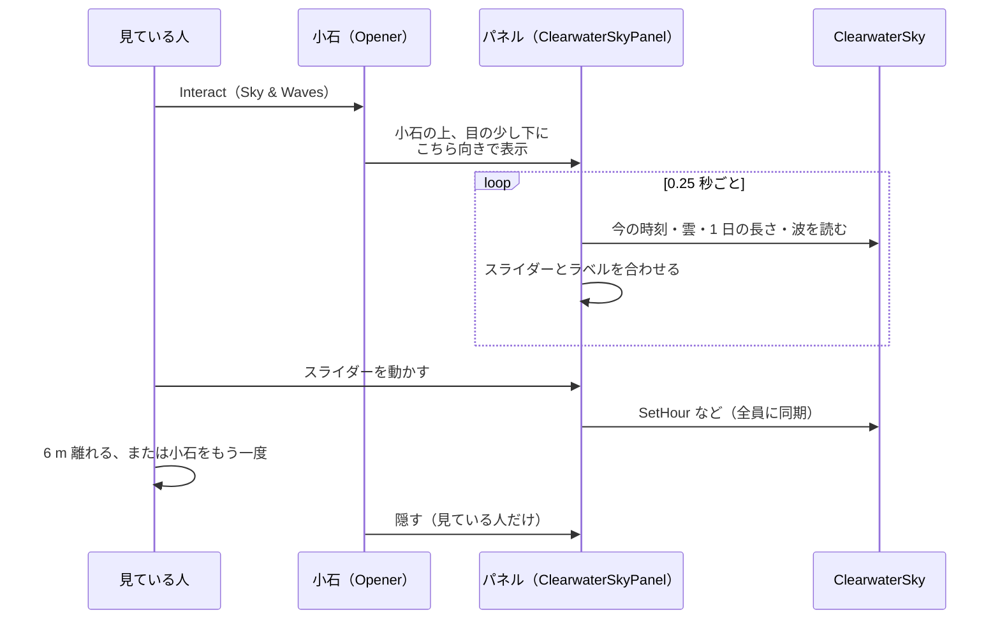

| スライダー・トグル | 範囲 | 呼ぶもの |
| --- | --- | --- |
| 時刻（Time） | 0〜24 時 | `SetHour` |
| 雲の量（Clouds） | 0〜100% | Settings の `SetClouds` |
| 雲の流れ（Cloud drift） | 0〜60 m/s | Settings の `SetCloudDrift` |
| 1 日の長さ（A day in） | 1 分〜24 時間の 17 段階 | `SetDayMinutes` |
| 時刻を進める（Day goes by） | オン / オフ | `SetCycle` |
| 岸の波の高さ（Shore waves） | 0〜初期値の 2 倍（最低 30 cm） | Settings の `SetShoreWaves` |
| 沖のさざ波（Ripples） | 0〜100% | Settings の `SetRipples` |
| さざ波の速さ（Ripple speed） | 0〜200% | Settings の `SetRippleSpeed` |
| 初期状態に戻す（Reset all ボタン） | — | Settings の `ResetAll` |

**初期値の置き場所**。Sky & Waves Settings の Inspector に集めてあります。時刻・Day goes by・1 日の長さは Clearwater Sky の値をそのまま表示・編集し、雲の量・流れ・岸の波・さざ波・さざ波の速さは Settings の値です。雲と波は、変えるとその場で関係するマテリアル（空と水面・水底・プールの雲の写し、水面・水底・水中・自分の地形の浜の `_SwashHeight`、海の水面・水底・水中・アバターの光の模様の `_Calm`）にも書き込み、Scene ビューを実行時の見た目と揃えます（Undo 可）。Add Sky Control Panel は、Settings がなければ作り、そのときの初期値はマテリアルの今の値から取ります。

パネルが値を表示し直すとき、スライダーを動かすと UI のイベントが起きます。パネルは表示し直している間の印（`_showing`）を持ち、その間のイベントは見ている人の操作として扱いません。パネルを出すか隠すかは見ている人ごとで、同期しません。

## 15. 調整できる数値

### Coast（海岸）

シーンの「Coast (editor only)」のコンポーネントです。変えたら Bake します。

| 項目 | 初期値 | 効果 |
| --- | --- | --- |
| `Points` / `Closed` | 3 点、200 m のまっすぐな線 / オフ | 波打ち際の線。矢印の左が海。Closed で輪（島・湖） |
| `Line` | Smooth | Straight / Smooth / Handles（点ごとのハンドル） |
| `Shore waves` | オン | 打ち寄せる波と波音。オフで静かな水（湖・池） |
| `Wave direction auto` / `Wave from` / `Wave spread` | オン / 0° / 25° | うねりの来る向きと広がり |
| `Section` | Gentle Beach | 断面。Gentle Beach（数値）か Curve（曲線） |
| `Shallow depth` | 0.35 m | 浜の足元の水深 |
| `Shallow slope` | 0.041 | 膝までの浅瀬が 1 m ごとに深くなる量 |
| `Shelf slope` | 0.155 | 浅瀬の先の急な斜面 |
| `Deep depth` / `Deep start` | 3.45 m / 48.3 m | 沖の平らな底の深さと、波打ち際からそこまでの距離 |
| `Beach slope` | 0.1 | 浜の傾き。打ち上げの速さと距離もここから決まる |
| `Land height` | 0.6 m | 浜の奥の陸の高さ |
| `Terrain source` / `User terrain` / `Seam width` | Generated / なし / 20 m | 地形の出どころ（5 章、9 章） |
| `Bed look` | なし（Sand） | 底の見た目 |
| `Sea size` | 5000 m | 海の一辺。Reference Camera の Far Clip はこの 0.8 倍 |
| `Area size` / `Resolution` | 512 m / 1024 | 細かく焼く範囲と解像度（0.5 m 間隔） |
| `Outer resolution` | 1024 | 海全体の粗い焼き込み（5000 m で約 5 m 間隔） |
| `Ground half size` / `Ground step` | 100 m / 0.5 m | 歩ける範囲の半分の長さと、当たり判定の間隔 |
| `Stamp resolution` | 1024 | スタンプの焼き込み（200 m で 0.2 m 間隔） |

### マテリアル

シーンのフォルダー（9 章）にあります。Inspector で変えると、すぐシーンに映ります（波と光の模様は Play モードの間だけ動きます）。

| マテリアル | 項目 | 初期値 | 効果 |
| --- | --- | --- | --- |
| Water・Seabed・Sky・Underwater | `Sun intensity` | 6 | 太陽の強さ。4 つとも同じ値にする |
| 同上 | `Exposure` | 0.63 | 全体の明るさ。4 つとも同じ値にする |
| 同上 | `Tone map in shader` | オン | 12 章 |
| Water・Seabed | `Breaker height` | 0.14 m | 砕ける波の高さ |
| 同上 | `Run-up` | 2.6 | 打ち上げが届く高さ（`Breaker height` の倍数） |
| 同上 | `Whitewater height` | 0.03 m | 打ち上げの先端と砕ける波の盛り上がり |
| Water | `Swell start depth` | 2.6 m | 寄せる波（うねり）が現れ始める水深。0.8 m 浅い所で本来の高さ。海岸の断面の最深部より深いと海全体に出る（重くなる）。水底・水中・自分の地形の浜のマテリアルには、コントローラーが起動時に写す |
| 同上 | `Foam relief` | 0 | 泡の凹凸の陰影。近くで見るとき用（2 cm で片目 +0.45〜0.9 ms） |
| Water | `Depth write` | Off | 11 章。On にするとアバターの半透明の服が水に隠れる |
| Underwater | `Fog density` | 0.2 | 水中の見通し（1 で水面から見た水と同じ濃さ） |
| 同上 | `Fog saturation` / `Fog brightness` | 0.7 / 1 | 遠くで行き着く水の色の濃さと明るさ |
| 同上 | `Max fog distance` | 200 m | 霧の計算の上限 |
| Sky | `Cover` | 0 | 雲の量。水面の反射と水中から見上げた空にも出る |
| 同上 | `Size` / `Drift speed` / `Drift direction` | 900 m / 8 m/s / 60° | 雲の大きさ、流れる速さと向き |
| 同上 | `Distant land` | 0.5 | 水平線のうち遠景の陸が占める割合 |

Sky の雲と遠景の陸は、Inspector で変えると Water と Seabed にも自動でコピーされます（`Editor/ClearwaterSkyGUI.cs`）。

### Clearwater Controller

| 項目 | 初期値 | 効果 |
| --- | --- | --- |
| `Tap Radius` / `Tap Strength` | 0.154 m / 0.07 | タップの波紋の大きさと強さ |
| `Step Strength` / `Step Spacing` | 0.035 / 0.22 m | 体が動いたときの波紋の強さと、何 m ごとに出すか |
| `Touch Height` | 0.18 m | 水面からこの距離内の体の部位を「水に触れている」とみなす |
| `Max Tap Distance` | 40 m | これより遠い水面はタップできない |
| `Shore Level` / `Bed Level` / `Underwater Level` | 0.9 / 0.3 / 0.8 | 3 つの波音の音量 |
| `Ripple Resolution` / `Ripple Size` | 512 / 14 m | 波紋の窓。CRT と合わせる（Build Scene が設定） |

### Clearwater Sky と小石

| 項目 | 初期値 | 効果 |
| --- | --- | --- |
| `Time of day` | 16.5 | 時刻（その土地の太陽の時刻。12 時に太陽が一番高い） |
| `Cycle` / `Day minutes` | オフ / 24 分 | 時刻を進めるか / 1 日にかかる実時間 |
| `Latitude` / `Day of year` | 35° / 172 | 緯度と日付。太陽の高さ、昼と薄明の長さが決まる |
| `North` | Build Scene が計算 | 北の向き。初期値で太陽が時刻のない空と同じ位置に来る |
| `Moon` / `Night brightness` / `Stars` | オン / 0.05 / 1 | 満月、月夜の明るさ、星の明るさ |
| `Underwater Glow` | 1 | 夜の水中に残す青緑の明るさ（水中の暗さの下限の倍率。0 で下限なし、0〜3） |
| `Update interval` / `Probe interval` | 0.1 秒 / 10 秒 | 時刻を進めるときの空と映り込みの更新間隔 |
| 小石の `Close Distance` | 6 m | パネルから離れると隠れる距離（0 で隠れない） |
| 小石の `Show Above` | オン | 小石の上に出す。オフで置いた場所のまま出す |

## 16. ファイル構成

`Runtime` はワールドに入るもの、`Editor` はエディターだけで動くもの、`~` の付いたフォルダーは Unity が読み込まないものです。

| ファイル | 役割 |
| --- | --- |
| `Runtime/Shaders/ClearwaterCommon.cginc` | 共通：座標、ノイズ、空（時刻のない空と時刻の空）、反射率、トーンマッピング |
| `Runtime/Shaders/ClearwaterFloor.cginc` | 水底：`cwFloorDepth`（焼き込みの読み出し）、Bed look の模様、水中の光 |
| `Runtime/Shaders/ClearwaterShore.cginc` | 波打ち際：うねり・砕波・打ち上げ・泡・濡れた砂 |
| `Runtime/Shaders/ClearwaterSurface.cginc` | 水面の高さと、水面すれすれのカメラの水上・水中の判定 |
| `Runtime/Shaders/ClearwaterWater.cginc`、`Water.shader` | 水面（水上から・水中からの 2 パス） |
| `Runtime/Shaders/Seabed.shader` | 水底と浜 |
| `Runtime/Shaders/Underwater.shader` | 水中の霧 |
| `Runtime/Shaders/Sky.shader` | 空（スカイボックス）、雲、遠景の陸 |
| `Runtime/Shaders/CRT_Spectrum.shader`、`CRT_FFT.shader` | 波の FFT |
| `Runtime/Shaders/CRT_Ripple.shader`、`CRT_RippleNormals.shader` | 波紋 |
| `Runtime/Shaders/Caustics.shader` | 光の模様の格子 |
| `Runtime/Shaders/AvatarCaustics.shader` | アバターと Receive Caustics の物への光の模様（Projector） |
| `Runtime/Shaders/UserBeach.shader` | 自分の地形の上の浜（濡れ・打ち上げ・泡、Projector） |
| `Runtime/Shaders/CoastBake.shader`、`FloorBake.shader`、`StampBake.shader`、`RockBake.shader` | 焼き込み用（海岸の座標、当たり判定の高さ、スタンプ、岩場） |
| `Runtime/Udon/ClearwaterController.cs` | 見ている水、波紋、体とタップの波紋、水中の判定、太陽の向き、波音、光の模様の Projector |
| `Runtime/Udon/ClearwaterSky.cs` | 時刻の空と、その同期 |
| `Runtime/Udon/ClearwaterSkyPanel.cs`、`ClearwaterSkyPanelOpener.cs` | 空のパネルと、それを出す小石 |
| `Runtime/Authoring/ClearwaterCoast.cs` | 海岸（編集用。アップロードに含まれない） |
| `Runtime/Authoring/ClearwaterStamp.cs`、`ClearwaterPool.cs`、`ClearwaterBedLook.cs` | スタンプ、プール、Bed look |
| `Runtime/BedLooks/`、`Runtime/Textures/` | 小石と砂の Bed look、その画像（計算で作ったもの） |
| `Runtime/Audio/` | 波音 3 種、波の崩れる時刻表、出典（`CREDITS.txt`） |
| `Editor/ClearwaterSetup.cs` | Build Scene・Recreate Scene・Add to Current Scene・Use Clearwater Sky and Sun、共有の素材とシーンのフォルダー |
| `Editor/ClearwaterCoastBake.cs` | 海岸の Bake：座標・断面・スタンプ・歩ける地面・波音の点 |
| `Editor/ClearwaterCoastEditor.cs` | Coast と Stamp の Inspector、Scene ビューでの線の編集 |
| `Editor/ClearwaterCoastExposure.cs`、`ClearwaterCoastTiming.cs` | 波の届きやすさと到着の遅れ |
| `Editor/ClearwaterUserTerrain.cs` | 自分の地形の焼き込みと Projector |
| `Editor/ClearwaterPoolBake.cs`、`ClearwaterPoolEditor.cs` | プールの Bake と Inspector、Add Pool |
| `Editor/ClearwaterBedLooks.cs` | Bed look をマテリアルに当てる、自分の地形から作る |
| `Editor/ClearwaterAtmosphere.cs` | 大気の散乱の計算（空の表） |
| `Editor/ClearwaterSkyEditor.cs` | 時刻の空の設置と Inspector、Add Sky Control Panel |
| `Editor/ClearwaterSkyGUI.cs` | Sky マテリアルの Inspector（雲と遠景の陸を水面と水底へコピー） |
| `Editor/ClearwaterToneMapping.cs` | トーンマッピングの方式の切り替え（PPv2 の LUT） |
| `Editor/ClearwaterDemoScenes.cs` | デモシーン 6 つ（Clearwater が作る地面の浜と、自分の地形・プールの例） |
| `Tests/Editor/` | EditMode のテスト（19 章） |
| `Tools~/make_wave_audio.sh`、`detect_wave_breaks.js`、`make_sand.py` | 波音の加工、波の崩れる瞬間の検出、砂の画像 |
| `Documentation~/images/` | README の画像 |
| `docs/technical.md`、`docs/adr/`、`CONTEXT.md` | この文書、後から変えにくい決定、用語 |
| `.github/` | リリースと VPM リスティングの自動化（GitHub Actions） |

ワールドのプロジェクトの側には、Clearwater が作るものがあります。

| 場所 | 中身 |
| --- | --- |
| `Assets/Clearwater/Scenes/Clearwater.unity` | Build Scene が作るシーン。2 回目以降の Build Scene は、シーンに手で置いた物や値を残し、素材だけを作り直す |
| `Assets/Clearwater/Generated/` | 共有の素材と、シーンごとのフォルダー（9 章）。直接は編集しない |
| `Assets/Clearwater/Demo/` | Build Demo Scenes が作るデモ |

## 17. 負荷と計測

負荷はほぼ画素数に比例し、水面が画面を覆うときに一番大きくなります。README の「負荷の目安」に、条件ごとの増え方をまとめています。ここでは、どこに時間がかかっているかの内訳を残します。

**測り方**。Unity エディターの中で、VR の片目に近い 2048×2048（約 420 万画素）・視野 90° に同じ視点を繰り返し描き、GPU の完了を待って時間を測ります。部品ごとの値は、その部品だけを消したときとの差です。計測ごとに 1 割ほどぶれるので、比べるときは 1 回の計測の中で交互に測ります。Unity のウィンドウが最前面にないと GPU が 1 割ほど遅くなるので、前面に出して測ります。

| 視点（パッケージ 1.0.0、RTX 4070 Ti SUPER） | ms/片目 | うち水面 |
| --- | --- | --- |
| 浅瀬で足元を見る | 5.7 | 5.2 |
| 岸から 26 m の海を見下ろす | 5.4 | 4.9 |
| 沖合を見下ろす（水が画面いっぱい） | 4.8 | 4.2 |
| 浜から沖を見る | 2.8 | 1.5 |
| 水中から水面を見上げる | 2.6 | 1.8 |
| 潜って水平に見る | 1.9 | 0.9 |

時間の大半は水面です。岸に近いほど重くなるのは、打ち寄せる波と泡を水面の計算の中で求めるためです。

視点によらず、毎フレーム光の模様のカメラが 0.33 ms かかります。波と波紋の計算（Custom Render Texture の更新）は、エディターでは GPU の時間を切り出せません（更新を指示する CPU 側は 0.09 ms）。解像度を縦横半分（画素数は 1/4）にすると、時間は約 1/3 になりました。

| GPU（VR の両目、水が画面いっぱい。概算） | 水だけの負荷 | 90 fps の予算 11.1 ms に対して |
| --- | --- | --- |
| RTX 4090 | 約 6 ms | 半分ほど |
| RTX 4070 Ti SUPER（実測から） | 約 10 ms | ほぼ使い切る |
| RTX 3070 | 約 15 ms | 超える |
| RTX 3060 | 約 21 ms | 超える |

4070 Ti SUPER の値は、沖合を見下ろす視点の片目の値を 2 倍し、光の模様のカメラの分を足したものです。それ以外は、公開されているベンチマークのおおよその性能比で割った値で、実測ではありません。水が画面いっぱいになるのは見下ろしたときで、浜から沖を見る視点なら 4070 Ti SUPER で約 6 ms です。実際の VRChat では、これにアバターや UI の描画が乗り、SteamVR の解像度設定に比例して増減します。デスクトップ（1920×1080、縦の視野 60°）では、沖合を見下ろして約 2.6 ms、浜から沖を見て約 2.4 ms です。

これまでに入れた主な軽量化です。どれも、前後で同じ視点の画像を比べて、見た目が変わらないこと（平均の色の差が 1/255 未満）を確かめています。

1. 水面より上から見ているときは、水面に隠れる水底を Seabed で塗らない（水深 25 cm までは塗る）
2. 水面が計算していた「水平線より上の空」を、水平線の近くの画素だけに限る
3. 水面と浜の計算と頂点を減らす
4. 見えないときの計算は、値をちょうど 0 にして分岐で飛ばす（星、月の空、太陽の空）
5. Seabed は Projector を受けない。自分の地形の投影が、水面の高さにある Seabed の格子全体を描き直していた（港のデモで片目 0.3〜0.6 ms）

## 18. 制限と注意：負荷のために諦めたこと

負荷を抑えるために、次のことを受け入れています。

- **Quest では動きません。** CRT の FFT と、1 画素ずつの水底の計算が重いためです
- **波の模様は 4.6 m ごとに繰り返します。** 2 枚目を回して重ね、目立たなくしています
- **上からの反射は空だけです。** 水面に岸や建物は映りません
- **水越しの水は描けません。** GrabPass を名前付きで共有しているため、後から描く水に先に描いた水は写りません
- **焼き込みとマテリアルはシーンごとです。** シーンを増やすと、既定の海岸で約 40 MB（自分の地形を使うとさらに約 32 MB）増えます

移植元の WebGL デモから外した表現もあります。

- きらめきの周りの光の筋やにじみ（グレア）、色収差、フィルムグレイン。スマートフォンのレンズを真似たもので、VR では不自然なので外しました。その分、元のデモより少し色が濃く見えます。ブルームは、ポストプロセスの方式を選んだときだけ使えます
- 重いときに解像度を下げる処理

気をつけることです。

- **太陽の影は有効のままにします。** 水の中のアバターの透け方と水中の霧は深度テクスチャを使い、VRChat では影があるときだけ作られます（5 章）
- **Reference Camera の Far Clip は Sea size の 0.8 倍（既定 4000 m）にします。** 短いと遠くの水と地面が切れます。Coast の Inspector が足りないときに知らせ、ボタンで設定できます
- **Play モードの後、マテリアルに実行中の値が残ることがあります。** Udon が実行中に書いた値（太陽の向き、波音の時計、波紋の窓など）は、エディターでは保存されていない変更として残り、次に保存したときに書き出されます。git で管理しているときは、差分を戻します
- **岩場は作ってありますが、切っています。** `ClearwaterSetup.cs` の `Rocks` を `true` にして Build Scene を実行すると戻ります（水越しに見下ろすと片目 +0.85 ms）

移植元の WebGL デモとの対応、コードの中の細かい判断は、各ファイルの冒頭と関数のコメントに書いてあります。この文書で分からない点は、GitHub の Issue で質問してください。

## 19. テスト：焼き込みの計算と Bake の警告を確かめる

`Tests/Editor` に、Unity Test Framework（EditMode）のテストがあります。対象は、数値で正解を書ける焼き込みの計算と、Bake の警告です。

| テスト | 確かめること |
| --- | --- |
| `PoolSpanTests` | プールの範囲（どの高さまでが、そのプールの中か） |
| `CoastFieldTests` | 波打ち際からの符号付き距離と、海岸に沿った距離（`CoastField`） |
| `CoastLineTests`、`RebakeCheckTests` | 線の点の数の上限、Bake し直しの判定 |
| `UserTerrainTests` | 自分の地形の波打ち際への差し替えと、その警告 |
| `BakeNoteTests` | 覆われていない所・焼き込む範囲からのはみ出しの警告 |
| `SkyTests` | 空の計算（昼の天頂は地平線より青い、日没の地平線は太陽の側が赤い、太陽が 18° 沈めば空はほぼ暗い） |
| `SkyClockTests` | 時刻の空の合わせ方（初期値で太陽の位置と光が時刻のない空と同じ）と、星が空と一緒に回ること |

シェーダーの見た目と、VRChat の中での挙動（同期、実際のジャンプ）はテストしていません。見た目は Play モードで撮影して比べて確かめます。

テストを動かすには、ワールドのプロジェクトの `Packages/manifest.json` に次を足し、`Window > General > Test Runner` の EditMode で実行します。テストは Test Runner が用意する空のシーンで動き、焼き込んだデータ（`Assets/Clearwater/Generated`）には書き込みません。

```json
"testables": ["com.vbamboo.clearwater"]
```
